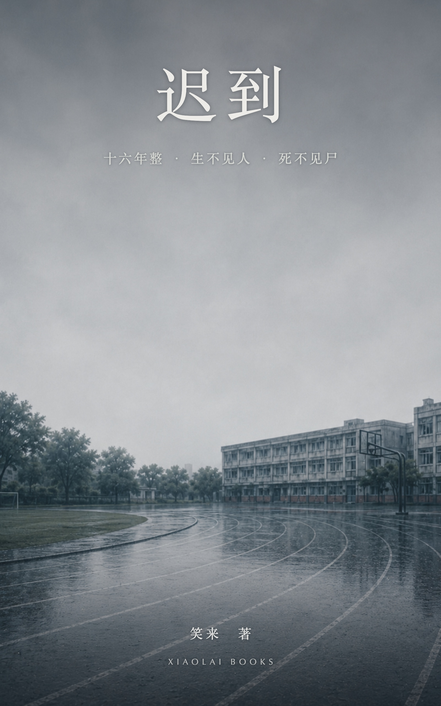

# 迟到

> 真相曾经遥遥无期

笑来　著

本书纯属虚构。书中人物、姓名、机构、情节均为艺术创作，与任何真实人物或真实事件无对应关系。

## 1

夜里。天上飘着的雪花有指甲盖那么大，没有风，落得慢。

空地上一辆铲车，车灯没亮，引擎响着。铲斗举起，落下，斗齿插进冻土，撬起一斗，铲头扭到一边，翻斗，一个小土包。铲头再转回去，又一斗。

* * *

屋里有些暗，只桌上一盏台灯亮着。台灯旁边，直立着一个人，穿着一双布鞋。

桌子前的空地上，跪着个人，脚上只有一只鞋，另一只鞋甩在远处。那人边上，一双皮鞋退后半步，一根短高尔夫球杆抡圆了，抽在跪着那人的腿上。

地上的人咬着牙出声，“我真不是故意的……”

穿着皮鞋的那双脚，横着挪了挪，站好。球杆又落下来。

“是不是”，一下。

“故意的”，又一下。

“重要吗”，再一下。

最后这一下声音很重，地上的人直接趴到了地上。离他的头不远，一双脚往边上挪了挪。

地上的人嘴里在嘟囔着什么，已经听不清了。

* * *

坑不浅，也不小。雪花落在土包上已经一层了的雪上，没声音。落在铲斗上，土坑里的雪花，挨着就化了。

不知道哪儿的炮仗震天响。

雪地上被拖出一道印子，一个人影把一个东西往土坑那边拖，长长一条，编织布包着，绑了绳子。到了坑边，那人直起腰，喘了几口气。一脚把那东西踹进坑里。

* * *

“让你喝！” 球杆落在屁股上。

“让你喝！” 落在大腿上。

“我让你喝！” 落在小腿上。

最后这一下，伴着好像是骨折的声音，虽然小，但有点脆。

站在桌边的那人的腿都跟着抖了一下。他双手接过递过来的球杆，转身把它插回包里。退回桌边，低头，抚了抚袖口。

皮鞋绕着地上的人转了一圈。踢了一脚。这次不重。声音平平的，“滚。”

* * *

铲斗转过来，推着土，一斗一斗，往坑里填。

* * *

屋里，那双皮鞋踱到窗前，推开窗。雪气和冷风一道涌进来。外面传来嗵嗵嗵嗵的声音，飘着大雪的天空里，绽放一簇接一簇的烟花，把屋里都照得很亮。

明暗之间，打火机点燃烟头，那烟头闪得慢。可这一支烟，很快也就到头了。那人转身，回到椅子上坐下，把烟头摁进桌上的烟灰缸，拧了好几下才抬手。

“这小子……” 顿了一下，他用手指敲了敲自己的太阳穴，摇了摇头，“不行。”

“明白，” 那双布鞋往前凑了一小步，“我盯着。”

* * *

空地上，铲车从那片新土上碾过去，来回两趟；铲斗翻下来，在上头拍了拍，拍实，拍平。方向盘上那只手打着轮，缺半截指头。缓缓开到一边，停下。

雪更大了。不一会儿，地上就铺了厚厚的一层白。

教学楼顶上立着一块牌子，红漆的字，一道一道盖白了 —— 东江县第一中学。

## 2

东江县第一中学。红漆的字，这会儿在五月的太阳底下，晒得发亮。

二〇一九年五月四日，星期六，五一假的最后一天。街上还冷清，学校里却满了人。

初三教学楼的走廊，墙上贴着红榜，一张挨一张，红纸黑字，名字不按姓氏排，是按名次，没有分数。家长们仰着头找自家孩子，找见了的，看一眼，转身就走，谁也不说话。

顾佳在榜上找陈艺不费劲，从第三变成了第五。排在第一个的名字是沈嘉朗。她站了一会儿，往大厅去。

大厅里家长扎堆，说的都是分数、哪个老师抓得紧、暑假补不补。一个穿戴齐整的女人绕过来，挽住顾佳的胳膊：“顾姐！你们家陈艺，又往前了吧？”

“往前什么呀，” 顾佳摆手，“这回掉了两名。倒是你们家嘉朗，从来都不用看榜。”

“就这个成绩不用操心，” 沈嘉朗的妈妈沈秀叹口气，“剩下的吧……” 又摇摇头，“他爸一个礼拜见不着一回人，孩子的事，全是我一个。”

“都一样啊。” 顾佳应了一声。

* * *

走廊另一头，孩子们三三两两凑着。周悦从人缝里钻出来，看见沈嘉朗靠墙站着，手插在校服兜里。

“沈嘉朗，” 她凑过去，“你是把手机丢了，还是把自己给丢了？放假这几天，发消息不回，电话不接 ——”

沈嘉朗眼皮没抬：“对，手机丢了。” 说完就走。

周悦愣了一下，刚要追，看见他走的方向 —— 大厅里那个挽着顾佳说话的女人。周悦把抬起的脚收了回来。

她回身在人堆里找见陈艺，走过去。

“陈艺，” 她压低嗓子，“你爸今天怎么没来？”

陈艺低头看着手里的成绩单：“来，一会儿到。”

“沈嘉朗手机丢了你知道不？他自己说的。”

“你看见他丢了？”

“…… 没有。”

“那就是他懒得理你。”

* * *

走过来一个学生，通知家长进教室。桌上立着孩子写的名牌，家长照着名字找自家娃的位子，一个个坐进小桌椅，膝盖顶着桌肚。教室后门，摞着几摞塑料凳子，跟椅子差不多高，留给一家来俩的、或来晚没座的。顾佳找到陈艺的位子坐下，把桌肚里的书理齐，一张折了角的卷子抚平，搁回去。

讲台上，班主任攥着话筒，嗓子哑了：“这时候，多考一分，就是甩开一操场的人。” 黑板正上方挂着一块牌子：距中考还有五十四天。窗开着，风把墙上标语的角吹得一翘一翘。

班主任念到一半，后门轻轻推开，陈晓伟侧身进来。穿着件户外运动夹克，没系拉链，头发乱着。往陈艺桌边扫了一眼，然后轻轻抽出一个过道凳，走过去坐下。班主任念到陈艺，顺口夸 “这孩子用功”，顾佳的腰挺直了些；陈晓伟在旁边点点头，手没个着落，于是插进裤兜。

班主任开始发安全责任书，一式两份，从前排往后传。密密一页条款 —— 防溺水的 “六不一会”、交通、用电、饮食；末了一行：学生在校外、节假日发生意外，学校已尽教育告知之责，后果由家长自负。底下空一行，等家长签字，一份交回、一份自留。

传到顾佳手里，她扫了一眼，两份都签了。陈晓伟在旁边看着，咕哝一句：“这表年年签、回回签，顶屁用。”

顾佳把其中一份递给前排的家长，另一份折好收进包里，没抬头，“签个字的事儿。” 陈晓伟没接话。

会散得差不多了，家长们起身往门口走，手里多半还捏着那张签过字的纸。陈艺从后门进来，到顾佳跟前：“妈，能走了吗？我下午还有套卷子。”

顾佳没动。她从包里摸出个翻旧了的小本子，翻开 —— 里头一栏一栏，记着陈艺每回月考各科的名次，往下掉的用红笔圈着，这回圈的是数学。“再坐会儿，” 她眼睛已经去逮讲台上正收话筒的班主任，“你这数学，两个月掉这么多，我得问问老师怎么回事。”

陈艺一眼看见那本子，脸就红了，压着嗓子：“妈，你别问了……”

顾佳伸手替她理校服领子。陈艺往后缩了缩，没让她碰。

隔了一会儿，陈晓伟从裤兜里摸出钱包，抽出两张，塞进陈艺手里：“急什么，卷子又不会跑。拿着，路上想吃啥买。” 又冲顾佳那边说了句，“让孩子去吧，坐这儿也是干坐着。” 陈艺把钱攥进手心，嘴角松下来。陈晓伟又说，“要么我陪你去吧。” 顾佳的眼睛还在老师身上。

* * *

讲台那头围了一圈人，全是孩子排在前头的家长，一个挨一个等着问老师 —— 词不同，话一样，为了这最后的冲刺，哪科到底该怎么补。

顾佳站着等，终于轮到她。她翻开本子，问数学。老师扫一眼那两栏，“陈艺底子在那儿，冲一中没问题，掉这两名我也急。我觉着，她不是题不会做，是心思太重 —— 你们家里别再给她上弦了，越压越坏。你让她不会的随时来问我，我盯着。” 数学到底哪块塌了、怎么补，他没给一句准话。

教室里的家长只剩她和沈秀。每次家长会，沈秀都会等到最后，上前抓起老师两只手，“这段时间您辛苦了”。从来不问别的。

两人一道往外走，楼道里空着。沈秀手里还捏着那张责任书，扬了扬：“你说那玩意，开学签、放假签，防个溺水也签 —— 签这么多遍，到底管什么用？”

“真出了事，” 顾佳伸手替她把大厅的门推开，“顶用的也不是这张纸。”

窗外操场上，不知谁家的小孩在跑。倒计时牌底下，五十四天。

## 3

出了校门，顾佳包里的手机震起来。医院的号码，男护士小刘。

“顾姐，昨天的报告出来了。几项指标都不太好……”

“我这就到。” 她跟沈秀摆摆手，先走了。

县医院在城西。五一最后一天，住院部楼下的小卖部都关了门。顾佳在大厅门口的台阶底下站住，蹲下身，把包放地上摆好，然后又把两只运动鞋的带子都解开，重新系过，才上去。

护士长老远迎上来。“顾姐来了。” 她总是这么熟络，伸手要替顾佳拎包，顾佳没给。护士长也不恼，从兜里摸出一张缴费单，“这个月的，老何都安排好了，你对下金额就行。”

顾佳接过，扫一眼，揣进兜里。“麻烦你了。”

“一家人，说什么麻烦。” 护士长顺口问，“陈科长最近忙啊，好些天没见他过来了。”

“他忙。” 顾佳说，往里走。康复病区在走廊尽头，长期护理的床都归在这儿，一住就是多少年。

父亲在靠窗那张床。眼睛睁着，是早班护工替他撑开的，到这会儿眼白已经发干。床头的监护仪上，几个数字一上一下地跳。顾佳看了一会儿，从床头柜上拿过那瓶人工泪，俯下身，一只眼一滴，用指腹替他揉了揉。

“爸，” 她说，“今天是陈艺开家长会。”

他眼角的皱纹里有浅浅的水线。他没动。

那对眼珠有时候自己会动 —— 浮上来，沉下去，只有这一条道。大夫早就说过，那不是应人。头几年，她一遍一遍试过：“爸，看得见我，就眨一下。” 没眨过一回。

小刘进来，顾佳搭把手，两个人把人从床上挪进轮椅，垫好，系上安全带。三道，胸前一道，肚子上一道，小腿上一道。顾佳推着轮椅，出了病房。

院子里两棵老杨树，太阳不毒，照着花坛边一圈空长椅。顾佳推着轮椅，在院子里慢慢绕。

“陈艺这回掉了两名，数学。” 她说，“老师说不要紧，底子在那儿，盯一盯就回来了。” 轮椅咯噔过一道砖缝，她偏了偏，绕开。“我明天上班。攒了一假期的事，明天可有的忙了。”

走到杨树荫里，她停下。

“你别操心啊。我都好。”

她从挎包里摸出一张折着的纸，打开 —— 一篇论文，打印的。

“爸，我看了一篇论文。” 她念摘要给他听，“…… 超过百分之七十五的闭锁症患者，其实是幸福的。”

她把纸折回去，收好。叹口气，“要真的是这样，就好了。”

太阳从杨树叶子的空里漏下来，正照在他脸上。顾佳伸手，把他的眼皮往下一抹，合上了。

合上了，那张脸就空了。

她的手在他脸边停了一下。

再伸过去，用指腹揉揉他的眼皮，帮他打开。蹲下身，帮他按摩大腿，小腿，脚。起身前，把自己的鞋带又解开，重新系好。

“走，回去了。”

回到楼上，她搭手和小刘把人重新弄回床上。上上下下折腾完，直起身来对小刘说，“我现在去缴费，明天早上照常过来。”

出门拐弯，路过护士站，护士长在台子后头抬头：“顾姐慢走。” 顾佳应了一声，下楼，缴费。

天擦黑了。五一就这么过完了。明天一早，信访办的门一拉开，人就该在外头等着了。

她走到路边站住，低头看自己的鞋。

## 4

顾佳去医院，路过了百川宾馆。医院在更西边。百川宾馆在一个大院里，院儿里没几个人，车却停得满满当当。旋转门一圈一圈，那玻璃像镜子，把外面的世界卷进去又吐出来。她从大院门口走过，街对面的门脸都关着 —— 这两年县里的旅游不热了，长假还没过完，街上就没多少人。

大堂里，前台正给一个瘦高男人办登记。男人放下身份证，只一个背包，问有没有朝街、看得见街口的房间。

电梯厅里，一个清洁工推着车候着，车上摞着毛巾和一排小瓶子。看见一个穿夹克的男人过来等电梯，手里捏着房卡。清洁工笑着打招呼，“您好。” 男人不回。

一个穿戴讲究的女人和个大高个孩子走过来，那张脸在县里的电视上常见。

“呀，陈艺爸爸。” 女人认出夹克男人，笑着打招呼。男孩也停下脚步，说，“陈叔叔好。”

陈晓伟愣了一下，随即也笑：“真巧。”

“你这是？”

“上去见个领导。” 他说，“你们这是 ——”

这会儿电梯门开了，电梯厅里又多了两个人。陈晓伟走进电梯，侧边站好。其他人跟进去，清洁女工站在原地，不进电梯。那女人冲陈晓伟摆摆手，和孩子继续往里走。电梯厅旁边另有一道门，没把手，只一个感应区；她掏出卡一刷，门开了，牵着孩子进去，门又合上。

陈晓伟的眼睛，在那道合上的门上，停了一下。

电梯停在七楼，陈晓伟出来，走廊往里，最里头一间，刷房卡，进去。门关上前，里面传出来一个女人慢悠悠的声音，“怎么这么半天啊？”

* * *

那个瘦高男人的房间在三楼。他把背包搁在桌上，没打开，先把椅子挪到能看着门的地方坐下，把窗户推开一条缝，窗帘拉上一半。

过了一会儿，有人敲门。三下，停，两下。他开门。是那个刚才电梯里推清洁车的女人。她进来，反手把门关上。

“一个月了，” 她说，“孙磊这人，亲手什么都不沾。放贷、催收，露面的全是关金炳和他底下那拨人。关金炳儿子带一帮人管催收，下手狠，街面上都知道。自己也放着一摊账，还有个工程队。孙磊最近六七年已经不做工程了。不过，县一中这些年所有改建缮修一直都是他做，表面上挂在关金炳儿子名下的工程队。表面上，孙磊就守着这个宾馆，当他的体面老板。组里查的账，跟我在这段时间考察的一样 —— 想要连到他身上，很费劲。”

“人呢？”

“宾馆里见不着几回。刚才在电梯厅撞上的，是他老婆带孩子回家 —— 老婆是县电视台的主持人。孩子跟妈姓，不姓孙，在县一中念初三。一家住顶层，进出走边上那道门、单坐一部梯，外人上不去；那一层做清洁的，也不是我们这一拨人。当时旁边还有个男的，孙磊老婆跟他打招呼来着，听口气是同班的家长，嘴上说上去见领导 —— 电梯关上之前，他盯着那道门，看了好一会儿。看样子，他也是今天才看出来。”

男人没接这个。他从背包里抽出一个牛皮纸袋，倒出来是一沓复印件 —— 字迹一样的信封，手写的信纸，邮戳排下来，最早的是二〇〇四年。起初多，后来少，再后来每年两封，最后一封是二〇一九年一月五日。

“省城那个帖子，不是李守成的老婆发的，是一个做自媒体的远方亲戚。” 他把信纸往桌上一推，“你去看过了？”

“看了。她这些年一直在县一中门口摆个摊，卖豆浆包子，早中晚都出。有个女儿，十六 —— 我找师哥帮忙查的身份证，李守成失踪之后两个月生的。初中毕业没考上护校，现在没事干，帮她妈打下手。母女俩跟外人几乎不来往。”

男人指了指桌上那叠信：“附近的人，知道她一直在寄这个？”

“我买过几回包子，附近也转了不少圈。那片有两个缠访的，闹了好多年，局里怎么处理他们我都遇到过。可侧面打听了不止一回 —— 压根没人知道她这些年还在上访。我看，弄不好连她闺女自己都不知道。”

男人往后一仰，靠着椅背，半天没做声。

“丈夫是县一中的，除夕夜没的。十六年，没立案。她不哭不闹，自己把孩子生下来，辞了职，守在县一中门口摆摊，一年寄这么几封信。”

他像在问她，又像在问自己，“那学校里，就没一个认得她的？”

“这就没法知道了。”

男人重新坐直，把信收拢。“非法放贷，暴力催收，够不着孙磊。就算够到了，数也不够。得是这一桩。”

他把收好的牛皮纸袋轻轻放回茶几。

“李守成没有犯罪记录。二〇〇四年他没换过二代身份证。他也从来没有过出入境记录。住宿登记从二〇〇二年就全国联网，找不到任何他的痕迹。一个没有任何犯罪记录的大活人，十六年来，在全国都找不到一丝痕迹，没这种事 —— 这可不是失踪了，这应该是命案。李守成失踪前在县一中做改建工程的质量监理，当时那工程，” 他抬眼看了看天花板，“就是孙磊的。”

他站起来，走到窗边。“活着的，找不到，死了的话，就必须得找到尸首。”

从三楼望出去，就能看到县一中。在窗户正对的这条街尽头。操场上人不多，红旗飘着。顺着这条街往西，另外一个尽头是医院。

## 5

天还没亮透，顾佳就醒了。刷牙，洗脸，换上跑鞋，出门。

五月的早上，街是空的，路灯还亮着。她沿着这条街往北跑，脚步声在两排关着的卷帘门之间来回撞。

县医院的住院楼在她身后，亮着零零几格窗。她爸在其中一格里头躺着。她没回头。

跑过公安局大院，铁门关着，门口停着两辆警车。挨着大院有条窄胡同，她往里瞥了一眼 —— 胡同里空着，尽头是城关派出所，她入警头一年就在那个所里待过。她跑过去，没多看。

再往前是百川宾馆。院子里的车停得满满当当，旋转门却一圈一圈空转着，没人进，没人出，那玻璃像镜子，把整条街卷进去，又吐出来。三楼有一扇窗开着条缝，窗帘拉着一半。她贴着院墙跑过去，眼睛没往上抬。

街尽头是县一中。操场空着，红旗在杆顶上垂着一动不动。她顺着围栏跑，脚没停，也不往里头看。

街角拐角支着个摊，热气腾腾，两个女人在忙。

“一屉包子，三份豆浆。”

当妈的应了声，手没停。旁边一个十六七的姑娘低着头，把包子一个个码进袋，递过来，又抬手指了指二维码，一眼没往上看。顾佳接过，扫码付了钱。她又跟那姑娘要了两个空袋，把豆浆和包子分开扎好，拎着，接着跑。

这一圈下来，差不多六公里。回到小区，进门，陈艺已经收拾停当，坐在桌边等，双肩包挂在椅背上。

两个人就着豆浆吃包子，没怎么说话。陈晓伟的房门关着。餐桌另一头，单搁着一个纱罩，罩着一碗豆浆、两个包子，是顾佳进门时摆下的，凉了也没人动。

“谢谢妈，我上学去了。” 陈艺背上包，出门去了。

顾佳冲了个澡，回屋，换上那身藏蓝警服，蓝衬衫，肩上一道杠、两颗星，脸没上妆。走到门口，鞋架上只有运动鞋。她拿起一双，蹲下身，把鞋带一根根抽紧，仔细系好，才站起来。

自行车骑出去的时候，街上人多起来了，车也多。

她先拐到医院。上楼，过护士台，小护士喊 “顾姐早”，她笑一下，“早”。推门进屋，她爸的眼睛睁着，是早班护工撑开的。她从床头柜上拿过人工泪，一只眼一滴。她就那么坐着。看表，七点半。她起身，扫一眼监护仪上跳的那几个数字，“爸，我上班去了。” 他不动。她转身，带上门。

出了住院部，开锁，骑上车。快到公安局，迎面来了三个人刚拐进胡同口 —— 中间是刚才卖她包子的那个姑娘，两边一边一个干警，一男一女。姑娘低着头，没看见她。

顾佳脚下一顿，车把晃了晃，又扶正。她没停，骑过去，拐进大院。

进了大厅，正对面墙上的电子钟跳着：七点五十五。

## 6

大院门口，一个刚下夜班的年轻女警迎面出来，手里拎着袋豆浆，眼睛里带着红丝。见了顾佳，“姐。” 没等应声，人往街口去了。

信访办在公安局大楼的一层，大厅左边的走廊，最里面。不大的一间，三张桌子。顾佳进去的时候，另外两个已经到了。小郑端着茶，小吴对着个小镜子描眉，两个人正说得热闹。

“讲个你不知道的，” 小吴说，“一中门口卖包子那家的丫头，偷了沈秀家孩子的手机，叫城关所逮了。就刚刚带进去的。” 下巴往窗外胡同口的方向一抬。

“谁家？” 小郑问。

“我表哥夜班，回家时打那摊前头过，正看见带人。” 小吴描完一边，端详了一下，“就县一中街角摆摊那家。”

“你刚才说的是那个电视台的沈秀？”

没等小吴回话，小郑自己又愣了一下，说，“刘莉那闺女吧？没考上护校、好几年没着落那个？叫啥来着？”

“就她。叫啥我可不知道。”

顾佳把包搁到自己桌上，坐下。“卖包子的，是刘莉？”

小吴抬眼看她：“顾姐你不知道？” 又描另一边，“就那个刘莉啊 —— 一年信访好几回、可从来不来闹的那个。也是，你没见过她 —— 她又不来，你也就咱们年底整档案的时候，在表格里见过她名字。”

小郑接上：“她那口子，早些年跟一中食堂一个女的跑了。她不信，说她男人不是那号人。这些年就守在学校跟前摆个摊。刚开始城管撵，罚款，她今天交了，明天照支；后来也就没人管了 —— 她也配合，城管说上头要来检查，她那天就不出摊。”

“嗐，” 小吴合上眉笔，“还别说，她家包子是真好吃。顾姐你也买过吧？”

顾佳拉开抽屉，把今天要见的人的登记表抽出来，理齐。

门常年开着。走廊里，已经坐了几个人，靠墙等着。

她正翻着表，门口有人轻轻敲了一下。

一个女人站在门口，穿戴齐整，半身站在门内，盯着顾佳。

“顾佳，” 那女人说，“我们得单独聊聊了。”

## 7

上课铃还没响，陈艺对着窗外发呆。隔着操场的栏杆，她看见一个女的，被一男一女两个警察带着，往街那头去，低着头，没挣。

摊还支在街角，没人。笼屉的热气散着。挂在车把上的那个塑料袋 —— 一早的零钱都在里头 —— 晃了晃，一个过路的顺手摘下来揣进兜，脚没停。

陈艺还没挪步，那三个人已经过了拐角。再回头看蒸屉的方向，刚才那顺钱的人也没了影。

陈艺还盯着那边。有个人从蒸屉那个方向过来，绕过校园栏杆的拐角，往教学楼走。看了半天 —— 是周悦。

第一节课的下课铃一响，陈艺去找周悦。

“早上那姑娘，怎么叫警察带走的？”

“我报的警。” 周悦说得理直气壮，“卖包子那家的丫头偷了沈嘉朗的手机 —— 东西就攥在她手里，沈嘉朗自己说丢了的，我亲耳听见。”

“沈嘉朗跟你说丢了，是懒得理你。” 陈艺说，“那手机是他借给她的。借的时候，我就在边上。”

周悦愣在那儿，半天没出声。

第二节下课，大课间。陈艺冲到办公室，“老师，我有急事，打个电话。”

林老师从抽屉里翻出她那台递过来，没走开。陈艺当着她的面拨给顾佳。

响了两声才接。“…… 喂。” 那头有别人说话的声音，“妈正接待，你长话短说。”

“妈，早上卖包子那家的姑娘被警察带走了，说她偷了沈嘉朗的手机。是周悦报的警 —— 她看见手机在那姑娘手里，又听沈嘉朗说丢了。可那是借的，我五一放假前路过包子摊看见的，是沈嘉朗把手机递给她的。” 陈艺压着嗓子，“那摊现在空着，钱都叫人顺走了。”

那头静了一下，“你亲眼看沈嘉朗把手机递给她的？”

陈艺嗓门高了，“我亲眼看见的！”

“你亲眼看见这事儿，是线索，不一定是证据。你看见的事实，证明不了她一定不是偷的 —— 就说那回她把手机还回去了、可是偷这个动作在那之后呢？” 顾佳的声音还是稳稳的，“想事儿不能只想一头。妈妈教过你的。先别着急，现在这事真能说清的，只有沈嘉朗自己。东西是他借出去的，他是当事人，他说的才算。让他去跟警察讲。”

“…… 嗯。”

“妈这儿还排着人，先这样。”

陈艺把手机还回去。林老师收进抽屉：“行了，学你的习，别管那么多闲事。”

随后是间操，全年级到操场上做操，谁也躲不掉。陈艺站在队列里，胳膊抬上去、放下来，眼睛望着街那头的拐角。

第三节下课，陈艺拉上沈嘉朗一块儿去要手机，边走边把事说了。

沈嘉朗脸一下白了。“偷？她是借的 —— 五一前在摊上，她说借去看个东西，我给她了，赶着上课没要回来。后来我就想，正好我想找我妈要那个新手机……” 他顿住，“我妈昨晚问我手机呢，我嫌烦，说丢了，没提是借给摊上那姑娘……”

“你跟她家很熟？”

“从初一我就馋她家包子，比宾馆里的强。” 他声音低下去，“那阵我还没手机，有时候忘带钱，她跟她妈摆摆手，让我先拿，回头也不提。” 沈嘉朗停了好一会儿，说，“你见过别的摆摊的，穿得那么干净的吗？”

陈艺一挥手，“这个不重要啊，她现在被当作小偷了！”

“我都打算把那旧的送给她了 —— 她连手机都买不起。我哪儿知道会变成这样啊！”

等他拿到手机，赶紧拨他妈。“让我妈去跟所里说清楚 —— 手机不是丢的，是我自己借出去的。” 响了半天没人接。再拨，还是没人。“…… 在台里录节目吧，关机了。”

“放学你自己去说。” 陈艺说，“你是当事人，你说的才算。”

沈嘉朗刚要再拨 —— 上课铃响了，林老师在门口伸着手：“手机。”

熬到放学，两个人马上往校门冲。周悦在后面大喊 “等等我！”

出了校门，沈嘉朗站住了，“她现在…… 到底被关哪儿啊？” 陈艺说：“去找我妈。这种事，她懂。”

## 8

公安局大院门口，日头白晃晃的，照得人睁不开眼。顾佳和陈晓伟站在台阶下，谁也没看谁。

陈艺先跑到，后头跟着沈嘉朗、周悦。她上气不接下气，一头扎到顾佳跟前：“妈！”

俩孩子抢着说 —— 卖包子那家的姑娘、城关所、偷手机、是借的、手机是沈的。周悦站着不说话。顾佳听着，没打断。陈晓伟在边上，眼睛往街那头瞟。

末了顾佳问沈嘉朗：“手机是你的，确定是你借给她的？”

“是。” 沈嘉朗低着头，“五一前，在摊上。”

顾佳偏头对陈晓伟：“你先过去，我办完这个就来。”

陈晓伟扫了一眼那几个孩子，又看了眼街那头：“那边……”

“等着。” 顾佳说。

陈晓伟把手插进裤兜，走了。

城关所在大院边的胡同里，顾佳进出过的地方。办这案子的民警，是小吴的表哥小林，跟顾佳也相识，叫她顾姐。

顾佳没拿公事的派头，就是回老所讨个面子：自己的孩子跟那俩是同班同学。这事儿是场误会。手机是这男孩的，他自己说借出去的、对方不是偷的，孩子本人也来了，你们跟失主家长也要核对一下。

小林拨通沈嘉朗他妈的电话，大致说了说情况，把听筒递给沈嘉朗。

“妈…… 手机不是丢了。” 沈嘉朗低着头，“是我借给卖包子那家的姐姐了，五一前。” 那头说着什么，他 “嗯、嗯” 地应，“…… 对，我自愿借的。你跟他们说一声，这是误会。”

沈嘉朗把听筒递回去。那民警对着话筒 “嗯” 了一句，搁下，翻着登记，“哦，那行，没这回事了。” 像划掉一笔账。

又从抽屉里拿出沈嘉朗那个 “丢了” 的手机摆在桌上，沈嘉朗签了字，领回去。

放人也有手续。关了一上午，临出来，那姑娘还得在放她的那张纸上签字、摁手印。顾佳看着她写 —— 李焰，一笔一画。她谁也不看。

摊还在街角，支了一上午没人管，笼屉里的包子早凉透、塌了。李焰过去收摊，沈嘉朗、陈艺、周悦都上手，搬笼屉、卸案板、推车。

“李焰姐，都是我不对。” 沈嘉朗说，“今天丢的钱我赔你，这手机也送你。”

“不用。” 李焰说。今天头一回开口，就这两个字。

周悦小声说了句 “对不起”。李焰没应。

周悦低着头搬笼屉，搬得比谁都勤。推车前，她背过身，从兜里掏出几张票子，卷成一小卷，压在案板底下。

车推到巷子里她家。门开着。卸车的时候，李焰从案板底下摸出那卷票子，走到周悦跟前，塞回她手里，转身接着卸。周悦攥着那卷钱，站在原地。

屋里坐着两个人。一个是她妈 —— 顾佳认得这张脸，天天卖她包子的；名字压在信访的表格里多少年，刘莉。另一个是个男的，不像本地人，一只半旧的背包靠在椅腿边，桌上摊开的本子写了大半本，旁边一杯茶早没了热气。他正听刘莉说话。

“你是？” 顾佳问。

“她外甥女在省城托我来的，” 那男的客客气气，“这两天催得急，说阿姨这事拖了很多年，想帮着问问。”

刘莉这才看见门口的女儿，腾地站起来，问怎么回事。李焰说，“没啥，都处理完了。”

顾佳没进屋。她看了看李焰、看了看刘莉、看了看那个外来的男人，最后看了看陈艺。

“你跟他们待会儿，” 她对陈艺说，“妈那边还有点事。一会别忘了买点东西吃。还有，看着点时间，下午课别迟到。”

周悦一个人在车边站着，手里还攥着那卷钱，嘴角结着一小块痂。顾佳走过去，抬手在她头上摸了摸。“她现在太难受了，” 顾佳轻轻说，“以后再找机会吧。”

她转身往回走。走了没几步，身后有人追过来。

“阿姨！” 是沈嘉朗。他跑到她跟前站定，“谢谢阿姨。”

顾佳停了一下，点点头：“回去吧。”

日头偏西了，起了点风，凉下来。她沿着这条街往回走，走到公安局斜对面那家临街的咖啡馆。左岸。顾佳在门口站住，吸了口气，推门进去。

他们在一个隔断坐着。陈晓伟和上午找她的那个年轻女人并排坐在一起。顾佳走过去，他们对面坐了下来。

## 9

顾佳坐下，慢慢把警服上的褶子抚平。没褶子的地方，也照样抚过去。她看了眼表。

服务员过来。“白水。” 顾佳说。桌上那两杯咖啡，没动过。

那女人等服务员走开，往前探了探身。“姐。” 叫得很轻，“我这情况，等不了了。” 她从包里摸出一张折着的单子，要往桌上放。陈晓伟一只手压过来，盖在她手背上，那张单子没能上桌。顾佳咂了口白水，目光越过那女人，落在他那只手上。

“晓伟也不是不想，” 那女人话接上来，“他说您舍不得孩子，一时下不来决心。我都懂，姐。” 顾佳搁下杯子，看陈晓伟。陈晓伟把手从那女人手背上挪开，搓起杯子，没看她。

“该是您的、该是陈艺的，一分不会少，” 那女人又往前一点，“孩子那边，我绝不让他亏待。” 陈晓伟由着她说。顾佳又看了他一眼。

“你看你。” 陈晓伟这才开口，冲那女人，声音放软，“这种事，哪能说办就办。你姐这边总得有个过程。再说孩子马上中考，这节骨眼上家里不能有太大变动，不然对孩子情绪影响也太大了，这也没多久了。我这边眼下又正卡着事 —— 你急这一阵子做什么。”

顾佳抚着警服的手，停在 “过程” 上。

“我急？” 那女人扭过头，头一回正眼看他，“你跟我说好几个月了。一会儿 ‘等她那边松口’，一会儿 ‘等孩子中考完’，一会儿 ‘等我位子定下来’，一会儿又 ‘等忙过这阵子’ ——” 她一条一条数，“她人就坐你对面。你问她呀，到底松不松口。”

顾佳看了眼表，像是等着被问。

陈晓伟看了顾佳一眼，眼睛又挪开。“这…… 当着……”

“等我位子定下来。” 他往邻桌瞟了一眼，压低声音，“定下来就办，啊。”

顾佳没动。

“你说过的。” 那女人翻起包来，翻了一遍，又翻一遍 —— 翻出来的还是那张单子。陈晓伟的手这会儿头一次稳稳搁着，没再搓杯。

他把手伸进内袋，摸出一张卡，往那女人那边推。“你先拿着。” 声音更低了，“亏不着你。”

那女人把卡推回桌心，没接。

“那我就去你们院里。” 她盯着他，声音上来。

陈晓伟往邻桌瞟，伸手虚虚一压：“你小点声 ——”

那女人没再看顾佳一眼。她现在只盯着他。

“你真闹大了，” 陈晓伟凑近些，“我这位子没了，拿什么管你。”

顾佳把杯里最后一口水咂了，眼睛落到他脸上。那张卡还摆在桌心。

两个人都没了话。僵了一会儿，一齐转过脸来看她。

“姐，” 那女人说，“你说句话啊。”

陈晓伟也看着她，等她接个话茬。

顾佳看了眼表，把空杯子往桌心一推，挨着那张卡。

“你跟我可不是这么说的。” 她终于开了口。

她看着陈晓伟，“还有，你没跟她讲你已经领了离婚证？”

那女人怔住。她转过脸，看陈晓伟。

陈晓伟没动。

顾佳站起来，又把警服抚了一遍。

她出了隔断。身后，没有声音。

## 10

韦正川傍晚才回宾馆。他的房间门开着，清洁车停在走廊。房间里，小汪在打扫卫生。

韦正川把背包搁在桌上，从里头抽出那个牛皮纸袋，又从里面抽出一沓新的复印件，放在茶几上。小汪把房间门轻轻关上。

“您去看过刘莉了？”

“去了。” 韦正川指了指牛皮纸袋那一摞，“不多。刘莉知道李守成在县一中当老师，可连李守成的具体职务都说不出来。她只记得那段时间李守成经常晚上去学校工地。失踪当晚，李守成也没跟她说去哪儿。她猜是去工地了。还有 —— 李守成刚没那年，有个瘦高个儿的警察，上门问过一回李守成的事。就一回，后来再没来过。姓什么，叫什么，她记不得了。”

“她报了警。可是没有案情 —— 一个成年男人除夕夜没回家，受理那头几句话就归了类：两口子缺乏沟通、丈夫自己走的，妻子不知道去了哪儿。让她接着找。偏巧那阵子学校里有另一个女人也不见了，街面上的话自己长出来：姓李的和她私奔了。私奔这俩字一出来，更没案子了。”

“没立过案。就没人需要去摁它一下。”

小汪在桌边坐下。“那这一沓呢？”

“这个你弄不来。” 韦正川把那沓复印件往她那边推了推，“这是师哥复印出来的。”

小汪拿起来看。是一张治安调解的底子，复印的，复印时原件没摆正，所有的行都是歪着的。

“二〇〇三年，除夕那一夜，县一中工地。” 韦正川说，“有人报警，工地有人斗殴。两个干警出警，带回来两个工人。说是喝了酒，动了手，叫人拉开了。带回城关所，当场调解，两人都按了手印。做笔录的干警，叫顾佳。”

“王二平、马春生，” 小汪把俩工人的名字过了一遍，问，“头儿，这俩人是不是跟孙磊有关系啊？”

“不清楚。”

韦正川把复印件重新收好，塞了回去。

“确定是李守成失踪的同一个晚上，可能是同一个地点，有两个工人打了一架，当场和解 —— 这份笔录的意思，等于是在说，那晚工地上没啥大事儿。”

他把牛皮纸袋放回背包。

“藕是断的，丝还连着，但看不清在哪儿。”

窗外，天彻底黑了。

## 11

二〇〇三年，除夕。大雪。

后半夜，城关所的电话响了。值班的接起来，听筒里一个女人的声音，压着嗓子，说县一中工地那头打起来了，打得不轻，你们快来。问是谁，那头把电话挂了。

那会儿城关所门前还是一片空地，县公安局的楼正在规划，要盖在这片地上。后来楼盖起来，城关所就缩成了胡同尽头的派出所；可二〇〇三年这个除夕，所还在这儿，离县一中近，隔三个街口。

所长彭国华带班。后半夜值班就剩他和一个新来的年轻女干警 —— 进所没几个月。两个人钻进院里那辆车，雨刮器在挡风玻璃上推着雪，红蓝灯一甩，几分钟就到了路口。

进了县一中，黑灯瞎火。校园栏杆边上一间工棚亮着灯。彭国华一路开着车穿过操场，到工棚前面，侧停好车。一下车，一个男人迎上来，夹着根刚点的烟，客气得有点过。

“彭警官，这么快就到了。” 他往工棚门口让了让，“没大事，俩工人喝多了，你一拳我一脚，这不都劝开、和好了么。” 他指指工棚门口。

工棚门口杵着两个人，缩着脖子。一个还淌着鼻血，仰头用袖子胡乱捂着；一个乌着一只眼眶，肿得睁不开。俩人不看她，也不看彼此。

彭国华在门口扫了一眼，没多站。小灵通响了，他走到一边接，听了两句，“嗯” “嗯”。回来时肩上落了层白，刚才那通电话，一个字没提。

那年轻的进了工棚。她四处张望 —— 转着身打量，眼神往墙根扫过去。工棚里头站着个人，一只手缺了半截指头，正挡着墙根那块；见她看过来，他两脚不紧不慢往旁边让了半步，把那块地让了出来。墙根一摊暗红，还没干。

“喏，” 夹烟那个跟进来，往门口淌鼻血的一指，“你一拳我一脚，淌了一地。烟头、玻璃碴子也一地。”

她看了看门口那俩挂彩的 —— 一个淌着鼻血，一个乌着眼眶；又回头看墙根那摊血。她张了张嘴。

“都带回所里。” 彭国华说。

彭国华启动了车，刚才门口那俩跟夹烟的上了车，三人坐后排。她拉开副驾驶座的门，回头往工棚那边看了看。那个男人摇下车窗，“他是拉架的，没他啥事儿。”

那个缺指头的没动地方，站在工棚门口，看着车灯扫过雪地，把影子拉长，又收回去。

所里灯管嗡嗡响。三个人在长椅上坐着。彭国华的小灵通又响了，他接起来，“嗯” 了两声，挂了。

“有个新警情，” 他抓起车钥匙，“这边你给他们录了，办了。” 说完走了。

那年轻的女警找出格子纸，坐下，问。两个挂彩的一个说东、一个说西，到底凑成一回事：喝了点酒，为点小事动了手，叫人拉开了，没伤着，谁也不告谁。夹烟那个靠墙坐着，从头听到尾，一句不说。

她一笔一笔记完，念给那俩听，问是不是这样。两个人认了。笔录末尾印着一行 —— 以上笔录我看过，与所说相符；底下他们一页一页签了名、摁了手印。那个还抽着鼻子的，手印上掺着血。

再是调解协议书：双方自愿和解，互不追究。王二平、马春生，当事人那栏一人一行，签了名，又各摁一个手印。她在印着 “承办人” 的那栏，落了自己的名字。

末了那张接处警登记，不经他们的手。“处理结果” 栏空着，她提笔填：经核查系工人纠纷，当事人自行和解，现场无其它违法犯罪事实，调解结案。落款那栏印着 “处警民警”，她写下：顾佳。

墨干了，她搁下笔。

窗外炮仗一阵一阵，把窗户纸照得忽明忽暗。

天快亮她才回家。这一夜没出什么大事 —— 一摊血，两个工人，打了一架，调解了。雪还在下，盖着街，盖着城关所门口那一片空地，盖着学校的楼，盖着操场，盖着工地。已经是大年初一。

## 12

二〇一九年。五月的工作带着上半年的指标。

半年的销号率压在头上，端午前得见底。桌上摞着要清的积案件，地上还靠墙码了两摞。重复的、早答复过的，一摞一摞地销 —— 同一封信，答过多少回的，核一眼编号，台账上红笔一划，就算清一条。小郑翻一本，登一笔，再翻一本，一天几十条地往下走，这一摞今天得见底。小吴对着化解清单念编号，念几个，叹一口气。

“这底深着呢，” 小吴说，“上头要清仓见底，咱这速度赶不上。”

“销呗，” 小郑说，手没停，“这一摞今儿不清完，明儿又压新的。”

小吴忽然想起什么，眉笔在指间转了转。“讲个你不知道的 —— 省城有个自媒体，把县一中街口卖包子那家的老案翻出来了。说什么失踪十几年没人管，底下点了好几千。我表哥昨儿才转给我。”

“就是昨天女儿偷手机被抓那个？”

顾佳插进来，“你们可不能乱说啊，昨天那事儿是误会，那手机是机主自己借出去的。”

小吴说，“我表哥说，昨天中午你还去了城关所？” 顾佳没搭话，翻着手里的文件。

小郑搁下茶，“到现在还咬死说她男人不是那号人、不会撇下她跑 —— 也是个苦命的实心人。不说别的，让咱等，别说十几年，两三年都难熬吧？”

科长进来了，手里一张交办单。“市里督办点了名 —— 网上炒起来那桩，卖包子那家，今天结掉、今天销号，别让它再发酵。” 他往顾佳那摞一指。

顾佳已经从那摞里把刘莉那桩抽了出来。卷不厚，十六年压成薄薄一沓。同一封信，一年一封，字都是一个模子；同一句答复 —— “自行离家、查无犯罪事实，不属信访受理范围”。每封信后头都别着一张照片，同一张，一个穿白背心的男人，眉眼平常。她翻到卷面登记栏，那里写着失踪人的名字：李守成。她的手在那一页上顿了一下，翻过去了。

“那家我昨天才去过，” 顾佳说，“晚上我再过去一趟，问一声、核实核实。”

“核实啥。” 科长把交办单往桌上一放，“老案子了，答复多少回了，你昨儿不是去过了吗？” 他看了一眼那摞还没销的，“上头要的是今天销号，先把号销了。” 说着，伸手把刘莉那桩从顾佳桌上拿起来，搁到小郑那条桌的卷堆上，“这桩别压着，小郑先录了销了。” 转身就走了。

小郑应了一声，把它搁到手边，先把正翻着的那本登完，才翻开它。

办结销号审批表。“事项类别” 那栏，他在 “涉网涉舆情·重点督办” 的格子里打了个钩；“是否重复信访”，勾 “是”；“拟办结方式”，照着写：依规不再受理、办结销号。经办人意见那行，他写：建议予以销号。经办人栏，签他自己的名。

再是重复信访事项不再受理告知书。他抽出模板，一行行往上套：经核，信访人就其家属失踪一事反复来信，我局已依法处理、多次答复，无新的事实和证据，依规不再受理。失踪人那一栏空着，他翻回卷面，照着抄上去 —— 李守成。科室那枚信访专用章扣下去，红的。

“回访核实” 那栏要填。小郑没出过这门，也没见过那个卖包子的。他勾了 “信访人息诉息访”。

顾佳坐在自己这边，看着他勾。她那趟晚上，没去成。

末了是台账。这桩的编号，原先用红笔注着 “未销号”。小郑拿红笔，在那三个字上划一道，再换蓝笔，在旁边补三个字：已销号。

审批表上还空着一处 —— “同意销号” 后头那个圈。那个圈不在这屋里画，留着，等分管领导。

办结的件归到办结那摞。小郑伸手去够下一桩，翻开，登一笔。

一片柳絮飘过来，落在顾佳手里的资料上。她起身，去把窗户关上。窗外柳絮漫天，像是大雪。

## 13

孙磊天擦黑才到家。一路碰见的服务员都朝他微微点一下头，不出声 —— 这是规定，宾馆职员在公开场合见到孙总的时候，不许开口打招呼。年轻的司机把箱子送到电梯口。孙磊进电梯，西装搭在胳膊上，衬衫最上头那颗扣子松着。看着电梯门快关上，司机欠了欠身，退回。

进屋，灯光暖黄，门口摆着他的一双拖鞋，鞋头冲里，摆得正正的。菜是楼下厨房做好送上来的，一样样温在桌上。沈秀从里屋出来，“可算回来了。”

孙磊把西装搭到沙发背上，在桌边坐下。“嘉朗呢？”

“在屋里。” 沈秀往里屋走，在一扇门上轻轻敲了两下，“嘉朗，你爸回来了，出来吃饭。”

她回来，给孙磊盛了碗汤搁到面前，又拿了个杯子，“累了吧，喝一点？” 桌角立着瓶酒，红盒子，上回谁送的，一直没开。

“喝茶。” 孙磊自己伸手，桌边搁着一套紫砂的壶杯，是他惯用的。他烫了杯，续上，啜了一口。沈秀没再让，把酒搁回桌角。

沈嘉朗出来，坐下，端起碗。桌上摆着一屉包子 —— 沈秀前些日子特意去买了一回那摊上的包子，把馅儿是什么跟厨房说了，叫他们照着做。沈嘉朗瞟了一眼，没动。

“省城的学校，” 孙磊夹了口菜，“我去看过了。住宿、伙食都问了。暑假后，就去那儿读高中。”

“嗯。” 沈嘉朗应了一声。

“到了省城，可就没人替你管了。” 沈秀往他碗里夹了一筷子。

孙磊没接。一家三口就着几样热菜吃了一会儿，屋里只有碗筷响。

沈秀看沈嘉朗那屉包子一口没动，“外面地摊上的你天天买着吃，家里照着做，你倒不碰了。”

沈嘉朗没接话。孙磊端起茶杯抿了一口。

“到了省城，” 孙磊搁下杯子，看着沈嘉朗，“爸给你打电话，你得接。发消息，回一个字也行。”

“嗯。”

“他哪回落过你电话。” 沈秀替沈嘉朗接了话，“就前些天，手机借了出去，好几天没在身上 —— 还有人报了警，说手机让人给偷了，闹到城关所去了。”

“偷？”

“误会。” 沈秀摆摆手，“是嘉朗自己借出去的。借给那摊上卖包子的闺女。他班里有个女生打嘉朗手机找不到他，可后来看到摊上那女孩拿着嘉朗的手机，就报了警。我后来电话里跟派出所的人说清楚了。”

“啥包子摊？”

“不就是学校边上街口那儿，总摆着一个卖包子的摊吗。” 沈秀夹了口菜，“天天出摊那个。”

孙磊没再说话。他把碗里剩的半碗汤喝了，起身，走到窗边，把窗户推开一条缝。夜里的风灌进来，把桌上一张纸巾吹得动了动。他背对着桌子站了会儿，才回过身。

“手机找回来没？” 他问沈嘉朗。

沈嘉朗说，“早就拿回来了。”

“报警那个叫啥。”

“叫周悦，” 沈秀说，“你又不是不知道，天天给嘉朗发消息的女孩，班上可不止这一个。” 沈秀一边的嘴角扬了起来。

“周悦是哪个？”

“就是同学，” 沈嘉朗头也没抬，“说了你也不知道。”

沈嘉朗手机亮起来，嗡嗡地震。他看了一眼，把碗一推，“我同学找我。” 起身就往外走。

“饭还没吃完呢。” 沈秀在后头说。

门已经带上了。

* * *

院子里黑着。车停得满满当当，一辆挨一辆。

周悦在两排车的缝里等着，一件深色外套，帽檐压着。见他下来，往前凑了半步。

“这么晚，” 沈嘉朗压着声，“什么事儿啊？”

“沈嘉朗，你手上还有钱没有？” 她声音压得低，“借我点…… 我妈的住院费不够了，还差一千多，得马上交。我爸过两天就回来了，他一回来我就还你，真的。”

“周悦，” 沈嘉朗往门厅那边瞟了一眼，“从寒假开始，你陆陆续续找我借了不少钱了，都没还呢。”

“我都记着账呢，一笔一笔，等我爸回来一分不差还你。” 她又往前凑了半步，“就再借我这一回，行不行…… 我真是没别人能张这个口了。”

“我没有了。” 沈嘉朗说，“再说，我也不想张口跟我妈要钱。”

周悦不吭声了。

“你妈的病，” 沈嘉朗问，“现在到底咋样了？”

“做了一回手术，还得做。” 周悦说。这一句说得很平，不像头前那些话。

“要不 —— 我跟我妈说说？我妈总有办法……”

“别！” 周悦一把攥住他袖子，“千万别跟你妈说。跟谁都别说。”

沈嘉朗看着她，没再说话。

过了会儿，周悦低低说了句什么，帽子往下拉了拉，转身往院门外走。沈嘉朗也转身往回走。

街对面，站着俩人，抽着烟，往这边看。

* * *

三楼那间房，窗帘拉着一半。小汪刚进屋。

“今天的。” 她说。

韦正川没急着看。小汪顺手往窗边走了两步，撩起窗帘一角，往楼下院子里瞥。院子里站着个高个男孩，一个女孩刚从他跟前走开，快步出了院门。男孩转身往大厅方向走。

“那个就是沈嘉朗，” 小汪说，“孙磊的儿子。”

韦正川也往下看了一眼，没多停，“孙磊这会儿应该在楼上了。”

他重新坐回桌边，把那个塑料袋拆开。小汪把窗帘放下。

楼下，孩子往那部单坐的电梯走回去，门合上，人上去了。顶层那两扇窗还亮着。三楼这扇窗后头，没开灯。

* * *

顶楼。沈嘉朗回到自己屋里，往床上一倒，把手机点开。浏览器还开着，停在一篇帖子上 —— 不是他开的那页。标题里有县一中，有包子摊，有失踪，有十六年。

他从头读到尾。读完，把手机扣在胸口，躺着没动。灯亮着。

* * *

街对面，周悦走过去，站在那俩人面前。那两人岁数并不大。他们跟她说了两句，其中一个绿头发把烟头扔在地上，推了周悦一把，仨人一起走了。

## 14

那块牌子挂在黑板正上方，距中考还有三十八天。数字是每天有人踩着凳子换的，从家长会那阵的五十几，一张一张，换到了三十八。

课间，周悦在走廊拦住陈艺，拉到一边。她小声问，“陈艺，你手上有钱没？借我点。”

“我哪儿还有钱，” 陈艺看着周悦说，“那天你借的一百还没还我呢。”

“那算了那算了。” 周悦不等她说完，摆摆手，眼睛已经往别人身上飘去。

中午放学，人往校门口涌。周悦追上陈艺，扯住她书包带。

“陈艺，你手机呢？帮我个忙。” 她把自己手机举到陈艺跟前，屏幕上一片花花绿绿，“新出的软件，可火了，能上热门。你下一个，帮我点个赞 —— 新人扶持，我这轮就差几个赞，够了我就能进下一轮。”

“下啥呀这是。” 陈艺看了一眼那屏幕，“我下这个，对你到底有啥用啊？”

周悦卡了半拍。

“我参加艺人筛选。你就点个赞，” 她说，“一下就好。” 又补，“我还能推荐你。”

“我又不玩这个。”

“我头一个就想着你，” 周悦笑着说，那笑有点急，“这名额紧俏着呢，多少人想要都 ——” 见陈艺还是没接，那点笑就撑不住了，塌下来，“你就帮我这一回，阿艺，就一下。”

“我不会弄。”

“我帮你。” 周悦一把把陈艺的手机接过去。

拇指在屏幕上飞。装，注册 —— 号是自己带出来的，不用问；一个窗弹出来，点掉，又一个，又点掉，一路 “允许” “同意”，快得像拍苍蝇。机器在周悦手里一闪一闪，一串窗，被那根拇指一下一下摁没了。

“好了。” 周悦把手机塞回陈艺手里，“你点那个赞就行，红的那个。”

陈艺凑过去看。赞落在一张照片上 —— 是周悦，打扮得花枝招展，歪着脑袋朝镜头笑，一只手托着下巴。陈艺瞄了一眼，噗地乐了。

“周悦你咋拍成这样。”

“你管我。” 周悦脸有点红，“你点不点？”

陈艺随手点了那个红心，把手机递回去。照片底下一个数字，卡在那儿，半天不动。周悦把陈艺的手机还回去，然后掏出自己的，打开一样的界面，盯着它看了两秒，嘴里念叨 “还差几个”，又把自己的机器揣回兜里。

“我把咱俩互相关注上了，” 她想起来似的补一句，“能互相看见。”

走出校门口，周悦拽了拽她。“这事儿别跟你妈说啊 —— 说了准嫌你耽误学习。”

“知道了。” 陈艺应着，往家那条路拐。走到半道，她把手机掏出来，找见桌面上那个新图标，长按，拖到角上删了，动作干脆，像顺手把桌上一样占地方的东西收拾掉。删完还看了一眼，屏幕干干净净的，才揣回兜里。占地方，又没用。

* * *

家里，饭已经端上桌了。顾佳坐在那里看着窗外等。

陈艺进来，坐到左边，拿起碗就吃。

“妈，” 陈艺一边夹菜一边说，“周悦最近有点不对劲。”

“咋了？”

“也说不上来。今天中午还非让我给她下个软件，点个赞，说啥艺人筛选、新人扶持 —— 我帮她点了。”

顾佳夹菜的筷子停在半空。

“她最近，” 顾佳把筷子搁下，“是不是跟你借钱了？是不是跟不少人借？”

“嗯，” 陈艺想了想，“这几天她问了不少人。跟我也借过。”

“你哪儿来的钱？”

“就那天家长会，爸不是给了两百块吗？”

“都借给她了？”

“没有！我买了点吃的……” 陈艺声音越来越小，“只借给了她一百。”

“她让你去叫别的同学一块儿下没有？”

陈艺想了想。“那倒没让我拉。就让我帮她点一个赞。”

“手机拿来我看看。”

陈艺把手机递过去。

顾佳打开翻了翻，“那个 APP 呢？”

陈艺说，“她走了，我就删了。我讨厌手机里有乱七八糟的东西。”

顾佳翻她的通讯录，一个一个往下划。陈艺的电话通讯录，每个人名之前都有她用来排序填写的数字，01 爸爸，02 妈妈，03 林老师，04 宋老师，05 佟老师，06 沈嘉朗…… 一共排到 15，家长、老师、同学，没有了。她又点开小信，翻里头的联系人，也是那几个。翻完，她把手机递回去，肩膀松下来，重新端起碗。

“行了，吃饭吧。”

“没事，妈。” 陈艺扒了口饭，“你放心，选秀啥的我可没兴趣 —— 我知道自己几斤几两，不会分心的。”

顾佳看了女儿一眼。

“下回她再找你，” 她夹了一筷子肉搁进陈艺碗里，“不能再借钱，也不能把手机给她用了，啊？” 顾佳想了想，又说，“离中考没几天了。”

“知道了知道了。” 陈艺低头扒饭。

“吃完饭，你得把那杯牛奶喝了。”

陈艺的手机亮了，是个电话。

## 15

陈艺的手机在桌上响了，屏幕朝上，跳出来两个字：爸爸。

她咽下嘴里的饭，伸手按了接听。“爸？”

几乎同时，顾佳的手机在她手边震了一下。一条消息，发信人是陈艺 —— 人就坐在对面，碗还端在手里。顾佳点开了。

屏幕一亮，是一张照片。一个女生，鼻子以上打着码，上身裸着。

“…… 我没发啥啊。” 陈艺对着话筒，眉头皱起来，声音往上翻，“啥照片？爸你说啥呢 ——”

顾佳把手机翻过来，又翻过去。她这条，发信人是陈艺。陈艺那台，正连着她爸的电话。

她伸手，一把从陈艺手里抄过那台机器。陈艺 “啊” 了一声，饭碗还端着，筷子悬在半空。顾佳翻过来，上划 —— 没有任何应用开着，桌面干干净净的。短信一条接一条往外走：一个号，绿的对勾；下一个号，还在转圈；再下一个。她看着那串号一个个亮过去。

她摁住关机键不放，摁到屏幕黑下去。陈晓伟那通电话，跟着屏幕一起没了。

她起身，进里屋，翻了半天，找出一根能捅卡槽的长针，把手机卡从陈艺那台机器里磕出来，攥进手心。

“妈 ——” 陈艺半站起来，碗还端在手里，“我真没发东西啊。爸刚在电话里说，说我给他发……”

顾佳走回来，坐下，抬手也按陈艺坐下。她深吸一口气，把自己的手机递过去。

陈艺接过来，看了一眼，瞪大眼睛。“妈，我怎么会给爸发这种 ——” 她用两根手指把照片放大，凑近看了一会儿，捂住嘴，又松开。“妈，” 她说，“是周悦。”

她把照片挪了挪，指给顾佳看。“五一后上学第一天，她嘴角就是这个伤，形状一样。那天她不也跟我们去城关所了吗，你可能没注意。我那天还问过她，她说不小心碰的。”

顾佳拿过来看了一会儿。“…… 那天我看见了，” 她把手机搁下，“我还当是哪儿磕的。”

她又拿起手机，翻到陈晓伟那个号，拨了过去。

响了两声，接了。

“喂。” 陈晓伟的声音压得很低，那头有别的动静，像是在楼道里，“陈艺那手机咋回事，好好的给我发这个 ——”

“陈艺没发。” 顾佳说，“她手机让人做了手脚，手机自己往外发的。孩子是被人害的。”

那头静了一下。

“…… 做了手脚。” 陈晓伟像是把这三个字在嘴里过了一遍。半晌，他的声音又压低一层，“这事儿得抓紧处理。我一个在医院里上班的，这种东西沾上身，说不清。”

“…… 你先看着办吧，” 他说，“有事叫我。”

顾佳挂了。

她刚想站起来，手机响起来。不是消息，是电话。屏幕上三个字：林老师。

顾佳看着那三个字，响了一声，两声，第三声上接了。

“顾佳啊，” 那头急得很，声音压着，“你先别、先别急啊。学校这边收到点东西，好几个老师手机上都有，是陈艺的号发的…… 然后是周悦的不雅照片，我知道你家孩子不是那样的人，可这个…… 教导处那边已经知道了。”

顾佳握着手机，没出声。

“我看您得抓紧来一趟，陈艺也得来，跟主任当面说说，” 那头还在说，“这事儿传得快，你趁早 ——”

“林老师，” 顾佳说，“我也着急，不过，这会儿我得先带着陈艺去报警。” 她把电话挂了。

桌上那杯牛奶还搁着，皮结得厚了，凉透了。那张卡攥了这半天，还在她手心里，攥出了汗，硌着掌心。

## 16

顾佳的手机震了一下。陈晓伟的消息：医院这边走不开。底下又跟一条：有事叫我。她看完，把手机扣在桌上，没回。

就是自己天天上班的公安局。一层大厅右侧，有一间大屋。玻璃隔断，几个窗口，塑料椅在中间摆成两排。墙上贴着办事流程，字都褪了色。取号机吐出一张纸条，上头一个数。

下午上班时间还没到，顾佳把纸条交给陈艺，让她找座位坐下。陈艺不坐。顾佳拿出电话给自己请假。

请假电话打完，里头出来个人倒水，端着杯子路过，一眼看见她，脚就顿住了。“顾姐？” 那是邢敏，比顾佳小不少，进局里也晚好几年，平日见了她一口一个姐。“今儿怎么上这边来了。”

“来报个案。” 顾佳说，“家里的事。”

邢敏脸上那点笑还没来得及收，眼睛已经落到她身后的陈艺身上。“报案……” 她把水杯往手里紧了紧，“行，姐你坐，我给你受理。”

她进去把自己那杯水搁下，转身又倒了一杯，绕出来放在陈艺跟前的塑料椅扶手上。“小艺坐，喝口水。” 陈艺挨着椅子边站着，没碰那杯水，也没坐。

邢敏在窗口另一边坐好，低头把登记本翻开，笔搁在上头。她抬头，先冲顾佳笑了一下，这回没叫姐。“说吧，什么情况。”

顾佳把包拉开，把那个塑料袋取出来，隔着袋子把手机、卡放到台面上，推过去。

“这是小艺的手机，” 她说，“今天上午有同学给她安装了个软件，让她帮忙点个赞。她点完赞就删了。应该是那软件有问题，有病毒。这手机现在自己往外发不干净的图片，她通讯录里的人都收到了，有老师，有同学。”

顾佳拿出自己的手机，找到那张照片，递过去。

邢敏接过手机，没翻。递回来，说，“姐你截一下屏，先小信上发给我，回头我去打印出来，留底。” 又补，“暂时不要删除。”

“这张照片里的人是谁，认识吗？”

顾佳转脸看着陈艺。陈艺说，“我认得照片里那个嘴角的伤，应该是我同学，叫周悦。” 邢敏又伸手要回顾佳的手机，仔细看了一会儿。脸打了码，可那道嘴角的伤在。她低头记下点什么，笔比头前慢了。

邢敏把台面上袋子拿起来看了看，又放下。“往外发的，是这台机器？”

陈艺说，“是，我的。”

“你叫什么？” 问完她自己先笑了一下，“阿姨明知故问，登记得走这一步。”

“陈艺，艺术的艺。”

邢敏写完接着问，不抬头，“谁给你安装的那个软件？软件名字还记得吗？”

陈艺说，“周悦，她……”

邢敏抬起头。“她自己的照片。” 她看着陈艺，把笔搁下，“这周悦，最近是不是手头紧，跟人借钱？”

陈艺愣了愣。“…… 她跟我借过一百。跟好些人也借过。”

邢敏的目光在顾佳肩章上停了一下。

顾佳想了想才开口，“我是要证明这图不是陈艺发的。这机器里那东西肯定还在，一鉴定就知道，它自己会发。你们收着，送去鉴定 ——”

“鉴定。” 邢敏把手机隔着袋子又拨了一下，“姐，这个得往上送。咱这儿没这条件，得排队。什么时候能出，我也说不准。” 她声音缓下来，“再说这么一台手机送上去，来回也是不知道多久。”

顾佳看着她。“那这机器里的东西 ——”

“按规矩，这机器我这就该入袋封存，给你开张收条，收进库里。” 她把袋子推回来一点，“可收进去，也就是搁柜子里排队睡觉。你先自己保管好，别再开、别删、别弄丢了。到时候真要，再说。”

那部手机隔着塑料袋停在台面正中，两个人谁也没再碰它。

“小艺你多大了？” 她问。

“十五。” 顾佳说。

“十五。” 邢敏在本子上记下，笔头顿了顿。“这岁数，担不了刑责。” 她声音低下去，像不是隔着窗口、是凑到顾佳耳边说的，“姐，你放心 —— 就算这号真按 ‘陈艺发的’ 办，十五，法律上也够不着她。不赖她，她是让人当枪使了。” 她抬头看了眼陈艺，又看顾佳，没再往下宽她的心。这一段，她低着头，一笔一笔记得慢。

陈艺往前挪了半步，声音很小：“不是我发的。”

邢敏把笔记本推过来给陈艺看，“阿姨记下了。”

顾佳的手机又震，她看了一眼，又抬眼看邢敏。邢敏看着屏幕上林老师三个字，示意顾佳应该接。顾佳拿起来，“林老师 ——”

那边说了很久，顾佳等那边说完，“我和陈艺在报警。这边笔录做完了，就马上过去。”

邢敏在纸上一处一处地补着，边写边说，声音又压低了些，“姐，跟你说句实在的，这两年这种事儿多了。这种软件的服务器，一般都在境外，我们也查过几起……” 她笔没停，“基本都没什么下文。”

她终于写完。撕下一联，盖了个红章。又说，只够顾佳一个人听见，“姐，这案子往上走，多半就那样了。你别干等 —— 我私底下给你盯着，有个风吹草动，头一个跟你说。”

她把那张纸推过来。“行了，先受理着。” 她说，“有情况我们联系你。回去等消息。”

顾佳接过那张纸。抬头一行编号，底下是她和陈艺刚才说的话，压成几行字，末了盖着章。跟她在自己平日里开出去过的那些，其实是一个样子。

她把那部手机隔着塑料袋收回包里，压回最底下，钱包和纸巾盖上去。那张受理的纸，她对折了一下，夹进包侧的插袋。

出了大厅，日头已经上来了，照在台阶上。陈艺跟在她后头，走到台阶下头站住。

“妈，” 她小声说，“…… 我那手机，还给我了？”

“搁妈这儿。” 顾佳说，“暂时不能用。”

她低头把包的拉链拉严了，又拉了一下确认。然后她拉起陈艺的手，往县一中走。

## 17

传达室门房拦下她，登了记，往楼上打了个电话，才放她进去。

走廊墙上的红榜换了新的，倒计时牌底下的数字，三十八。这时候已经是下午第二节上课铃刚响过，楼里静着。上了五楼，一间间办公室的门半开着，老师伏在成堆的卷子上。

顾佳到教导处门口，林老师从里头迎出来，侧身把她让进去。屋里还坐着个人，四十多岁，是教导主任。桌上压着一摞作业本，一台旧电脑亮着。

“陈艺妈妈，坐。” 主任指了指对面的椅子。

顾佳坐下，没绕圈子。她把话理得很平，“陈艺那手机今天中午放学的时候让人做了手脚，中了那种东西 —— 病毒。是它自己往外发的，孩子根本不知情。那些图不是她发的，我收到的时候，她就坐我对面。我来，是想请学校帮着把这话说清楚，别让孩子担这个名。”

屋里静了一下。

主任身子往后靠了靠。“陈艺这孩子，” 他说，“我们心里都有数，一直本本分分，是个好苗子。” 他换了口气，“可是顾佳啊，你也知道，这个东西…… 影响太不好了。”

“现在好几个老师手机上都收着，” 林老师在旁边接了一句，声音低，“刚才也有家长来问了。”

“就是这个话。” 主任点头，“眼下什么时候？离中考没几天了。这节骨眼上闹起来，对哪个孩子都不好 —— 我说句实在的，尤其对陈艺。”

顾佳看着他。“我已经带着陈艺报警了。” 她把受理书拿出来递过去。

“知道知道，” 主任接过来，扫了一眼，递回去，“不用这个，我们也都清楚，不是她…… 存心。”

那半句停在那儿。顾佳没接。

“我看这么着，” 主任继续往下说，语气缓下来，像在替她拿主意，“收到的老师、孩子，让他们都把那个删了，别再往下传。让它自己冷下去，捂一捂，过阵子也就没人提了。传出去，才是真伤孩子。”

主任桌上的手机亮了一下，屏幕上一串没点开的消息叠着往上冒。他瞥了一眼，翻过去，扣在本子上。

“行。” 她站起来。

* * *

出了教导处，顾佳在走廊里叫住林老师。

“林老师，收到那东西的，都有哪几家？家长的电话，你给我几个。”

林老师脸上为难。“顾佳，这个……” 他往办公室那边看了一眼，压低声音，“你别跟人说是我给的。”

“不说。”

他掏出手机翻着，一个一个念。顾佳从包里摸出个小本子，翻到空页，一笔一笔记下来。头一个念的，是沈嘉朗家。她记着，笔尖顿了一下，又往下走。念完，一共没几个。

“这几家，我一家一家去说。” 她把本子合上。

“还有个孩子，” 顾佳说，“周悦。”

林老师的脸沉了沉。“她…… 最近有点不对劲，我也说不上来。今天下午就没来。”

顾佳站住了。“号你给我一个。”

林老师翻出来一个号。顾佳记在沈嘉朗家底下。

“还有，” 顾佳说，“林老师，这两三天，我想先给陈艺请个假。” 林老师点点头，没说什么。

* * *

铃响了。教室里的孩子涌到走廊上。顾佳看见一个跟陈艺要好的女孩，招手叫住她。

“周悦最近怎么了？好几天没见着。”

那女孩眼神躲着。“不知道。”

“她跟你们，是不是借过钱？”

女孩迟疑了一下。“…… 借过。跟好些人都借。” 她声音小下去，“她家……” 她没说下去，抿住了嘴，退了半步，跟着人流走了。

* * *

出了校门，日头正足。

顾佳打了个车，让陈艺先回家，“剩下的事儿，妈先去处理，你能做卷子就做卷子，不能做卷子，看看小说也行。”

出租车开走。顾佳翻出手机，照着刚记的号拨过去，第一个是周悦爸爸的。响都没响，听筒里一个女声不紧不慢地说：“您拨打的电话已关机，请稍后再拨。”

她把手机收起来。那个记着名单的本子，攥在另一只手里，头一个要去的是沈嘉朗家。

身后学校里，铃又打了一遍。

## 18

百川宾馆。旋转门转了半圈，把她送进大堂。

里头比外头暗，也比外头静。地是磨得发亮的大理石地板，脚踩上去没声音。一溜沙发空着。前台后头站着个姑娘，见她过来，露出练过的笑容。

顾佳走过去。“麻烦你，” 她说，“我找沈嘉朗的妈妈，沈秀。你就说，陈艺的妈妈。”

姑娘拿起话筒，低声讲了两句，搁下。“您稍等，沈姐这就下来。”

顾佳没坐。她把包挎在臂弯里，站在大堂当中。

沈秀从电梯间出来，还是家长会上那副利落样子。见了顾佳先笑，“哟，是你呀，顾姐。”

“沈秀，我今天来，是有件事，得跟你当面说清楚。” 顾佳把话放得很慢。“陈艺那个手机，今天中午让人做了手脚，中了那种东西，病毒。她自己不知情，手机自个儿就往外发，发了些…… 不干净的图。发出去的是她的号，可东西不是她发的。”

沈秀脸上的笑还没收下去，就停在那里。

“嘉朗那儿，” 顾佳说，“怕是也收着了。我来，一是跟你说清楚，这不怪陈艺；二是，别让这事儿影响了孩子，我当面跟你说一声 —— 对不住。”

对不住三个字，她说得清清楚楚，眼睛看着沈秀，没有躲。

沈秀终于反应过来，“嘉朗没跟我提过收到什么。他这孩子，对爸妈爱答不理的，有事儿也不说。”

顾佳说，“我和陈艺中午报了警，录了笔录，又去了学校跟老师说明情况，才来的这里”，又补，“我刚才在学校里问了陈艺，她说今天沈嘉朗请了病假。所以也不知道他有没有收到那个不干净的图。”

沈秀说，“嗯，他早上说有点不舒服，我就没让他上学。你放心，我一会儿上去也问问嘉朗，要真收着了什么，删掉就是了。”

顾佳说，“我是怕别的孩子看见了，往外传，说成是陈艺……”

“哎，这种事，越描越黑。” 沈秀摆摆手，“你放心，我这边一个字都不会往外说。孩子们那点事儿，咱们大人跟着搅和什么。” 她顿了顿，“我知道不怪陈艺。这样吧，等他爸回来，我跟他也念叨一声，家里知道就完了。你也别往心里搁。”

话说到这儿，也就到头了。“那就麻烦你了。” 顾佳把包挎正，“我还得去别家走一趟。”

就在这时，旋转门转过来，进来一个男人。前台那姑娘抬眼看见他，只微微点了下头。他也没言语。

“回来了。” 沈秀迎了半步，“正巧，嘉朗一个同学的妈妈，过来说点事儿。”

那男人停下，朝顾佳看过来。顾佳反应过来 —— 这是沈嘉朗他爸，这么大一家宾馆的老板。家长会上从没见着他。

“你好。” 顾佳朝他点头。

“你好。” 他也点了下头，声音闷闷。他没问她是为什么来的，也没多看她一眼。

“没什么大事，” 沈秀朝他摆摆手，“你上去吧，我一会儿就来。”

那男人 “嗯” 了一声，走向电梯厅。

沈秀送她到旋转门口。“真是难为你专门跑这一趟。”

“应该的。” 顾佳说。

她走进旋转门，转了半圈，出来，外头的日头晃了她一下眼。

天偏西了。这条街她天天清早跑，这会儿是另一副样子 —— 店都开着，车来人往。她刚从那栋楼里头出来。楼里什么样，这才算看着了。

顾佳站在台阶上，把那张名单从包里抽出来，头一个名字划掉了。底下还长长一串。

她看了看第二个名字，把纸折好，收回包里，往下一家去。

## 19

名单上头一个名字划了。底下还长长一串。她在街边，看着笔记本，照着一个一个拨。

有的拨过去没人接，有的关着机。接了的，那头闹哄哄的。她不能在电话里讲，先说明身份，只说有件事要当面说清，问在哪儿，这就过去。拦个车，过去。

第一家在城东一个单位的办公楼。她在传达室等了一会儿，人从楼上下来，是个男的，公家人的样子，手里还捏着没放下的老花镜。

她把话又说了一遍，放得很平 —— 陈艺的手机中了病毒，图片不是陈艺发的，孩子不知情，她带着孩子已经报了警。

“哦，这样啊。” 他把老花镜的腿别进上衣口袋，“知道了。小孩子家的手机，谁往心里去。”

“那就，谢谢你。”

“应该的应该的。” 他客气，“也难为你跑一趟，都是家长，不容易。” 一直客气到把她送出传达室那道门。

* * *

她又拦了个车。车上，她掏出手机拨给陈艺。

“妈今晚回得晚。冰箱里的东西，你自己拼一拼，拿出来热热吃。…… 牛奶记着喝。卷子做不动就歇会儿，该睡觉睡觉。啊。”

挂了，车还堵着。她翻出另一个号。

“科长，是我。…… 我明天想再请一天假。…… 嗯，家里点事。就…… 这两天怕是完不了，怕明天还得占一天。…… 耽误不了。谢谢科长。”

车到了。这家是个女的，在自己单位的办公室，把她让进去。一迭声 “哎哎”，起身给她倒了杯水，一次性纸杯，接的饮水机里的热水，搁在桌角。顾佳站着没坐，把话说完了。

“知道知道，不怪你家孩子。” 女人把那杯水往她这边推了推，“你放心，我嘴严，一个字不往外漏。都不容易，是不是。”

那杯水冒着气，她没碰。女人送她到走廊口，“真是难为你专门跑一趟” —— 跟头前那家一个样。

出来又拦车。车上，她拨了医院的护士站。“…… 我今天怕是过不去了。…… 嗯，明天一早。” 那头护士说，老爷子这两天指标又差了些，比前阵子。她 “嗯” 了一声，把电话收起来。窗外一盏盏路灯往后退，天一格一格暗下来。

过了晚饭点，剩下的那些家，人都回家了。她照着电话里人家说的地址，继续跑。

一家在老家属院。楼道的声控灯要跺一脚才亮，亮一截，人还没上到楼，又灭了。她摸黑敲门。里头电视响着，人来开门，防盗链没摘，门开一条缝，一张脸从缝里探出来。是那身警服先让那脸怔了怔 —— 以前家长会，顾佳穿的是便装 —— 随即客气起来。

她把话说了 —— 不是陈艺发的，孩子不知情，报了警了。这话今天说了好多遍，一个字扣一个字，说得像背书。

缝里那人听着，点头。“知道知道。” 停了停，又说，“你放心。我已经让娃把陈艺那个号拉黑了，屏蔽了，往后再不会有这种事。你放心。”

顾佳站在那儿。

她张了张嘴，又没说出来。

“…… 那就，谢谢你。” 她说。

“应该的。你忙你的。” 防盗链一直挂着，门半开着，等她下楼。

另一趟车上，手机响了，“何叔。” 顾佳说完听着，“…… 嗯，我知道了。给您添麻烦…… 哎，您忙。” 挂了，她捏着手机停了一下，才收起来。

名字一个一个划。没有一家不客气的，也没有一家听完了，回她一句：那不怪陈艺。但，还有好几家。

天早就黑透了。她在马路牙子上站着，手机响了。林老师。

“顾佳……” 那头顿了顿，“跟你说个事。你今天…… 其实…… 那图，已经传遍了。”

传遍了。她握着电话，没出声。

“网上、群里，都有了。压不住了。” 林老师说，“我也是…… 唉。”

顾佳踱了两三个来回，那边也没声音。

“林老师，” 她问，“周悦她家，还有没有别的电话？”

那头静了一下。“…… 没有了。就那一个。”

县医院在城西。八点了。住院部楼下的小卖部只剩下一个窗口开着，留一盏灯。她在台阶底下站了站，才上去。

病房的灯还亮着。老何坐在床边那把椅子上，对着床上那张没有反应的脸，不知在说什么。见她进来，他撑着膝盖站起来。

“来了。”

“何叔。” 顾佳把包挎正，“这么晚了，还劳您跑一趟。”

“顺路，看看老哥。” 老何拍了拍父亲盖着的被子，“床位的事，我跟院里打过招呼了，你别管，都安排着。” 他往门口走，“你陪陪他，我先走。”

“哎，何叔慢走。”

老何走到门口，回头看了床上一眼。床上那对眼睛睁着，正落在他身上。他出去了。

父亲在靠窗那张床。眼睛闭着。床头的监护仪上，几个数字一上一下地跳。

她在床边的椅子上坐下来。

“爸，” 她说，“今天…… 忙了一天。”

他没动。监护仪滴一声，又滴一声。窗外整个黑下去了，玻璃上映出屋里这一盏灯。

“你别操心啊。” 她说，“都好。”

她就那么坐着，也没别的话。屋里静得很。

手机响了。她摸出来，屏幕上三个字：林老师。

她按了接听。

那头的声音变了，抖着，说了点什么，听不清。她 “喂” 了一声。那声音又起来一遍，这回听清了 —— 说，“周悦，跳楼了。”

她握着电话，坐在她爸病床边，一动没动，电话贴在耳朵上，那边挂了。

## 20

电梯停在十一楼，门打开，出来的是孙磊。右转，推开门，里头有人闷喊，“县一中……” 然后是扑通一声。

地上，有个人往前扑了一下，两只手撑住地。

“不能碰”，又一下。

“说了”，再一下。

“一万遍”，这一下落在肩上，声音闷。

地上的人已经趴在地上，身体一颤一颤。

球杆歇住了。抡球杆的那口气有点接不上，喘着，杆头拄在地上。墙角立着一个高尔夫球包，鼓鼓一包，就空了一个位。

孙磊慢慢走到沙发那儿，轻轻坐下。

那口气缓过来了，球杆重新抡起来。

“咱又”，一下。

“不缺”，一下，砸在腿上，闷响里带着点脆，像里头哪儿裂开了。

跪着的人这回叫出了声，短短一声，又咽回去。

“那点 ——” 球杆停在半空，握着球杆的手，缺半截指。

这一句没落地。沙发已经空着，孙磊抓住了那只胳膊。

“是你亲儿子。”

屋里静了一下。

抡球杆的那只手松开了。那口喘还没顺过来，胸口起伏得厉害，另一只手撑着桌沿。

孙磊把球杆接过来，横过来看了一眼，走到墙角，插回那包里去。鼓鼓的一包，又满了。他退回沙发，坐下，翘起腿，跟先前一个样子。

地上的人还趴着，一只手往身子底下缩。一只鞋在脚上，一只在墙根。

孙磊拿起桌上的座机，按了一个键，等了一会儿，说，“这里有个人，得送到医院。”

* * *

三楼。小汪进来。

“关金炳手底下那伙人，” 她说，“逼死了个县一中的女学生。今晚跳的楼。”

韦正川没作声，看着她。

“底下人嘴上带出来的，” 小汪说，“好像姓周，跟沈嘉朗一个班。别的还没掏着。”

韦正川转身看着窗外。屋里，四处都堆满了箱子。茶几上摊着一张纸，圈圈连着线，看不清，像一张网。

* * *

十二楼。孙磊进屋，开始给自己沏茶。动作很慢。最后，他端起小茶杯，抿下一口，放下茶杯，看了看沈嘉朗的房间的方向，那门关着。

* * *

三楼。小汪走到窗前，站在韦正川边上。

小汪说，“那个就是关金炳。”

大院里，一辆黑色的轿车敞开门，一个男人正上车，坐好。门关上，车启动了。

## 21

到家九点来钟。客厅那盏灯还亮着。陈艺屋里的门开着，人趴在自己书桌上睡着了，一沓卷子摊了半桌，笔从指头缝里滑出来。台灯的黄光罩着她半边脸，一呼一吸，很匀。

顾佳把门轻轻带上，没开大灯。

她手里的手机还亮着。从医院出来那一路，那个家长群就没停过，一条压一条往上顶。她站在门口低头看。

“最早是陈艺那号发出来的，把人家周悦逼成这样。”

“这种孩子跟咱娃一个班，作孽。都让娃拉黑了吧，离远点。”

“幸亏不是在学校里跳楼。”

……

再往下她没看，把屏幕摁灭了。

她在沙发边坐下，把包搁腿上，拉开侧插袋，抽出那张对折的纸。受理单。她摊在茶几空出来的一角，用掌根从中间那道折痕上抹过去，一下，一下，抹平了。包最底下压着那个塑料袋，隔着袋子硌手，她连袋子取出来，搁在受理单旁边。

桌上没有夹子。她起身，从里屋书架上抽了个牛皮纸文件袋出来 —— 信访办带回来那种 —— 把那一沓装进去，绳子在扣子上绕了两圈，绕严实。

陈艺被响动弄醒了，趿着鞋从屋里出来，眼睛眯着。“妈，你回来啦。” 她揉了揉脸，“锅里给你温着牛奶呢，你喝了吧。你天天光叫我喝，你自己也得喝。”

顾佳去厨房端了那杯出来。温的，杯壁贴着掌心。她坐下，把杯子端到嘴边，又放下了。

陈艺没回去做卷子，托着腮看她。“妈，” 她说，“那照片…… 到底是周悦的呀。她自己看见了，得多难受。” 又小声问，“你找到周悦了吗？周悦知道了吗？咱们不都报案了，能不能给她也说一声…… 她一个人，多害怕。”

顾佳拿起杯子，又搁下。

“妈，我明天得去跟老师、跟同学都说清楚呗，” 陈艺说，“真不是我发的。”

顾佳张了张嘴，“拿什么证 ——” 话到一半，她停住了，没往下说。

“不早了，” 她说，“你先睡吧。妈给你这两天也请好了假。这些事，妈去处理。”

陈艺 “嗯” 了一声，往屋里走，走两步又回头。“妈，我爸今天回来不？”

“不回了。” 顾佳说，“你爸那头忙。”

陈艺没再问，回屋去，说再写两道题。没两分钟，屋里就没了声。

顾佳走到她屋门口。陈艺又趴在书桌上睡沉了，搭在椅背上的外套滑下来一截，露出半边肩膀。她进去，把外套给拢上去。手在女儿肩上停了一下。

台灯的旋钮，她拧到最暗，没关，留一点光。让她再多睡一会儿，什么都还不知道的这一觉。

她回到客厅，在沙发上坐下，把那个牛皮纸袋拉到跟前。从包里摸出那个小本子，翻到空白的一页，把笔按开。

二〇一九年五月二十日，上午十一点四十分左右，同学周悦借手机，装一个软件，让陈艺帮她点赞…… 她一行一行往下写，字很小，很稳。窗外整个县城黑着。台灯那一点光底下，只剩她写字的声音。

* * *

老小区六楼。那户的灯是拉线开关，一拽一亮。邢敏戴着手套，屋里的东西一样一样往登记表上记。

书桌上摊着一包辣条，撕开了口，吃了一半，剩下的卷着。旁边一杯水。窗敞着，夜里的风把半截窗帘掀起来，贴到墙上，又落下去。

课本、卷子、一个笔袋。一本英语单词本，塑料皮卷了角。邢敏拿起来翻 —— 正面一页一页背的单词，蓝的红的，划了又划，背到一半。翻到底，倒过来，背面另起了一行一行的账，歪歪扭扭，有的没日子、有的没名字、数目夹在一处，大大小小：谁谁五十，一千二，谁谁三十，陈艺一百，一千五……

邢敏的手停在那一页上。

她看了两秒，把本子合上，跟别的东西一道装进证物袋。登记表上她添了一行：英语单词本一本。别的没记。

她翻出一个号码拨过去。听筒里响了一声，就那一句 —— 您拨打的电话已关机，请稍后再拨。她把手机放下。

窗帘又让风掀起来，贴到墙上，又落下来。

## 22

清早顾佳去了趟医院。父亲那张床挪了位置，避开了风口 —— 老何昨儿说的，都安排着。护士说指标跟前两天差不多。她没多待。

回到家，锅里的粥还温着。陈艺坐在桌子对面，扒了两口，抬起头。

“妈，” 她说，“你昨儿…… 找着周悦没？”

顾佳给她碗里磕了个鸡蛋，用筷子把蛋黄戳开，铺到粥上。“今天在家待着，” 她说，“哪儿也别去。资料好好看看，妈中午就回来。”

陈艺还惦记着，“周悦要是看见自己了，一个人得多难……”

“先看书。” 顾佳说，“离考没多少天了。”

陈艺屋里书桌上，那台平板压在一摞卷子上。顾佳瞄了那儿一眼。

“嗯。”

“做你的题。” 她把陈艺那部手机在包里往下按了按，拉链拉严，挎上包。牛奶她也叮嘱了，记着喝，才出的门。

局里她还是去了。假条昨儿就递上去了，人却往办公楼里走。楼道里迎面撞见科长。

“顾姐？” 科长站住了，“你不是请了假吗？”

“来拿点东西。” 她说，脚没停。

她在二楼茶水间堵着了邢敏，把她往楼梯拐角里拉。

“昨儿那小区，” 顾佳压着声，“你去了？”

邢敏往四下瞟了一眼，点头。“姐，你问这个……”

“那屋里什么样。”

邢敏顿了顿。“课本、卷子，跟咱家孩子屋里一个样。” 她声音也压下来，“抽屉里翻出个本子，正面一页一页背单词，翻到底，倒过来，背面记的全是账。这儿五十一百，那儿千八百，密密麻麻。”

“钱是谁放的。”

“这么小的孩子，能借到钱的地方，怎么可能是什么正经平台。” 邢敏说，“QQ 群里、贴吧上挂着，学生无抵押、当天到账，加个小信就行。” 她摇头，“砍头息，利滚利，几天翻一倍，几百滚成几千。还不上，就拿相片逼你，逼你再去拉别的同学下水，拆东墙补西墙。放钱的在天边海角，号封了换一个。城南我经手过一个，城关一个，都是十四五的娃 ——”

“查过没有。”

邢敏看着她。“报上去过多少起了。” 她没往下说。那半句是什么，顾佳听得懂。

两个人在楼梯拐角站了一会儿。邢敏又往楼梯口看了看，声音低到只够两个人听。

“姐，我私底下帮你打听打听，这钱是打哪儿放出来的。” 她停住，“可就算打听着了，又能咋 —— 姐你是一个信访口的，立不了案，也动不了他们。这活儿归刑侦，不归你。”

她伸手攥了下顾佳的胳膊。“姐，” 她声音压得低，“这样的娃，摊上这种事，我见过没扛过去的。陈艺这两天，你可别让她一个人待着。”

从局里出来，顾佳拐去了学校。陈艺的课本，还有几张没带回来的卷子，落在教室抽屉里。

门房不让进，让她在传达室等。教导处下来个人，没往里让她，搓着手。

“顾佳同志，” 他说，“孩子的东西，我让人给你收拾出来。” 他把声音压低，“这节骨眼上…… 你也知道，家长们那头，情绪大。要不，让陈艺这几天先在家歇歇？等风头过了，再说上学的事。”

顾佳没接。传达室玻璃后头，几个老师看过来，有人跟旁边的交换了个眼色。她提上那袋课本，出来了。日头毒。

回到家，晌午早过了。

门一开，屋里静。陈艺不在饭桌前。

她在自己屋里，坐在书桌前。平板亮着。旁边那碗粥动都没动，那杯牛奶结了层厚皮。陈艺背对着门，屏幕的光落在她半边脸上，那脸没有一点血色。

听见响动，陈艺回过头。

“妈，” 她嘴唇动了动，“周悦她…… 他们说，是我。”

顾佳没去看那屏幕。她走过去，一把把平板合上，伸手将女儿从椅子上拉起来，搂进怀里，一只手按住她后脑，没松。

朝外那扇窗开着，风把半截窗帘掀起来，贴到墙上，又落下去。顾佳腾出一只手，过去把窗关严，扣上插销。回来，重新把孩子搂紧了。

## 23

周三。第一节课的铃响过，初三教学楼里静下来。

教导处的门关着。主任坐在桌后打电话，声音不高，像在念一件核对过的东西。

“…… 对，初三的。五月二十号晚上，在她自己住的那个小区，坠楼身亡。” 他停下，听那头说话。“时间是晚上，非在校时间。地点在校外。家里的情况是，父亲常年在外，联系不上；母亲重病，住着院。孩子心理上 —— 对，家庭和个人的因素。”

那头又说了些什么。

“照片是校外网络上传播的，公安已经介入了。” 他说，“在校学生这边，情绪安抚都做了安排。班会也开了，就一句话，要考试了，收心。…… 好，有情况随时报。”

电话搁下。屋里还有个年轻老师，抱着笔记本电脑候着。主任口述，他打字。关于我校初三学生周某意外身故有关情况的说明。事发时间为非在校时间。地点为校外居住小区。经初步了解，系家庭及个人心理因素所致。学校已尽安全教育告知之责。

打完最后一行，年轻老师抬头：“报哪儿？”

“先不报。” 主任说，“打一份出来，备着。”

他起身，从柜顶搬下一个档案盒，标签上写着：初三·安全责任书。一沓纸，按班分着。他翻到那个班，指头一张张捻过去，抽出一张。学生姓名：周悦。往下，家长签字那一栏，签着周永刚三个字，笔画歪歪扭扭，头一个字的那一竖，还描过一遍。

“复印一份，附在说明后头。” 他把纸递过去，“原件放回去。”

年轻老师接过去复印，机器亮了一道光。原件插回那沓纸里，档案盒送回柜顶。打印出来的说明，别上复印件，进了抽屉。

第二节下了课，三个家长在楼下把林老师堵住了。都是熟脸，家长会坐前排的。

“林老师，我们不是冲你。” 打头的女人说，“可娃们天天跟她一个教室坐着，心里能不硌硬？眼看就要考了。”

“就是想要个准话，” 旁边的接上，“她还来不来？”

“她这两天 ——” 林老师往楼上瞟了一眼，“在家歇着呢，没来。”

“听见没，” 打头的回过头，“停课了。”

“那就好，那就好。”

人散了。走出楼门，落在后头那个掏出手机，在群里打了一行字：学校已经处理了，大家放心备考。发出去，手机揣回兜里。

教务室里，靠窗那张桌上摊着中考考生的花名册，打印的，一个班一页。教务员对着电脑核，核一行，笔在纸上点一行。

核到周悦那一行，他把笔横过来，划了一道。电脑上，异动情况那一栏，敲了两个字：核减。光标跳到原因栏，停着闪。他停了停，敲上两个字：身故。

再往下核。核到陈艺那一行，笔尖在纸上顿了一下。报名号在，照片在，体检合格。那一行什么都不缺。笔过去了，点下一行。

走廊尽头，一个学生踩着凳子，把倒计时牌上的数字摘下来，换上新的，三十六。凳子搬走，铃响了，楼里又静下来。

## 24

下午，顾佳先去看了父亲。监护仪上那几个数字，比前两天稳当了些。值班大夫说，这两天平稳，先这么看着。她替父亲滴了人工泪，把被角掖了掖，坐了一会儿，出来。

陈晓伟的诊室在同一层，走廊另一头。门虚掩着，里头正送人出来。

出来的是个上了年纪的男人，一双布鞋，正把一个白纸袋对折起来，揣进裤兜 —— 袋子不大，上头什么都没印。陈晓伟跟在后头送到门口，欠了欠身：“先这些，回头缺了再说。”

那人侧身出门，脚步在门口停了半拍，往边上让了让。顾佳正抬手要敲那扇虚掩的门，顺势进去了，没看他。他走路没有声，到了走廊那头，拐下楼了。

“你怎么过来了。” 陈晓伟把门带上。

“刚从我爸那屋出来。”

陈晓伟在桌后坐下，把桌上一沓片子往边上挪了挪。“老爷子的片子我看了。” 他说，“这两天倒稳住了。你也顾着点自己。”

顾佳站着，没坐。“我今天来，是陈艺的事。”

“警察那边，” 陈晓伟先开了口，“后来没再找你们吧？那东西是从她号上发的，院里都有人问过我……”

顾佳看着他。

“我不是那个意思。” 他站起来，又坐下。

“我这边，爸这样，局里的假请不长，外头还有事得跑。” 顾佳说，“陈艺一个人在家。这阵子，她身边不能离人。你每天过去，陪她坐坐。”

“要不 —— 请个人？” 他从白大褂里头摸出钱包，“找个可靠的阿姨，白天陪着，钱我来出。”

“她不缺人做饭。” 顾佳说，“她一个人在家。”

“这一阵子院里正定事儿，” 钱包捏在手里，没打开，也没收回去，“我真是 ——”

墙上的挂钟走了几格。

“行。” 陈晓伟说，“我每天过去。坐坐。”

“嗯。” 顾佳往门口走，手搭上门把，又停了一下。“钱就别塞了。她不出门，用不着。”

“…… 嗯。”

她出来，带上门。走廊尽头，父亲病房的门开着一条缝。她走过去时放轻了脚步，没进去，下楼了。

* * *

晚上七点来钟，门开了。

是陈晓伟，拎着一兜桃酥。

“爸。” 陈艺从自己屋里探出头。

“嗯。复习呢？” 他把桃酥搁在茶几上，在沙发上坐下。陈艺给他倒了杯水，搁在茶几上，又回屋去了。屋门开着，书桌上摊着一沓卷子，台灯亮着，笔搁在一边。她坐回桌前，没拿笔。

“吃饭了没？” 他冲着那扇门问。

“吃了。锅里给妈留着呢。”

“…… 好好复习。”

客厅里没了话，里屋也没声音。他坐了十来分钟，起身，从兜里抽出两张钱，压在茶几上那杯水底下。水没动过。

“爸，” 里屋传出一声，闷闷的，“我根本就不出门。”

他的手停了一下。钱留在杯子底下。

“留着。” 他说。

门带上了。

陈艺出来，把那杯没动过的水端去厨房，倒了。两张钱留在茶几上，她没碰。她回屋，在桌前坐下。那沓卷子摊着，一个字没添。

## 25

这些天，父亲那头倒平稳，指标还见好。顾佳照旧一早去医院，晌午赶回来。这天她半道捎了菜，门一开，屋里静。

“陈艺？”

没人应。桌上那沓卷子摊着，笔帽没扣，搁在一边，跟前两天一个样，一道没动。她把菜搁在门口，先推开陈艺屋的门 —— 床空着，被子叠着。她先看窗。窗关着，插销扣着。

厨房。卫生间。阳台。都空着。

她抓起钥匙下楼，楼梯下得很快。院里没有人。单元门口，晒太阳的老太太抬起头：“找你家闺女？头晌出去的，往西边去了。”

自行车骑出去，链条空转了一圈才咬上。往西，过两个路口，是县医院。

住院部，她上台阶一步跨了两级。父亲病房里，父亲眼睛闭着，监护仪上的数字跳着。小刘从护士站跟出来，压低了声：“顾姐，你头前刚走，小艺就来了，陪老爷子坐了一会儿。后来跟我打听 —— 打听那个孩子的妈，住哪屋。我说了。三楼，拐角那间。”

顾佳下到三楼。走廊长，两边的门有开有关。快到拐角，一间病房门开着，一个男人站在床边，正把一兜东西往床头柜上放，拎兜的那只手，缺了半截指头；她走过去了。

拐角那间，门开着半扇。她在门边站住。

床摇起来一半，靠着个很瘦的女人，头发贴在脸边。陈艺坐在床边的圆凳上，背对着门，两只手放在膝盖上。床头柜上搁着一袋苹果，袋口敞着。

“来就来，还拿什么东西。” 那女人说话慢，说几个字，歇一口气。“功课那么紧，还来看阿姨。…… 小悦呢？还那么忙？打她电话，老是关机。”

陈艺的手在膝盖上没动。过了一会儿，她说：“周悦这阵子忙着复习，前两天又在学校跑步，崴了脚。校医看了，没大事，养几天就好，就是这两天走不动道。她在家歇着呢，手机也没顾上开。她让我替她来看看您。”

“崴了脚？” 那女人皱了下眉。

“校医说了，没事的。” 陈艺说，“她怕您惦记，还不让我细讲。”

“这孩子。” 那女人往枕头上靠了靠，像是放了心。“脚上的伤，可不敢逞能。你回去跟她说，好好养着，别乱跑 —— 等好了，来看阿姨。你也是，功课要紧，快回去看书。” 她把手从被子里挪出来，在陈艺手背上拍了拍。手很轻，没什么分量。

“阿姨你歇着。” 陈艺站起来，扶她躺好。那女人闭上眼，胸口慢慢地起伏。

陈艺回过身，从兜里掏出叠得整整齐齐的几张钱，压在床头柜那个搪瓷缸子底下。压好，把缸子摆正。

她一抬头，看见了门口的顾佳。

母女俩谁都没出声。陈艺出来，顾佳侧身给她让开，抬手替她把额前的头发拢到耳后。陈艺没躲。

走廊里静。走出去几步，陈艺小声说：“妈，阿姨她还不知道。”

“嗯。” 顾佳说。

出了住院部，日头偏西了。顾佳推着自行车，陈艺在边上走，两只手空着。一路谁也没说话。

到家，顾佳把菜拎进厨房。路过陈艺屋，她推开门看了一眼。

窗关着。插销扣着，跟她走的时候一个样。她把门轻轻带上。

* * *

刚才顾佳路过，拐角那间的隔壁，门还开着。

床上的人还是脸朝里躺着，一条腿打着石膏，高高架起来。床头柜上摆着剥好的橘子，一瓣挨着一瓣。一个缺了半截指头的人坐在床边。

门口有人探了下头。屋里坐着的人看了一眼，招手让他进来。

进来的年轻人在床前站好。坐着的人看了一眼门。年轻人赶紧又冲回去把门关上。再返回来站好。

坐着的人伸出手。

年轻人赶紧从兜里掏出一个碎了屏的手机递过去。断指把手机接过来，在椅子上侧了身，从兜里摸出一根专用的指针，把手机卡取出来，连针带卡一起塞回裤兜。然后把手机递了回去。

“就这一个？”

“就这一个。”

那只手摆了摆。年轻人转身出去。带上了门。

屋里的人站起来，走到门口，把门打开，又回去，坐到床边。一个剥好的橘子瓣上落了点什么，他挥了挥手，那东西不见了。

## 26

顶层亮着灯，暖融融的。菜早撤下去了，桌上剩一壶茶。孙磊烫了杯，续上，啜了一口。

沈嘉朗坐在对面，碗里的饭没动几口。

“爸，” 他说，“我问了，周悦她妈，在县医院住着。”

孙磊把茶杯搁下，没接话。

“我想去趟医院。”

沈秀端着果盘从厨房出来。“去什么去。” 她把果盘往桌上一搁，“你跟人家又不熟。这节骨眼上，你少往那上头凑。”

“她跟我借过钱。” 沈嘉朗低着头，“好几回。最后那回，我没借给她。她说她妈住院，住院费 ——”

孙磊续茶的手，停了一下。

“她还跟你借钱？” 沈秀站住了，一连串：“借了多少？你哪儿有什么钱？你怎么不早说。”

沈嘉朗没答。

“钱的事，” 孙磊开口，声音平平的，“算了。”

沈嘉朗抬起头。“可她最后来找我，我没帮上。”

“你现在就管考试。” 孙磊端起茶，“别的都别想。” 他啜了一口，“考完，你跟你妈去省城。学校、住的地方，我都安排好了。” 抿了口茶，“早点过去。”

沈秀的手停在果盘上。“我去省城？”

“你陪读。”

“陪读？” 她声音上来了，“我台里一摊子事呢。这一去就是三年。孩子念个书，用得着我把这边全撂了？”

孙磊没看她，续茶。“用得着。”

沈秀看着他，把嘴边的话又咽了回去。

“我就去看她一眼。” 沈嘉朗还在说，“坐一会儿就走。”

“看她做什么。” 孙磊说。

“看个病人，怎么了。” 沈秀把话接过去，语气反倒松了下来。“行，你要去，妈明天带你去。看一眼，说两句话，就回来。别一个人在那儿瞎转悠。”

孙磊端着茶杯，没再说话。

沈嘉朗 “嗯” 了一声，起身回屋。门轻轻带上了。

桌上那盘水果还在那里。孙磊坐着，把杯里的茶喝了。那茶早就凉了。

## 27

县医院三楼。日头从走廊尽头的窗子斜进来，照着一地。

这两天，父亲那头指标还不错。自打上回陈艺一个人跑出去，顾佳就不敢再把她撂在家里；这天邢敏不当班，过来陪着，顾佳才腾出空来医院。她从父亲那屋出来，往楼梯口走，迎面上来两个人 —— 一个女人挎着个果篮，后头跟着个半大孩子。

“顾姐。” 那女人先认出她。是沈秀。

“沈秀。”

“我带嘉朗来看看周悦她妈。” 沈秀把果篮往上托了托，“这孩子，非要来。”

顾佳的眼睛落到那男孩身上。沈嘉朗低着头，脸绷着，眼圈红着。

顾佳没让开路。她把声音压低。“她还不知道呢。”

沈秀愣住。“…… 不知道？”

“周悦的事，没人告诉她。” 顾佳看了看那孩子的脸，又看沈秀，“你们这么进去，她一看孩子这脸色，就要问了。”

沈秀低头看了看儿子那张脸，把果篮慢慢放下来些。

沈嘉朗站着，眼圈更红了，肩膀慢慢塌下去。

“…… 那我就不进去了。” 他说，闷闷的。

“让她……” 顾佳说，“再多不知道几天吧。”

沈秀 “哎” 了一声，把果篮重新挎回胳膊上。她拍了拍儿子的背，带他往回走。

顾佳站在原地，看着那母子俩下了楼梯。拐角那间的门虚掩着，里头没声音。她看了那扇门一眼，也往楼梯口去。

* * *

拐角那间的隔壁，关彪那屋，门关着。

一个年轻人上了楼，往这屋来。快到拐角，他放慢脚步 —— 走廊上那几个人还没走利索：挎果篮的女人正带着孩子往楼梯口去，一个女的站在原地看着。他没停，走过去，在关彪那间病房的门上轻轻敲了两下。

门开条缝，他闪进去。

“炳叔，” 他压着声，“刚楼道上，老板娘带着儿子来了。跟一个警察，在那儿说了半天话。”

关金炳起身走到门边，把门拉开一条缝，往走廊那头看。

那女人带着孩子已经到了楼梯口。穿着警服的还站着，看他们下楼。

关金炳看了一会儿，把门轻轻关上了。

床上，关彪翻了个身，腿上的石膏磕在床沿上。关金炳站在门边，没再坐下。

## 28

傍晚，顾佳站在阳台上打电话，压着声。

“何叔，那就麻烦您了。…… 床位的事，还得靠您费心。…… 嗯，我爸这两天倒平稳，大夫说指标见好，难得。…… 哎，您别总往医院跑，天热。…… 好，好，我记着。”

她挂了，站了一会儿，才回屋。

门铃响。是邢敏，换了便装，拎着个塑料袋。

“姐。”

“来了。” 顾佳侧身让她进来。她把声音放低，“我得去趟医院，我爸那头离不开人…… 陈艺一个人在家，我不放心。你陪她坐会儿，啊。”

“你去吧。” 邢敏说，“这儿有我。”

顾佳看了她一眼。有句话在眼睛里，没出口。邢敏没让她说。

“饭在锅里热着，” 顾佳挎上包，“她不怎么吃。你别硬劝。”

顾佳走了。

邢敏在陈艺屋门口站了站。屋里，陈艺坐在书桌前，卷子摊着，一张没动。她没回头。

“小艺。” 邢敏把塑料袋里的辣条、酸奶往桌角一放，“阿姨不当班，过来看看你。”

邢敏拉过一把椅子，在她边上坐下，也不多话。

天一点点暗下来。过了好一会儿，陈艺开口了，声音发哑。

“阿姨。”

“嗯。”

“周悦…… 到底是怎么了。”

邢敏没马上答。

“她欠了钱。” 过了一会儿，她说，“不是你那一百块那种。是一种很坏的钱 —— 借的时候容易，还起来要命。有人拿这个，缠上了她。”

陈艺的手指在桌沿上抠着。

“那照片，” 她说，“怎么会从我手机发出去。我明明把那个软件删了。”

“你删的是那个图标。” 邢敏说，“底下那个东西还在 —— 病毒。是它自个儿发的，借你的号发的。” 她看着陈艺的侧脸，一字一字，“不是你发的。这事，从头到尾，不怪你。”

陈艺的眼泪掉下来，砸在卷子上。

“可他们都说是我。” 她说，“说周悦是我逼死的。”

“他们不知道底细，瞎传。”

陈艺转过头来，眼睛红着。“那警察呢。” 她说，“警察能查清楚，不是我啊。”

邢敏没接。

阳台外头的天，暗透了。

“阿姨帮你盯着。” 她终于说，“这种事，慢…… 总会 ——”

她停住了。那半句，没说完。

陈艺看着她。也没再问。

邢敏伸手，握住她放在桌上的手，握了握。

“周悦的事，真不是你的错。”

陈艺眼泪一直往下掉。

## 29

端午前几天，父亲那头的指标一直见好，大夫说难得这么稳，让她宽心。顾佳白天去医院看看，傍晚赶回来守着陈艺。

陈艺这些天没再碰过卷子。那一沓纸在书桌上摊着，一张没动。饭也不怎么吃，顾佳夹到她碗里，她扒两口，就搁下了。让她看看书，看不进；给她拿了本小说，搁在枕头边，也没翻开。她整天就那么坐着，望着窗，望着墙。

顾佳不敢把她一个人撂下。邢敏不当班的时候，过来替她守着；这些天，她一进门先叫一声；听见陈艺应了，才往里走。

这天傍晚，邢敏当班，来不了。顾佳在医院守着父亲，早早往回赶。开了门。

“小艺？”

没人应。

客厅空着。厨房空着。她走到陈艺屋门口 —— 门开着。

那扇朝外的窗，顾佳每回都替她扣上的，这会儿大敞着。陈艺趴在窗台上，探着身子，往楼下看。

顾佳站住了。

她张了张嘴，没出声。脚像钉在地上，抬不起来。她不敢喊，不敢动 —— 怕一喊，怕一扑过去，反倒……

陈艺手里捏着一张纸。是卷子。她的手一松，那张纸飘出窗外，打着旋，往下落。

陈艺的眼睛跟着那张纸，往下追。身子探得更出去了。脚跟，离了地。

顾佳的腿一软，扶住了门框。

那张纸落到看不见了。陈艺慢慢直起身，转过头来。

她满脸是泪。

一转头，看见门口的妈 —— 也满脸是泪，扶着门框，站都站不稳。

陈艺从窗台边下来，慢慢走过去，抱住她。

“妈，” 她说，“放心，我不是……”

顾佳搂得太紧，陈艺的脸埋在她胸前，一句字都说不出来。

“我就想看看，” 陈艺略微挣开，把脸搭在她胳膊上，声音很轻，“周悦最后看见的，是啥样。”

顾佳的手，抖着，按在女儿后脑上。

“妈，” 陈艺说，“要是我也那样，你可怎么办啊。”

顾佳一手按着女儿的后脑，一手撑着门框，慢慢把她搂紧了。过了好一会儿，她才腾出一只手，回身去，把那扇窗关严，扣上插销。

朝外的风把半截窗帘掀起来，贴到墙上，又落下去。

母女俩在门口站着，谁也没松手。

## 30

她起床，出屋。门口鞋架上，几双运动鞋摆着。

进洗手间，拉了灯。镜子里是她自己。

左手拿起牙缸，右手从缸里抽出牙刷，拧开龙头接水，放下牙缸。拿起牙膏，挤在刷毛上。抬起头，冲着镜子，刷起来。

镜面上，忽然裂了一道缝。细细的，斜着穿过她的脸。

又有玻璃开裂的声，从背后传来。她回过头 —— 身后那面墙，现在也变成了镜子。再转身，前后左右、头顶、脚下，全是镜子，没有门。那道缝往两头爬，一道生出一道，玻璃碎裂的声音从四面挤过来，越来越密，越来越响 ——

她睁开眼。

天刚蒙蒙亮。手机屏幕上，五点。陈艺睡在她旁边，脸朝着她，一只手搭在被子外头。

她躺了一会儿，轻手轻脚下了床，出屋。进洗手间，接水，刷牙。出来，看了一眼鞋架，走到餐桌旁边，坐下。

屋里一点声音也没有。

坐着坐着，手机亮了。

她按了接听，贴到耳朵上。那头是男护士小刘，声音压得低，抖着。

“顾姐，” 他说，“你爸……”

## 31

顾佳挂了电话，在桌边坐了一会儿，给邢敏打了过去。

邢敏很快就到。“姐你去，” 她说，“陈艺我看着。”

陈艺也醒了，从屋里出来，眼睛肿着。“妈，姥爷他……”

顾佳没接。“你在家，” 她说，“跟邢姨。妈去趟医院。”

陈艺起身要跟。顾佳按住她的肩，摇了摇头，出了门。

顾佳赶到医院，天已经亮透。父亲那间病房，帘子拉着。小刘守在门口，见她来，让开半步。“顾姐…… 五点差一刻走的。”

她进去。父亲躺着，眼睛闭着。顾佳的手伸进兜里，摸到人工泪。顿了顿，又把手慢慢抽出来。那双眼睛不用再撑开了。她还是伸出手，用指腹揉了揉那双眼皮。又把他搭在被子外头的那只手，掖回被窝 —— 手还没凉透。她站在床边，无泪。

陈晓伟来了，穿着白大褂。

“手续都我来办，” 他说，“死亡证明、结账、往殡仪馆送。” 又说，“何叔那边，我也打电话说了。”

护士长过来，握了握顾佳的手。“顾姐，节哀。这么多年了，你也太不容易了。” 她眼圈红着。“有要搭手的，你言语。”

顾佳忽然说，“我得去趟老屋。”

又说，“爸走的时候，得穿上他那身警服。”

* * *

住院部门口，老何正在锁自行车。顾佳看见他，轻声打了个招呼，“何叔。”

老何什么都没说。顾佳告诉他要回去拿她爸的警服。

老何才说，“你别急。拿到了，直接去殡仪馆。”

* * *

出租车停在老房子楼下。老屋在二楼。

开锁，推门，一股关久了的闷味。屋里空着，没几样东西，都蒙着灰。

打开里屋衣柜，很多灰，飘进光束。那只纸箱蹲在衣柜底下的角落 —— 父亲住院那年，她亲手把他剩下的几样东西收进去、推到这儿的。

她把箱子拖出来，掀开盖。

最上面，是一顶警帽。那套藏蓝衣裤，叠得方方正正，放在下面。肩上的衔、领口的风纪扣都还在，就是旧了。她自己身上穿的，也是这一身。

箱子底里还有几个牛皮纸袋。一个旧笔记本，塑料皮卷了角。最底下是斜放的一把工兵铲，木柄让手磨得发亮 —— 那是她小时候的玩具，父亲退伍那年带回来的。

她伸手，指头在那木柄上蹭了一下。

她抱着警服，盖上箱盖，把箱子放回衣柜角落里去，跟原先一个样。

出门，锁好。抱着警服下楼，路边的车还候着。

* * *

父亲躺在那里，穿着那身警服。

顾佳把兜里的那小瓶人工泪掏出来，轻轻放在她爸的手里。

## 32

六月五号，晌午。县公安局的人正陆续往食堂去。

雷崇山办公室的电话响了。他拿起来，听了半分钟，“嗯” 了两声，放下。没去食堂。

到了下午快下班的时候，才有一辆黑色的轿车开进大院。

车停在办公楼底下。小汪从司机位上先下车。雷崇山从台阶上迎下来，抢前两步，去拉右后门。手刚搭上车门把，小汪已经打开左侧后门，韦正川从另一侧下车了。一整辆车，横在他和韦正川中间。

副驾驶位上下来的，年轻些，省厅刑侦，江涛，手里拎着个银灰色的箱子。

雷崇山绕过车头过来，两只手先伸出去。“韦组长，一路辛苦。省里也真是，一点信儿不提前给，我这接待都没备……” 笑挂在脸上。“饭点上，先垫一口？食堂还留着 ——”

“不用。” 韦正川说，“找间会议室。”

“有有有。”

二楼会议室。有人赶紧进来擦桌子，端上带盖的瓷杯，茶沏得满，烫，溢出来一点，在桌面上洇开。

韦正川坐下。

雷崇山也坐下，自己也沏一杯，端起来，说，“韦组长，喝茶。”

“我就不了。我是来请人喝茶的。” 韦正川笑着说。

雷崇山想了想，把手里的茶放下。

江涛把箱子搁在长桌上，打开，三台笔记本，几块硬盘，一沓文件夹。小汪走过去，把窗帘拉上。

俩人又下楼，从车后箱里搬纸箱子出来。

雷崇山站起来，说，“住处接待办给订在百川宾馆了，县里就这一家像样的。车也备妥了。要调的档案、要见的人，言语一声。这会儿局里人不太齐 —— 县里的老人，顾正声今晚发丧，不少同事都过去了。”

韦正川也站起来。“这次我们来，主要是扫黑除恶。副厅长专门提了，东江县去年这个数，全省垫底。我们也看了，举报有，线索有，就是案子立不起来，人抓不动。”

小汪和江涛各搬进来一个纸箱子，放到墙角，又转身出去接着搬。

韦正川来回踱了几步，说，“非法放贷、暴力催收，局里沾这两条线的材料，我们都要。雷局长，拜托啦。”

“这就办。” 雷崇山应着，退出去，带上了门。

“对了，” 韦正川对小汪说，“宾馆退了反倒扎眼，就住那儿。”

窗帘拉严了。江涛打开了所有的灯。三台笔记本全亮着，大家各自忙。长桌上那杯茶，还放在那里。

## 33

六月五号，傍晚。县殡仪馆。

顾正声的告别厅不大。里头摆开几张长桌，桌上搁着点心、茶水，还有几瓶酒。顾佳没办太正式的仪式 —— 她这身份，也不该那么大办。

六张长桌，坐满人的只有两张。靠门那桌，两个男人已经开了瓶白的，一人面前一只纸杯，就着一碟花生米，压着嗓子说话 —— 像是在合计谁家宅基地的事。别的桌子空着，一次性杯子倒扣在盘子上，没人动过。

告别厅最内正中，摆着父亲的遗像，早年一张 —— 穿着那身藏蓝，肩上的衔，脸还没垮下去。像前，一只骨灰盒。

顾佳穿着自己的警服，站在一边。这些天她没掉过一滴泪，可现在声带像是坏了，一个字也说不出来。陈艺挨在她身边，一身黑衬衫、黑裤子。娘儿俩都没披麻，没戴孝。邢敏默不作声地左右帮忙。没事儿的时候，就站在陈艺边上。

老何下午就来了，里里外外地张罗。礼桌摆在门口，他坐在后头，面前一个本子、一叠信封、一支笔。有人往桌上搁信封，都是没字的。老何就在信封上写个数字，翻开本子记上一笔，一个名字，一个数字。进来的人他都认得，隔老远就招呼名字，让人往里坐、吃点东西。有人要往顾佳跟前凑，他抬手一引：“先坐先坐，让她缓缓。”

沈秀来了，手里牵着沈嘉朗。她往礼桌上放了个信封，跟老何说了句，沈嘉朗跟陈艺一个班。那孩子没往里走，也没坐，站在门边那张空桌旁，隔着一屋子人，直往陈艺那边看。陈艺在那边低着头，没看见他。沈秀过来拽他一下，他挪了两步，站住，还朝那边看。

陈艺盯着姥爷的骨灰盒，看了很久。她轻声问邢敏：“邢姨，你说，周悦是不是也这样，在一个盒子里。”

邢敏没接。她眼睛往顾佳那边扫了一下，又往门口扫了一下，才伸手替陈艺拢了拢鬓角的碎发，又把她衬衫的领子抚平。“…… 嗯。” 她应了一声，没有下文。

老何的手机响了。他走到门边接起来，是视频通话，那头是他闺女。闺女兴冲冲地说着话，老何把手机调成静音，冲镜头竖起一根手指，做了个 “嘘” 的动作，又点一下屏幕，把摄像头翻到后头，举着手机，四周慢慢转了一圈，再翻回来。屏幕上，闺女捂住了嘴，一脸惊。老何摆摆手，把通话挂了。

人到得差不多了。顾佳站在像前，张了张嘴，出不了声。老何搁下手里的本子，走到前头。厅里静下来。坐着的人陆续起身，走到厅中空处，大致排好，站定，等着。

老何从中山装口袋里摸出一张纸，展开。声音不大，可非常稳 —— 听着就是念惯了这种东西的人。顾正声同志，上世纪七十年代参加公安工作，办案兢兢业业，任劳任怨，立过三等功；二〇〇三年病倒，卧床一十六年，家人不离不弃…… 终因医治无效，于六月三日与世长辞。念到 “医治无效” 那儿，他停了半个字的空，翻过纸，接着念下去。念完，他领头朝遗像鞠躬。一躬，二躬，三躬。一屋子人跟着弯下腰。

鞠完躬，人陆续散。有的过来跟顾佳握握手，说句节哀；有的站着，不知道说啥，撂下一句 “那我先走了啊”，走了。

有个上了岁数的，父亲从前所里的同事，过来握住顾佳的手，拍了拍。“这些年，难为你了。” 顿一下，“老爷子这么走，就都不遭罪了。” 又拍了拍她的手，走开。

顾佳没应声。她的手往警服兜里摸了一下，是空的，又抽了出来。

沈秀带着沈嘉朗走过来。她没先跟顾佳说话，先到陈艺跟前，弯下腰，替她把散在脸侧的头发别到耳后。然后才直起身，握住顾佳的手。“顾姐，节哀。”

顾佳没出声，只把她的手攥紧了一下。

沈嘉朗看着陈艺。陈艺不抬头。他到底没上前，转身跟着沈秀走了。

门口那边忽然有了动静，老何先迎出去。进来的是彭国华。屋里几个坐着的半站起来，他摆摆手让人坐，径直走到像前，站定，鞠了个躬。局里送的花圈就立在边上，落款 “东江县公安局”。他转过来，握住顾佳的手，眼睛却越过她的肩，在那张遗像上停了一下。“老同志一辈子不容易。” 手握得不久。“家里有任何难处，都要跟局里言语。” 话周全，手一松，人就走了。

邢敏凑到顾佳耳边：“彭局长亲自来了。” 又低声补一句，“雷局那头来过电话，说省里下来领导督查，腾不开身。”

陈晓伟一直在门口那头，跟老何站着，递烟，送客，忙前忙后。陈艺站在顾佳身边，偶尔抬头，眼睛跟着她爸 —— 看他给一个要走的人点烟，看他把人送到门口 —— 然后又低头，就那么站着。

来客里有两个女人，凑在长桌那头，一个往陈艺这边努了努嘴，“…… 就她……” 另一个赶紧用胳膊肘捣了她一下。

人散得差不多了。老何把礼桌上的信封归拢齐，拿橡皮筋一道道箍好，又把本子从头到尾翻了一遍，合上，递到顾佳面前。顾佳低头看着那本子。手没动。老何等了一下，把本子连那叠信封，转手交给邢敏。

“顾佳这两天顾不过来，” 他说，“你替她收着。”

骨灰盒要存到殡仪馆后头的骨灰楼去。老何领着，邢敏陪着顾佳娘俩，一道过去。

楼里一间大屋，一排一排的柜架，当中留着过道，像图书馆的书库。柜架不到棚顶，上头空着一截。一格一格全是小柜门，巴掌见方，嵌着玻璃。多半格子后头都摆着一张小照片，一个名字，底下两个日子，中间一道横杠；有的添一朵塑料花，有的搁一只小酒盅。

工作人员拉开一个空格子。老何把骨灰盒放进去，又把那张遗像从镜框里抽出来，靠在盒子前头，照片冲着玻璃。他关上小门，门面上一个号。

顾佳看着那个号。

外头，不知道什么时候开始下的雨。

* * *

邢敏领着母女俩，往车那边走。顾佳紧紧搂着陈艺。

## 34

葬礼第二天，顾佳去了学校。

走廊墙上那块倒计时牌，底下的数字换成了二十一。上午的课还没下。还是一样，楼里静，办公室一间间开着门，老师趴在成堆的卷子上。

林老师今天坐靠门的位子。见她进来，他放下手里的红笔，起身，侧过身，把她让到走廊上说话 —— 屋里还坐着别的老师。

“林老师，” 顾佳说，“家里老人的事，这两天还得料理。我想再给陈艺请几天假。”

“行，这个你放心。” 林老师点头，“家里的事要紧，我跟那边打声招呼就是了。”

顾佳嗯了一声。“下个礼拜一，” 她说，“我无论如何让她回来。落下的功课，回来我盯着她一门一门补。”

林老师没接话。

他手里那支红笔，在指头上转了半圈，又停住。“礼拜一……” 他把这三个字念出来，像在掂它有多重，没往下走。

过了一会儿，他才开口。“陈艺妈妈，要不 —— 让她先在家里待着吧。在家清静，看看书，复习复习，跟在学校，也不差什么。就剩这么几天了，来回跑，孩子也累。”

顾佳看着他。“在家跟在学校，怎么会一样。” 她把声音放得很平，“林老师，你是不是，有话没跟我讲。”

林老师往办公室门里瞥了一眼，又收回来。走廊尽头有人抱着一摞作业本走过来，他等那人过去了，才把声音压低。

“我也不瞒你。” 他说，“这两天，有几个家长，来找过我。就为陈艺这事。他们的意思是…… 眼下这节骨眼上，别的孩子都憋着一口气冲刺呢，怕分心。学校这头，也不想临考再起什么波澜。”

他像是把后半句在嘴里先过了一遍，才放出来。“我说句掏心窝的话 —— 这时候让陈艺回来，对她自己，也未必是好事。”

顾佳没说话。

“不过有一样，你尽管把心搁肚子里。” 林老师又往前凑了半步，声音更低，“中考的资格，学校动不了，谁也动不了。她报了名，报名号在花名册上填着，那个是取消不了的。到时候，她人往考场里一坐，就行了。” 他顿一下，“这话，你别跟人说是我讲的。”

顾佳一直攥着包带的那只手，松了松。

“取消不了。” 她跟着念了一遍。

“取消不了。” 林老师点头。

“谢谢你，林老师。”

* * *

下班回到家。

陈艺屋门开着一条缝，里头没声。

顾佳把包搁在沙发上。兜里的手机震了一下。

她掏出来。一条消息，一个不常来往的号，通讯录里存着名字 —— 班里一个孩子的妈。

顾姐，家里的事，节哀。底下隔了一行，还有一段。有句话，本不该这时候跟你提，你可别多心。眼看就要考试了，孩子们这些天心都吊着，一点动静都坐不住。陈艺这事，我们做家长的，也都替她心疼。你看，能不能让她这阵先安安心心在家歇着，中考那两天，就…… 先别去考场了。对她，也是个清静。都是为孩子好。

顾佳站在屋子当中，把这条消息从头看到尾。

她没有回。她把手机屏按灭，搁在茶几上。

顾佳突然站起来，推开陈艺屋子的门。陈艺不在。

## 35

六月的天，这个时候，外面还很亮。

顾佳退回客厅，站住。拿出了手机，却又停在那里，看着亮着的屏幕，手指头悬着，没落下去。

* * *

门口有钥匙响。门开了，陈艺进来，手里拎着一个塑料袋，鼓鼓的。

“妈，” 她说，“我买了包子。”

顾佳还是没动。过了一会儿，她走过去，把袋子从女儿手里接过来。袋子沉，底下烫手。

“你出去了。”

“嗯。” 陈艺低着头换鞋，“我想着，买点包子，晚上跟你一块儿吃。”

顾佳没再说什么。

袋口一解，白汽冒上来。是刘莉家的包子。

她拿了两个盘子，把包子码上，一人一半，又去厨房从冰箱里取出两个盒装牛奶，倒出来放进微波炉热了。一分钟后，微波炉叮的一声。

娘儿俩坐下。

陈艺咬了一口包子，慢慢嚼。

“妈，” 她说，“我今天，见着李焰姐了。就她一个人守着摊，她妈不在。”

“她还认得你。”

“嗯。” 陈艺低着头，“我给钱，她不收。我说妈会怪我的，她才收。临走又往袋里多塞了两个。她不咋说话。”

顾佳嚼着，听着。

“我跟她说了周悦的事。” 陈艺捏着手里那个包子，没往嘴边送，“我跟她说，周悦…… 周悦跳楼了。”

顾佳嚼东西的动作停了。她看着女儿。

陈艺没抬头。“李焰姐听了，没吭声。” 她说，“过了半天，她问我，是不是那伙人。”

“哪伙人？”

“过街那个网吧的。” 陈艺说，“她说她天天在摊上看着那条街。她见过周悦往那边去，跟那些人站一块儿。里头有一个，染了绿头发的，推搡过周悦。”

顾佳把手里的包子搁下了。

陈艺说得很平。“她说她也没细看，隔着一条街，看见了，也就那么一眼。”

屋里静了一下。

“绿头发。” 顾佳说。

“嗯。”

“哪个网吧？”

陈艺想了想。“我回来的时候，过马路特意看了一下，那网吧名叫关关雎鸠。”

顾佳 “嗯” 了一声。她端起牛奶，喝了一口，又放下。

“趁热吃。” 她把一个包子搁到陈艺盘里。

陈艺低头吃。

窗外天黑透了。她看着女儿一口一口把包子吃完。自己那杯牛奶撂在手边，凉透了。

## 36

周六晌午，左岸。店里没坐几个人。顾佳先到，拣了靠里一个隔断坐下。玻璃外头，马路斜对过就是公安局那栋楼。

跟服务员要了两样：给邢敏一杯热咖啡，自己一杯白水。都端上来了，摆在桌上。她坐着等。

邢敏来的时候换了便装，一件短袖，看不出是个警察。她进门朝里张了张，往这边走，坐下。

“姐。”

“歇班还把你叫出来。” 顾佳撕开一包糖，倒进她那杯里，拿小勺搅。搅得很慢。她把那杯咖啡往邢敏面前推了推。

“不碍事。” 邢敏说，“姐你有话说。”

“陈艺昨儿跟我说了个事。” 顾佳的手还搭在桌沿上，说得快。

她往前探了探身子。

“周悦出事前那阵子，跟一伙人混。县一中街口卖包子那家人，见过她被人欺负。里头一个，染了绿头发的，推搡过她。那伙人泡的网吧，叫关关雎鸠。”

“就这么点。” 她像是怕邢敏没听清，又拢了一遍，“隔着一条街，就那么一眼。那绿头发的叫什么、多大、哪儿人，都不知道。就这么点。”

邢敏两手搁在桌上，听着。

“你不当班的时候，替我摸摸。” 顾佳说，“那是些什么人，谁在缠周悦。”

“这事，我自己使不上劲。”

她没往下说那是为什么。只是拿起来那杯白水，喝了一口。

邢敏没去端那杯咖啡。热气从杯口一缕一缕上来，散在两个人中间。

“行。” 过了会儿，她说，“我帮你看看。”

顾佳的肩，松下来一点。

“姐。” 邢敏低头看着杯里打转的糖。“有句话，我搁前头。”

她张了张嘴。

“这种事……”

她停住，像是在找一个说法，找不着。

“我碰过。”

又停了一下。

“别指望能翻出什么。”

她嘴唇动了动，像还想说点什么。到底没说。

顾佳看着她。邢敏没抬头。这话底下压着别的东西，顾佳听得出。她没问。

“喝口，” 顾佳说，“要凉了。”

邢敏这才端起来，喝了一口，搁下。她看了看腕上的表。

“姐，我得回去了。”

她起身。那杯咖啡，剩了大半。

顾佳没起来。她坐在隔断里，看着邢敏出了门。玻璃外头，日头白晃晃的，邢敏过了马路，往斜对过那栋楼去，走进去，就看不见了。

从咖啡馆出来，顾佳没回家。她过了马路，往医院去。

眼看就中考了。能搭把手的人，这些天她数来数去，数到末了，剩下孩子的爸。

进了楼，上了三楼，她脚下往那条走廊拐。这条走廊她走了十六年，闭着眼也走得到头。神经内科，尽头是康复病区。父亲在那儿躺了十六年，这些天，她每天下午都往这儿来。

走廊侧墙一扇门，磨砂玻璃上一块牌子，底下一行小字：科主任陈晓伟。她从那三个字底下走过去，没看第二眼。

走到尽里那间，门虚掩着。她伸手要推，手停在了半空。

门缝里，靠窗那张床上躺着个老太太，不认得。床沿坐着个中年女人，低着头削苹果。果皮一长条垂下来，绕着手转，转了一圈，还没断。

不是父亲那屋了。才五天。

顾佳站在门口，没进去，也没走。护士站在拐角上，隔着一根柱子。一个护士推着治疗车出来，车轮咕噜咕噜，从她面前过去，压着里头的话。

“…… 陈科长那个前头的 ——”

车轮声。一声低笑。听不真。

治疗车走远了些，里头的话就清楚起来。

“…… 老爷子前脚咽气，她后脚就把婚离了。跟了十几年呢，尸骨还没寒。”

“不能吧。”

“错不了，都传遍了。你说这女人，平时看着多面善 —— 够雷霆的。”

顾佳的脚，像钉在了那儿。

“她家那点事，还少。” 另一个把声低了些。

顾佳转过身，往回走。后头的话没停，一句半句追上来，落在她背上 —— “…… 那跳楼的丫头……” “…… 她闺女群里……” “…… 就一百块钱……”

走廊那头，一个后生坐着轮椅过来。一条腿从膝盖到脚踝打着石膏，架在轮椅的搁脚板上。推轮椅的是个穿护工褂子的，后头还跟着一个，两只手拎得满满当当：网兜、大包、暖水瓶，一趟拎不完似的。后生仰在轮椅里，两手拢在肚子上，谁也不看。护工一路小声念着借过、借过，走廊里的人都往墙边让。大门口台阶边停着一辆车，发动机没熄，突突地响。

顾佳往边上让了让，让他们先过去。她脚下赶着，没多看一眼。

她回到那扇磨砂玻璃门前，敲了敲，推门进去。

陈晓伟在办公桌后头。桌上摊着一沓材料，最上头一张，标题是红色的，“关于住院部扩建”，底下密密几行。他一手压着纸，一手捏着笔，正往一个地方签。

“陈艺垮了。” 顾佳站在桌子这边，“这些天一张卷子没做，人整天缩在屋里。眼看就中考了。你是她爸，你去看看她，跟她说说话 —— 帮我把她拉一把。”

陈晓伟的笔没停。“孩子嘛，” 他把签好的那张抽出来，搁到一边，“大不了今年不考，明年再考也一样。”

“房子你们娘俩住着。” 他腾出一只手，往空里摆了摆，“那不是问题。”

他没抬头看她。

“我最近……” 他把桌上的纸一张压一张，归拢齐了，“就先不过去了。”

说完，整个人往里侧转过去，够身后柜子上的一摞东西。

顾佳站着。她张了张嘴，没出声。

她退出来，带上了门。

经过护士站，那两个护士不说那事了。一个低头填着单子，一个推着治疗车往病房去。谁也没看见她。

下了楼，门诊大厅，两扇玻璃门一开一合。

## 37

二〇一三年，秋。城东。

孙磊的馆子开在街面二楼，楼梯口摆着一盆半人高的发财树，叶子擦得发亮。二楼最里那间包间，两桌菜都上齐了，热气从一只只扣着的盆盖边上钻出来。桌边坐着五个人。上首那位是雷崇山，县刑警队的队长。日后管扫黑那摊的雷副局，这年还是个队长。

门推开，孙磊侧身进来，一只手还攥着亮屏的手机，人先弯下半个腰。“雷队，不好意思不好意思，今晚好几个局都撞一块儿了，我说什么也得先到您这桌。”

他没坐。手机往桌上一扣，从旁边拎起个纸袋，抽出瓶酒，拧开。先给雷崇山面前那只空杯斟，斟得慢，酒在杯里立稳了才收手。“雷队您尝尝这个，贵城那边弄来的，外头买不着。” 一圈人，他一只杯一只杯挨着满上，弯着腰，绕着桌子走了一整圈。

雷崇山端起来抿了一口，搁下。“行。”

下首靠门那头坐着马春生，人称马三，干放贷收账营生的。打孙磊进门那会儿，他就站起来了，一直站着。面前那只杯子，酒没怎么动。

马春生边上那个，倒是喝得自在，孙磊斟一杯，他干一杯。端杯的那只手，缺了半截指头。

门口靠墙还杵着个二十出头的后生，叫关彪，连马春生那样的座都没有。

菜过了两轮，雷崇山把筷子搁下。“年底市局压下来个专项，两抢一盗，限期、排名、通报战果。” 他往椅背上一靠，“城北那片，接连十几起入室盗窃，专案组蹲了半个月，连个影子都没摸着。上头张口就要数字。” 他冷笑一下，“我上哪儿给他变数字去。”

孙磊提壶给他续茶。“这点小事，还能让您雷队上火。” 他没看马春生，下巴往门那头略抬了抬。

马春生没动地方，眼光往门口一递。关彪转身出去了。雷崇山的眼睛没跟过去，只低头夹了一筷子菜。

过了会儿，关彪回来，走到孙磊身后，手底下塞过去一张对折的纸。孙磊捏在掌心，转向雷崇山：“城北砖厂后头那排工棚，住着俩外地来的，我听人说，手脚不大干净。上回您提，我就记着了。” 他俯下身，凑在雷崇山耳边又添了一句，顺手把那张纸按进他右手里。

满桌的人各聊各的，杯盘响着，没人往这边看。

雷崇山没打开那张纸，顺手就揣进了裤兜。他抬眼看了孙磊一下。那点气像是消了，重新端起了酒杯。

酒过三巡，雷崇山靠回椅子上，眯着眼，似笑非笑地看孙磊。“老孙啊，你这一大家子家业，发展快啊。” 他拿筷子在满桌菜上点了一圈，“当年咱俩刚认识那阵子……”

孙磊笑着，又弯下腰去提酒瓶。“那会儿我啥也不是，全靠雷队拉一把。” 他给雷崇山满上，也给自己倒，倒得溢出来才收，举起杯子，“陈年的事了，不提它。雷队，我敬您，我先干。”

碰过杯，孙磊放下。“雷队，我那边还压着好几个局，实在走不开，您几位慢用。” 他退到门口，又回头拱了拱手。

出了包间，他沿楼梯往上走。三楼最里那间门关着。里头坐的是彭国华，十年前城关所的所长，如今在县局里，压雷崇山一头。孙磊在门口站住，侧过身，把耳朵凑近门缝，听了一听。他冲走廊尽头招了下手。一个服务生拿着瓶没开封的酒过来，接走他手里那半瓶。孙磊理了理衣领，推门进去，脸上堆起笑：“哎呀，彭大哥，不好意思不好意思 ——”

## 38

夜里。城西，一栋旧楼。楼下停着一辆车，突突响着，没熄火，车里坐着马春生。关彪下了车，一个人上到三层，敲门。

账房开了门，见是他，刚想开口，人已经被打倒在地，淌出了鼻血。

“账在哪。”

账房在地上抹着血，“没…… 没在这儿，” 又补，“我明天就给您送过去……”

关彪一脚蹬在他鼻子上。账房嘴里咕哝了句什么，听不清。关彪又一脚，重重踢在头上。

那人费劲爬起来，往里屋挪。关彪跟着。

账房蹲下去，挪开柜子，掀起底下一块木板，是个保险箱。他手抖，号码转了三回才对上。门开了，里头一摞本子，边上码着一捆一捆现金。他把那摞本子双手递过去。

关彪一本一本翻，翻头一页，翻末一页。指头上还沾着账房的血。一页不缺，他把本子塞进夹克。

他的腿往保险箱那边动了一下。账房吓得一缩。

手再掏出来，攥着一把刀。

账房从蹲变成了跪。“哥，那天我喝多了，乱说话，我不接别家的账了，以后只跟着东家干，您别 ——”

关彪蹲下，死盯着他，刀尖稳稳停在他左眼前头。账房憋住气，一动没动。

关彪侧脸看着那保险箱，看了半天，手没往那边去。账房悄悄往后仰了一点，满嘴是血，吓得磕巴，“爷，您都拿走，您都拿走……”

关彪转过脸。账房收了声。

“你给我听好了。半小时后，你报案。就说家里进了贼，伤了人，抢了钱，跑了。脸没看清。听懂没。”

账房一脸懵，“报、报警……”

“对，报警。”

“明、明白，抢劫的，脸没看清。”

关彪站起来，收了刀。他把桌子掀翻，抽屉一个个抽出来倒扣在地，末了抓起保险箱边那几捆现金，一把一把撒在地上。撒完，一分没带走。

抬脚又往账房脸上踹了一脚。账房本来跪着，这一脚下去，仰倒在地上，一条腿还折在身底下。

关彪看都没看一眼，走了。

他下了楼，上了楼下那辆一直突突响着的车。车开走了。

保险箱里还剩着几个牛皮纸袋，他没动。地上散着的现金，后来点过，整整三万，一张没少。

那摞本子跟着那件夹克走了。后来立的卷宗里，有牛皮纸袋，有三万块，没有这摞本子。账留了下来。

账房是在他走了以后，才停的呼吸。

* * *

第二天，城西的命案上了报。入室抢劫，致人死亡。命案必破 —— 五个字压下来，刑警队几天没合过眼。

第三天碰头。一屋子烟。桌上摊着现场照片、死者的底子。雷崇山坐在上首。

一个年轻刑警，姓邢，二十五六，翻着那份底子，把其中一页推到桌子中间。

“队长，这户主是个放贷的账房。现场那几个牛皮纸袋，里头是放贷账目的复印件。地上那三万块现金，一张没拿。一个入室抢劫的，把人打死了，撂下三万块跑了？这不像抢劫，是冲着账来的。该往放贷那条线上查。”

屋里静了一下。

雷崇山没接这话。他端起搪瓷缸喝了口水，搁下，问对面另一个：“城北那串入室盗窃，破了没有？”

那个说还差口供。

雷崇山把桌上那张专项进度表抽过来，搁在最显眼的地方。“局里要的是数。城西这桩，手法跟城北那串对得上 —— 团伙流窜，入室，伤了人命。并案。”

邢敏还没坐回去。“死者明明是放贷的，账还在 ——”

雷崇山这才看了她一眼。“这案三天破了，是全队的功，红头通报都拟好了。你要往放贷上翻，翻个一年半载翻不出花来，这功，你还要不要？”

旁边一个老刑警，在桌底下碰了碰她的腿。

邢敏张了张嘴，把后半句咽了，坐了回去。

城北抓来的几个小贼，关了有些日子了，前科都有。挑一个动过手、打过人的，城西那条命，记在他名下。

笔录做扎实，末了一页添上 “城西”。一个一个，摁了手印。

台账上，城西那一行，笔横过来，划了一道。

进度表上的数字往前挪了一格。县局的名次，跟着挪了一格。

过了几天，刑警队墙上添了一面锦旗，红底黄字 —— “神速破案，为民除害”，落款 “城西街坊敬赠”。

尸检报告也下来了。死因写得明明白白：颈椎脱位，延髓受损，呼吸衰竭致死。报告归了档，压在那摞已经结了的卷宗最底下。案子早破了，没人再去翻一个死人的死因。

赃物要登记造册，退还家属。这活派给了邢敏。

城西这户的赃物里，有那沓牛皮纸袋，登记成 “账册复印件，涉案物品，入库待查”，没人拆过。她拆开了。

里头是放贷这些年的账：谁借了谁，几分息，钱一层一层往上走。她顺着往上翻，翻到最后，钱归了一个名字 —— 马春生，绰号马三。再往上，账断了。

为着核这个名字，她登录系统，要调死者出事前后的通话记录。她那个岗，权限不够，调话单得上一级批。

屏幕上跳出一行字：此项操作将记入日志。

她在那行字上停了一下，回车摁了下去。十一月七号。那张批，二十二号以后才补上。

邢敏把这条线写成一份情况说明，递了上去。

说明递到了碰头会上。这回彭国华坐在上首。说明念完，他没问账册，也没问那个名字。他翻着手里另一份材料，半晌，说了一句：“城西这案，方向定了是团伙盗窃，人犯也收了。” 停了停，“通报都发了。”

没人接放贷那两个字。

话头转到那份话单上。彭国华看着调取记录上那个日子。“批了吗。”

邢敏说，她报了，批是后补的。

会上静了一下。

老何是管法制的。他把那份记录看了两遍，搁下，端起茶杯喝了一口。“小邢，” 他说，话不重，“案子破得漂亮。端了个流窜团伙，顺手还破了桩命案，这是集体的功，谁也抹不了你一份。”

他把那份记录往前推了推。

“可这个口子，不能开。今天你为破案破了规矩，明天人人都拿破案当由头，这队伍还要不要章程。”

他说得很诚恳，不像在为难谁。

会后，一份《情况说明》发了下来。头一段，城西案侦破经过，集体攻坚，战果显著。第二段，刑警邢敏，违规调取通讯数据一次，未经审批，事后补报，情节虽轻，影响不好，建议调离专案，回原单位另行安排。

彭国华在那份说明上签字的时候，说了一句：“功是集体的功，过是个人的过，这个要分开看。”

邢敏调回了原单位。城西那桩案的卷宗里，她最后留下的，不是那条指着马春生的线，是那一行十一月七号、没等批就调了话单的记录。

那行记录，跟着卷宗，压进了库房。十一月七号查的，二十二号补的批，前后差了半个月。没人去翻这两个日子。

那个名字，雷崇山在会上提过一句：查了，马春生，这几个月没下落，听说不在了，或者跑了 —— 核不上。追逃那一栏，空着。

墙上那面锦旗，一直挂着。开了春，调令下来。雷崇山的名字后头，添了 “副局长” 三个字。往上数一格，彭国华的名字后头，是 “局长”。

## 39

礼拜天一早，邢敏就来了。她这是刚下了夜班，没换衣裳，制服领子敞着，眼睛里带着红丝。

顾佳给她倒了杯水。桌上是早起备下的饭 —— 顾佳一早去买的小豆腐、咸菜，米饭是新焖的。

陈艺的房间门关着。

邢敏坐下，拿起水杯，喝了一大口。她从制服口袋里摸出一张纸，叠着的，展开，搁在桌上，往顾佳那头推了推。上头是她自己的字，两个名字。

“缠周悦那伙，我打听着了。” 她压着声，屋里明明就她们俩，“城南关金炳、关彪，一家子。放钱的，也管催。城关、城南这一片，十四五的娃摊上这种事，十有八九是从他们手里过的。”

顾佳低头看那张纸。关金炳。关彪。她把这两个名字看了一遍，抬起头。

“周悦跟他们，有没有来往的凭据。”

邢敏摇头。

“周悦出事那晚，她家里清点现场的时候我在，没有手机。” 她说，“肯定是在人没的前后，让人收走了。谁收的，我摸不着。”

顾佳等她往下说。

“手机没了不打紧。” 邢敏说，“她跟谁通过话，谁给她发过短信 —— 这些个，无论是哪家电话公司都留档，一条不落，你想删都删不掉。” 她停一下，“可那不是我说调就能调的。得走手续，得够级别。我现在的情况，够不着。”

她又喝一口水。

“还有那个 ‘小信’。她跟催债的，在那上头可能有来回。可那玩意儿，人收发的东西，存在人家自己的机器里，机器在外省。要调，得有市级以上的授权，还得跨着省去协调。就这么件事，排队都排不上号，猴年马月。”

顾佳看着桌上那张纸。

邢敏把话收住，看着顾佳。

“姐，我跟你交个底。这条路，走不通。就算哪天真让人查清楚了，也顶不到陈艺头上 —— 洗不清她。”

屋里静了一会儿。陈艺屋门关着，一丝声都没有。

顾佳伸手，把桌上那张纸拿起来，又搁下。

“我也没办法。” 她说，声音很平，“陈艺这摊…… 我撒不开手。”

她站起来，走到陈艺屋门口，推开一条缝。台灯还亮着，亮了一夜。书桌上那沓卷子，最上头一张翻开着，笔横在上头，一个字没落。她进去，把台灯关了，把卷子收拢齐，抱出来，搁在饭桌上，就搁在那张纸旁边。

“就剩十来天了。” 她说，“等她回过神，我盯着她，一门一门补。”

邢敏看着那沓卷子。过了一会儿，她伸手，把桌上那张写着名字的纸拿回去。那纸原是没用了，随手一揉扔了也就完了。她没有。她照着原来的折子，把它叠好，塞回了制服口袋里。

## 40

进入县公安局第二天，韦正川把会议室对面的小屋也借了过来，在这里接见一些人，做一些问询。

邢敏从楼梯口上来，右转，走到尽头。小汪等在那里，把她让进去，回身冲里头说了一声：“头儿，邢警官到了。”

走廊尽头另一间办公室的门虚掩着，门缝里有一双眼睛看着邢敏走进那扇门。

韦正川站起来，跟她握了下手。“邢警官。坐。”

邢敏坐下。她反手去带门。

“开着吧。” 韦正川说。

门就那么开着。小汪回那间现在已经堆满了纸箱子的会议室。

他从桌上拿起一张纸，搁到她面前。一张现场物品清单，末尾签着她的名字。

“周悦，” 他说，“县一中有个女学生，上个月跳了楼。出警那天，你在。”

邢敏看了那张纸一眼。

“遗物是我清点的。”

“缠她那伙，” 韦正川说，“是关金炳的人？”

邢敏顿了一下。

“我没证据。”

韦正川就那么看着她，看了一会儿。

然后他从边上抽出另一份材料，推过桌来。

落款处，签着她自己的名字。

“六年前，城西。” 韦正川的手指点在中间那几行上，“入室抢劫，打死了人。三天破的，评了功。”

他看着邢敏。邢敏不作声。

“一桩评了功的抢劫案。别人立功了，你呢，为了个电话通讯记录，拿了个处分。六年了，还坐在窗口里。”

他看着她。等。

邢敏看着桌面，嘴唇抿着。

“那案子，” 她开口说，“应该不单纯是抢劫。”

韦正川等着。

她张了张嘴，那句话起了个头，又咽了回去。过了好一会儿，她才吐出一个名字，一字一顿。

“马春生。”

“马春生？”

“那些账本，归到他名下。” 她说，“再往上，就断了。”

“还有呢。”

“我不能查了。”

韦正川没再问。

他俯身，从脚边的背包里抽出一个牛皮纸袋，又从里面拿出一沓复印件，捻出最后一张，摆在桌子上。这张纸复印得歪，原件没摆正，一行一行都斜着往下走。

那一张治安调解的底子。二〇〇三年，除夕，县一中工地。

他的手指落在纸头上，顺着往下走。两个当事人的手印。手指停在第二个上头。

马春生。

邢敏的眼睛落在那沓歪纸上。韦正川的手指尖再往下，承办那一栏，顾佳。她搭在膝上的手，攥了一下。

“二〇〇三年，除夕，县一中的工地上，也有一个马春生。”

韦正川抬起头。

“这人现在在哪？”

邢敏摇头。

“核不上。” 她说，“那年秋后就没了下落。有人说不在了，有人说跑了。”

韦正川看着桌上并排的两张纸。

* * *

门开着。走廊尽里头，那扇门还虚掩着，有人从头到尾，看着邢敏从那间房出去，消失在楼梯口拐角。

* * *

韦正川从那间小屋出来，走进会议室。小汪和江涛抬头看他，他说，“江涛，我们漏了一个人，马春生。”

## 41

邢敏歇了班，顺路过来看看。她没提东西，进门在鞋柜边换了鞋，“姐” 了一声，就在餐桌边拉开椅子坐下了。

顾佳站在桌那头掰杏。手边一小筐，是给陈艺的 —— 这些天，陈艺屋里那份，端进去，又端出来。她指甲顺着那道缝掐进去，一掰两半，核抠出来，果肉码进碗里。

“喝水不。”

“不了。” 邢敏说，“刚灌了一肚子。”

邢敏坐着，没往下说。手搭在桌上，手指在自己跟前的桌沿上来回蹭。

顾佳码满了一层，直起腰 —— 撞见邢敏正看着她。

不是看陈艺那屋。是看她。两人眼睛撞上，邢敏把脸转开，低头去看自己搭在桌上的手。

顾佳又拿起一个杏。

“省里来的那拨，” 她剥着，“到底冲什么来的？”

邢敏没马上答。

“听着，” 她说，“像是冲违法放贷、暴力催收来的。”

顾佳掰杏的手，停了一下。

“缠周悦那帮人，” 她说，“也归他们查？”

“都在里头。”

顾佳 “嗯” 了一声。手又动起来，慢了半拍。

邢敏的手指绞在一处。

“关家那些人，” 过了一会儿，她说，“早年就在城关这一片混。” 她眼睛没抬，“〇三年那阵，你还在城关所吧？”

“那年我入警没多久。”

“那时候，” 邢敏还是低着头，“那片，没跟他们打过交道？”

顾佳掰着杏，没马上接。

“这么多年了。” 她说，“信访干了十几年，之前城关所满打满算几个月。街面也不熟。好多事…… 记不清了。不记得有什么姓关的。”

邢敏等着。

顾佳把一个杏掰了一半，“你这么一提 ——” 手慢了下来。

“我想起来个事儿。大过年的，除夕晚上，出过一趟警。雪下得那么大，一宿的炮仗噼里啪啦。县一中那工地上…… 好像是俩工人，喝多了，打起来了。”

那半个杏搁在她指尖上，没往碗里放。

“打得也不重。一个淌鼻血，一个乌着眼眶。带回所里调解了，各回各家。” 她把最后一颗果肉丢进碗，“那俩人姓啥都没印象了，但肯定不姓关。”

“那之后开了春没多久，我爸倒下了。” 顾佳看着那碗杏，声音慢了，“何叔跟所里说了说，把我调去信访，坐办公室，好照顾我爸。要不这些年成天值夜、出外勤，他那头我哪顾得上。”

邢敏看着那碗杏，看了一会儿。

嘴唇动了动。

“姐，你 ——”

那半句起了个头，没往下走。

过了好一会儿，才说：“没什么。随口问问。”

顾佳看着她。“你今儿是不是太累了。”

邢敏没接。她坐了坐，站起身。

“我走了。” 她说，“歇班还得补个觉。”

顾佳擦了擦手，送她到门口。

“省里既然动了催收那伙，” 她说，手还在围裙上擦着，“陈艺……”

邢敏在门口站住了。她张了张嘴。

“…… 我盯着。” 她说，“你先顾好陈艺。”

门关上了。楼道里，她的脚步一级一级下去。

顾佳端起那碗掰好的杏，推开陈艺屋的门。

里头没开灯。陈艺蜷着，脸朝墙。

她把碗搁在床头。“吃两口。”

陈艺没动。

顾佳站了会儿，端起那碗杏，退出来，把门轻轻带上。

## 42

江涛很快在警综平台上找到了马春生。此人两年前在外省一个县因强奸获刑，判了八年，人在那省一所监狱服刑。

提审的函递上去，事由那一栏，填的是：孙磊涉黑放贷案，协助调查。

* * *

这趟，韦正川带上江涛，两个人去。

会见室的铁桌焊在地上。门外站个管教，屋里，他和江涛，对面这个人。比卷宗上那张照片老了、瘦了，颧骨支起来，眼睛倒活。

韦正川从几个牛皮纸袋里把复印件抽出来，一叠一叠摊在桌上，推到他面前。

马三探过头，眯着眼扫，扫了半天，直起身，没说话。

韦正川先问账。哪年起的本，钱过谁的手，过了他往上还有谁。马三答得不紧不慢。

韦正川从那摊纸里捻出一沓账册的复印件，往他跟前一推。“管这本账的，死了。账，留下来了。”

马三仰着头，不看那些纸。

“钱过你的手，” 韦正川说得平平的，“自然还往上走。你上头，是谁。”

“我一个放账的，底下欠账的一大把。” 马三把脸摆正，好像没听到账房死了。

“我问的是，你这摊账，上头是谁。” 韦正川不等他接，“你不说，我也知道。孙磊。眼下扫黑除恶，违法放贷、暴力催收，往重了判。落你头上加多少，你自己掂量。”

他停了足有十秒。

“跟你有关的，还有条命案。”

马三眼皮弹了一下。不说话。

韦正川另拿出一个牛皮纸袋，低头在里面慢慢翻，不抬头。

“县一中翻新那个工地，你还记得吧。”

“工地我去过不少。”

韦正川抽出一张纸。那张原件没摆正的复印件。他没摆到马三跟前，先自己看。

“二〇〇三年，除夕，县一中工地。”

马三没反应。

韦正川站起来，把那张纸拿过去，摆到他脸前，让他看清。手指落上去，压在底下当事人那栏 —— 两行，一行一个名字，各摁一个手印。

“签字画押的当事人，就俩。”

指尖点住第二行。“你。”

挪到头一行，停在那个手印上。“和王二平。”

那个手印比旁边那个暗，印子里发乌，像掺了别的什么进去，年头再久也没褪干净。

马三不说话。

纸底下还印着一行字。韦正川的手指没往下走。

“王二平呢。”

马三不接。

“这些年，” 韦正川说，“没了下落。”

马三的俩眼珠轻微动了一下。

韦正川回去，把椅子摆正，坐好。

“给你点时间。好好想想。不急。”

他从袋里抽出另一张纸，自个儿看。

“二〇〇三那年，没有大年三十。腊月二十九就是除夕。公历，一月三十一号……” 他拖着说。

马三坐直了。

“那天晚上，” 韦正川把纸搁下，抬眼盯着他，“这片工地上，死了个人。”

马三张了张嘴，没出声。

“十六年，没人问过。” 韦正川说得更慢，“现在 ——”

他顿住。

“立案了。”

他不往下说了。

门外管教的脚步来回响了两趟。马三的眼睛落在那两行名字上，一行，又一行。

“那晚你在这工地。” 韦正川低头看纸，不看他，“自个儿签的字，摁的手印。”

马三往上蹿了一下，没蹿起来 —— 腿让隔板挡住了，又坐回去。

“领导，那天晚上工地上不止我们俩人啊！”

韦正川不接话。

“那天晚上，” 马三的声音抬了上去，“是炳哥打电话叫我去的，让我捎上二愣。我们到的时候，地上就有一摊血。”

韦正川俯过身。“谁的血。”

“不知道！”

“再说一遍？”

“真不知道！” 马三喉结上下滚，“炳哥把二愣拉到那摊血边上，让我打二愣一拳，让二愣把鼻血滴上去……”

“炳哥是谁。”

“炳哥就是炳哥，真名是什么，我不知道。”

韦正川拿起桌上那张歪的复印件，抽出笔，在空白处写下三个字：关金炳。

“还有谁？”

“孙、孙磊！”

笔尖没停。孙磊两个字上，他画了个圈。

马三还往外倒，倒的都是纸上没有的。“对了 —— 那天的警，来得特别快。当中孙磊打了个电话，又接了个电话。警察来，做笔录，调解，按手印的是我跟二愣。阿炳没跟着回所里。我们走的时候，那片工地上，就剩他一个人。”

韦正川捏着笔，没动。

他站起来，把笔别回上衣口袋。

“看来你要想的事儿，不少。”

韦正川收好东西，转身走到门口。管教把铁门拉开。他走了出去，没回头。

门在身后合上。马三还坐在原地，盯着桌上空出来的那块，像刚才那几张纸还在那里似的。

## 43

这些天顾佳睡不踏实，三四点就醒了，睁着眼躺到天透亮。

陈艺屋里窸窸窣窣，顾佳看了一眼手机，五点十五。一会儿，陈艺到了她床边。

“妈，” 陈艺说，“陪我跑步，好吗？”

顾佳应了一声，起来。

两个人到门口换鞋。鞋架上她那双跑鞋，落了层灰。

街上没什么人，路灯还亮着。娘俩并排跑起来，跑得慢。

跑到县医院那一段，陈艺不声不响把自己挪到顾佳和那栋楼中间。顾佳眼睛看着前头，没往边上瞟。两个人脚下都快了些，跑了过去。

过了医院，街口右转，又跑了好一段，才是公安局、百川宾馆。顾佳只管跑，哪边都不看。

到县一中，丁字路口，转过，陈艺的脚步慢下来，隔着校园栏杆看着空无一人的操场。这半个月，她没再进去过。顾佳没停，陈艺追上去。

街拐角的包子摊冒着热气。她俩停下来。李焰认出她们，先是轻轻叫了声 “陈艺”，又补了一下，“阿姨”，手里不停。一屉包子，三份豆浆，再补两个塑料袋。陈艺接过来，分开扎好。李焰一句多的没有。

顾佳掏出手机，扫码，然后从陈艺手里分过一个塑料袋，转身接着跑。

到家，坐下吃。陈艺咬着包子，忽然说：

“周悦她妈不在医院了。”

顾佳咬包子的手停了停，接着小口吃。

“还有，昨天白天你不在的时候，林老师送卷子过来了，” 陈艺低着头，“说，没人能不让我考。”

顾佳抬头看着她。

陈艺手里拿着剩下最后一口的包子，还是不抬头，“妈，你是不是跟爸离婚了？”

顾佳转头看着窗外。

陈艺把那一口塞进嘴里，嚼完，抬头。“我又不瞎，妈。”

顾佳还是看着窗外。

陈艺伸手又拿起一个包子，“李焰她家包子真好吃。”

## 44

韦正川是傍晚回来的，跨省跑了三天。江涛跟他一道回来的。小汪在会议室，桌上摊着这几天忙出来的东西。

他把几个牛皮纸袋往桌上一搁，坐下，端起小汪给他晾好的温茶，喝了一口。

“头儿，马春生那边有什么收获吗？” 小汪问。

韦正川从袋里抽出一沓笔录，摊在桌心。

“那晚工地上肯定有事。” 他说，“根据马春生的口供，他和王二平是关金炳打电话叫来的，两个关键点。第一，他们到的时候，孙磊和关金炳在场；” 韦正川的手指在桌沿点着数，“第二，他们到之前，地上已经有一摊血了。”

他把笔录往前推了推，“可现在我们就只有他这一张嘴。没尸体，没物证。孤供。”

屋里静了一下。

韦正川又敲了一下桌沿，“方向绝对没错。”

“我这头也捋了。” 小汪把本子翻开，“您走这三天，让查的孙磊那条线，从头到脚过了一遍。”

“够得着他不？”

“完全够不着他本人。” 小汪翻了两页，手指按住一行，“〇三年，县一中改建，明面上是正规国营公司的工程，实际动工的是他，施工队是他的。”

手指往下挪了一行。

“〇五年，县公安局这楼落成，也是他那支工程队干的，挂在另一个国营公司底下。”

头顶的灯管嗡了一声。

“怪就怪在 —— 这么个人，跟县里当官的，几乎没什么来往。” 小汪说，“县委、政法委、公安局，一层一层筛下来，一条线都牵不出来。”

“干净。” 韦正川说。

“干净得不像话。” 小汪说，“放贷也早撒手了，全交给了关金炳。这些年账上过的钱，落到孙磊名下的，一笔没有。”

小汪把本子合上，“手里攥着不撒的，就剩一样。关家父子的施工队，平时不接活，但，只要县一中有工程，全是他们做。”

韦正川喝了口茶。

江涛从自己那摞材料里抽出一张纸。

“我这边，周悦那条线捋到头了。” 他说，“裸贷、催收，单子、账，顺着往上摸，摸到最上头，也就是个跑腿的。再往上，断了。” 他把那张纸按在桌上，“扫黑除恶，暴力催收，违法放贷 —— 顺哪条往上捋，到关彪、关金炳那儿就是头。孙磊，一条都挂不上。”

江涛从材料里又抽出一份，推过桌来。

“提请刑拘孙磊、关金炳的报告我拟好了。走个会签，今天就能递上去。”

韦正川看都没看那份报告。

“放贷这条线，本来就治不了孙磊。” 他说，“但，他身上要真是背着一条人命，就彻底是另外一回事儿了。”

小汪抬头，“反过来，就能全都串到一起了，孙磊，关金炳，马春生，关彪……”

韦正川端起茶，没喝，又搁下。

“命案，眼下立都立不起来。” 他说，“没尸首。这种无尸命案，立个案比登天还难 —— 得把人死了、谁杀的、怎么杀的，一环扣一环串成铁链，一个窟窿都不能有，才排得掉。” 他用手指关节叩了叩那沓笔录。

屋里没人说话。

江涛嘟囔，“这到哪里找尸首啊？”

小汪说，“工地里发生的杀人案，尸首十有八九都在工地…… 头儿，你记不记得……” 他从本子底下抽出一张县一中的平面图，铺开。图上铅笔圈了好几处，东一块，西一块。

“就算尸首真的就在里头，” 韦正川站起来，拿笔在图上点，“也还是个麻烦事儿。这月底就中考。别说挖，这节骨眼上派人进去转一圈、问几句，家长就能把天掀了。”

笔从一个圈挪到另一个圈，哪个都没停住。

“翻修了多少回，摊子铺这么大。掘地三尺的事儿，谁能批？” 他把笔撂在图上，“咱们又是异地办案，时间也耗不起。”

他把江涛那份刑拘报告推了回去。

“递上去，当天给你打回来。证据不足。人抓不着，倒把手里这点东西先亮了。” 他说，“收着。”

江涛把纸收了回去。

韦正川走到桌那头，又转回来。

“李守成的失踪，现在还是不成案子的，暂时翻不动。可违法放贷暴力催收这条线是活的。” 他说，“这条活的够不着孙磊，够得着关家。”

“够得着” 这三个字他拉得有点长，“你们俩刚才说，周悦那个案子，捋到头了，是谁？”

江涛拿出一张纸，递给韦正川，“一个小孩，张强，刚满十五岁，县一中，初一就辍学了。五一前，有人见过他殴打周悦。”

韦正川敲了一下桌沿，“就他了。留置盘问。” 然后又像是想起来什么似的，“对了，江涛，你调一下周悦的通话记录。借邢敏过来进行盘问。”

小汪的眼睛亮了一下。

“头儿，那这口供 ——”

“先攥着。” 韦正川把那沓笔录放回牛皮纸袋。

## 45

傍晚，张强让人带了回来。一头绿毛，打周悦那个半大小子，往审讯室的椅子上一坐，翘着腿。

留置盘问，手续江涛办的，通知了监护人。张强他妈来了，搁在墙角一张椅子上坐着。

进屋前，江涛递给邢敏一个牛皮纸袋，在她耳边说了点什么。

邢敏坐下来，抽出袋里厚厚一沓纸，坐在那里翻，掏出笔来，画这儿一笔，画那儿一笔。

张强坐不住了，“警官，叫我来什么事儿啊？” 邢敏不理他。张强他妈低着头，不说话。

足足有半小时，邢敏才开口，先核对了身份信息。

“县一中，初三，有个女生叫周悦，你认识吧？”

“不认识。”

“周悦她上个月跳楼自杀了，这事儿你知道吧？” 张强妈妈突然抬头，一脸惊恐。

“她是自杀，关我什么事？” 张强一脸不在乎。

“五一前，有人看见你打她。”

“记不清了。”

“你为什么打她？”

张强一只脚尖踮着，抖着腿，仰头看天花板。

* * *

江涛开门回到会议室。

“组长，这小子嘴严，什么都不说。”

“嗯。” 韦正川说，“留着。手续做足，留满四十八小时。”

* * *

第二天下午一点钟。

孙磊自己开车来的，让进一间会议室对面那间小屋，给倒了杯水，人搁在那儿。

关金炳后脚到，走路进的公安局。小汪把他领进会议室。长条桌上摞着一沓一沓的材料，牛皮纸袋、卷宗、打印件，堆得老高。小汪请他随便坐，自己坐回位置上，低头翻材料，一页，一页。

关金炳等了一会儿。“警官，要问什么，你问。”

“等我们组长。” 小汪没抬头。

* * *

小屋里，孙磊等着。两点半，没人来。三点，没人来。他起身拉开门，往走廊两头看，空的，又回去坐下。

通知他来的是个座机号，他存着。回拨过去，占线。过会儿再打，还是占线。他把手机倒扣在桌上。

* * *

韦正川这会儿不在这两间屋里。他抱着一摞材料上了三楼，敲开雷崇山办公室的门。

“雷局，楼下两间屋都占着，借你这儿坐会儿，翻点东西。”

“哎，你坐你坐。” 雷崇山把桌上的茶往边上挪了挪。

韦正川在会客那头的沙发坐下，把材料摊在茶几上，一张一张翻。

雷崇山低头批文件，批了两份，抬头看了韦正川一眼。韦正川低着头翻。

“喝茶啊，” 雷崇山说，“我让人给你续。”

“不用，您忙您的。” 韦正川头也没抬。

屋里就剩翻纸的声音。雷崇山搁下笔，瞟一眼茶几上那摞纸，看不清是什么。韦正川翻得不快，一张看半天。

有那么两个钟头。

韦正川把材料理齐，抱起来，站起身，往门口走。走到门口，又停下，回过身。

“对了，跟您打听个人。马春生。”

雷崇山正端起茶。“马…… 春生…… 哪个马春生？”

“放贷那摊上的。十几年前在咱县里混过一阵，后来人不见了。这会儿在外省一个监狱里蹲着，强奸，判了八年。” 韦正川说，“过两天，我想跨省去提审他一趟。您在这儿年头长，兴许了解点底细。”

“提审？” 雷崇山笑了笑，“为个放贷的陈年老账，值当跑那么远。”

“顺路。” 韦正川拉开门，“回头再聊。”

门带上。雷崇山端着那杯茶，没喝。

* * *

韦正川下了楼，推开小屋的门。孙磊在里头坐了两个多钟头了，见他进来，站起身。

韦正川在他对面坐下。示意孙磊坐下。韦正川没拿材料，没开录音。盯着看了孙磊足足一分钟，才开口问了一句：

“二〇〇三年，除夕那天晚上，你在哪儿？”

孙磊愣了一下，随即笑起来。“领导，二〇〇三年？哎呀，这一算都十六年前了，我上哪儿想去。”

韦正川拿出手机发了条消息。过了会儿，起身走了出去，门合上。

孙磊脸上那点笑，慢慢收了。他去摸兜里的烟，摸出来一半，瞥见桌角 “禁止吸烟” 那块牌子，又把手收了回去。

* * *

会议室那头，小汪看了一眼手机，合上材料，站起来。

“关先生，我们组长今天没空了。不好意思，人手实在紧张。” 她走过去说，“明天下午，您还得再来一趟。”

关金炳看看她，又看看那一桌子材料，站起来走了。从进这屋到出这屋，没人问过他一个字。

* * *

在窗口看到关金炳走出了公安局大院，江涛转身去了对面那间小屋。

“孙先生，组长说，今天暂时就到这里。您这段时间不要离开东江县，我们还有些事儿需要您配合调查。”

然后侧身，请孙磊出去。

* * *

三个人站在二楼窗口，看孙磊下楼，上车，点火，掉头，开出大院。

“要不要调人盯着？” 小汪问。

“不用。” 韦正川说，“盯人也是他们的人。” 他抬了抬下巴，瞟了一眼棚顶。

* * *

关金炳在人行道上往县一中方向走着，孙磊的车在边上停下来，关金炳上了车。

“问你什么了？”

“没问，” 关金炳说，“就俩警官，坐那儿翻了半天材料，一句没问，让我明天再来。”

孙磊没吭声。

“你那头呢？”

“也没问啥。”

关金炳看了他一眼，孙磊望着窗外。两个人都没再说话。

## 46

第二天一早，小汪把顾佳请进会议室。

昨天那一长桌摊着的材料，收干净了。韦正川请她坐，给她倒了杯水，把杯子往她面前推了推。

“顾佳同志，麻烦你跑一趟。核对点老情况，公事。”

顾佳坐下，多看了对面这人两眼。

“您……” 她说，“上个月，李焰那孩子的事，我们后来送她回家 —— 您当时在屋里，跟她妈说话。说是外甥女托您来的。”

“记性真好。” 韦正川说，“我那阵子在县里暗访，五一前就来了。李焰那孩子，那回跟同学借手机，就为看那个帖子 —— 写她爸的那个帖子。她家里，连个能上网的手机都没有。今儿跟你核对点老情况。”

他从卷宗里抽出一张纸，摆到她跟前。

“二〇〇三年，除夕。这份调解笔录，是你做的吧。”

顾佳低头。这回是原件了。纸边有点黄了。承办那一栏，是她自己的名字，十六年前的笔迹，比现在的生。

“那天晚上的事，还记得吗？”

顾佳看着那张纸。“前两天，邢敏…… 侧面问过我这事儿。”

韦正川等她接着说。

“那天晚上…… 是我跟彭局长一块儿出的警。有人报警，说是县一中工地有人斗殴。”

韦正川插进来，“彭局长？”

顾佳抬头，想了想，解释，“就是现在的彭国华局长啊…… 那时候他是城关所的所长，就咱边上胡同里面的那个所…… 那时候我刚入警没多久。”

韦正川哦了一声。

“到了工地，是俩人打架。都带回所里…… 然后彭所长说接着还有别的警情，得走。所里就剩我一个，笔录是我做的，调解，签字。”

“你们那趟，” 韦正川说，“彭局长打过电话没？或者接过电话没？”

顾佳想了很久。

“接过。” 她说，“像是…… 到所里以后。他说有警情。是不是所里给他打的，我说不准。没问过。”

“现场，” 韦正川说，“见着一摊血没有？”

“见着了。” 顾佳伸手，把那张纸翻了一下，指着一个名字，“那个挨打的，就这个，王二平。他鼻子一个劲儿地流血，地上、脸上、身上，糊得哪儿都是。到了所里还没止住。给他纸，他不接，光拿手捂着。”

她把纸放平。

“问这个事儿是……”

韦正川看着她。

“李守成，” 他说，“刘莉的丈夫。就是那天晚上，失踪的。刘莉说，那晚他应该是去了工地。”

顾佳的手还搭在那张纸上，停住了。

她低下头，目光落回承办那一栏，落在自己那个名字上。

“那他那晚……”

半截话撂在那儿。她把手从纸上收了回来。

“工地上就是打架。” 她说，“俩人喝了酒，动了手。带回所里，调解了，都按了手印。”

桌上那杯水，热气一缕一缕地往上走。

韦正川看了她一会儿。他把那张纸拿回去，收进卷宗。

“今天先到这儿。” 他说，“想起别的，随时来找我。”

顾佳站起来，走到门口，手搭在门把上，又停住。

“韦组长。”

“嗯。”

“昨天，快下班那会儿，” 她说，“我看见有个染绿头发的，被带进来了。那是…… 什么事儿？”

韦正川抬眼看她。

“你怎么想起问这个？”

顾佳站在门口。

“周悦，上个月跳楼那孩子。是我闺女的同学。那天我们送李焰回去，其中就有她。她跳之前，好些人收着了她的照片…… 那种照片。那些照片，是从我闺女手机里发出去的。我闺女，叫陈艺。这会儿，学都上不成了。这马上就中考了……”

搭在门把上的那只手，攥紧了。

“前些天，陈艺去李焰那儿买包子。李焰跟她说，见过一个绿头发的，欺负过周悦。”

过了会儿，韦正川说：“这个，眼下我只能跟你说 —— 调查中。”

顾佳看着他，点了点头，没再问。她拉开门，出去了。

韦正川从兜里掏出一张纸，展开，放在桌上。坐下。

正中，是李守成的名字，边上有个问号，名字被圈起来。下面一实一虚两条线，连着两个圈。虚线连着的圈里，俩名字，马春生、王二平。马春生的名字又连着一根虚线，另一头写着雷崇山。

实线连着的圈里，俩名字，孙磊、关金炳。孙磊的名字上，向上画了个长线，尽头是个箭头，箭头上画着一个问号。

最底下，是顾佳的名字。单独放在那里。

韦正川拿起笔，在顾佳的名字边上，写，一笔一画，彭国华。然后用笔在彭国华的名字和孙磊关金炳那个圈虚晃了几下，终究没有落笔。

## 47

中午，食堂里人多。菜打好了，雷崇山端着盘子找座，一抬眼，和那边彭国华的目光打了个正着。彭局长对面有个人，俩人边上的位置都空着。他就端着盘子过去了。

彭国华和老何坐在靠窗那张桌，看样子也才坐下，盘里的菜还没动几筷子。

“来，坐。” 彭国华说。

雷崇山跟老何互相打了个招呼，然后在老何边上坐下。

“我这儿正跟老何说我儿子呢。” 彭国华对雷崇山笑了一下，“孩子的作文。”

彭国华对老何接着刚才的话说，“你猜这小子写的啥？一大张纸，就俩句。头一句 —— ‘我的爸爸是警察。’ 句号。”

“下句呢？” 老何接住。

“‘可是我没怎么见过他。’ 句号。”

仨人都笑了。

“还没完。” 彭国华拿筷子点了点桌子，“底下老师红笔批的 —— ‘情感真挚。’ 给了一百分。”

三个人笑作一团。又接着吃。

“说起这个，” 老何把嘴里的东西咽下去，“前两天，我们办公室那小宋，你们认得吧，宋岸明。他老婆找上门了。”

“哟。” 彭国华说。

“踹门进来的。人家是交警。我们那什么地方啊，法制科啊那可是，人家压根不在乎 ——”

彭国华兜里响了。他掏出手机看了一眼。又随手塞进兜里，任它在里头一下一下地震。

“老婆。” 他说，冲老何抬了抬下巴，“你接着讲。”

“她冲上去就是一电炮。” 老何比划了下，“别看是她一个女交警，那腰扭的，跟你们刑警一个样。小宋当场鼻血就喷出来了。”

彭国华和雷崇山笑出了声。

“一边打一边骂，宋岸明你行啊，搞外遇！不想过了，想离婚，就直接跟老娘说啊，老娘也想换老公呢！然后，咣又是一电炮。” 老何顿了顿，“你们猜咋着？”

“啥？” 雷崇山问。

“这一电炮小宋压根没躲，啪一个立正，喊，我不想离婚！” 老何学得惟妙惟肖，这边俩人筷子停住。

“他老婆又是一电炮，那你他妈的搞外遇！” 老何夹了一筷子塞到嘴里，看着他俩等他把那口菜咽下去。

“小宋还是没躲，腰板笔直，嗓门更大了 —— 我他妈要是想离婚，搞什么外遇啊！”

俩人快不行了，老何擦着嘴，看他俩笑。彭国华兜里那手机，又震。

笑够了，彭国华端起汤碗喝了一口，像是随口想起来。

“对了，” 他说，“我听说，马春生找着了。在外省，强奸，判了八年。”

雷崇山夹菜的筷子没停。

“嗯，” 他说，“我也才知道。”

彭国华兜里的手机，不知什么时候，不震了。

* * *

百川宾馆，十一层。

一部手机砸在大理石地板上，翻了几个个儿，滑出去。

## 48

过了晚上十点半，孙磊从十二楼下来，独自一人，步行，摸到城西头那座院子。这个点，这个地方，已经没有人在街上了。

刚才下楼之前，他收到一条消息，在纸飞机上，阅后即焚那种：“边控确认”。

院子不大，墙皮旧了。屋里电视开着，声音拧得极小。老爷子坐在沙发里抽烟，背对着门。茶几上一只搪瓷缸，一只烟灰缸，缸里几个烟头。

孙磊在门口站住，按了下门铃。

门不开。孙磊又按了一次门铃。鲁敬之开门，穿着一双布鞋。他把孙磊让进去，让他坐在沙发上，那边，电视还开着。

鲁敬之转身给他倒了杯水。又给自己倒了半杯，从兜里摸出一板药片，抠出一粒，就水咽了，才在沙发另一头坐下。

孙磊拿起杯子，又放下，看了看里屋的方向，门虚掩着。

“鲁哥，我这回……” 孙磊的声音发着抖，“要不，您帮我跟老爷子说一声，老爷子总不能看着我……”

“你先别慌。” 鲁敬之往他这边挪了挪，慢条斯理，“你那点事，我看过了。也就到放贷，催收，顶天判几年，又不是要命的事。”

孙磊还要说，鲁敬之抬手压了压。

“赶上这风口，谁冒头谁倒霉，你认了。态度摆好，该认的认。” 他顿了顿，“还有，这年头，很多事儿不一样了，跑是不可能的。把你自己的嘴管好了，比什么都强 —— 听明白没有。”

孙磊张了张嘴，挤了出来，“他们问的是〇三年的事儿……”

“我知道。” 鲁敬之拍了拍孙磊的肩膀。

里屋的门缝里洒出的灯光里，烟一缕一缕地往上飘。

“老爷子身子骨硬着呢。” 鲁敬之的声音软下来，“只要老爷子在，天塌不下来。你安生等着，外头有人问，你该配合就配合。老爷子要是不行了……”

他看着孙磊。

“你懂。”

孙磊 “嗯” 了一声，站起身，一只手在茶几上撑了一下。

鲁敬之送他到门口。孙磊回身：“鲁哥，我就跟老爷子说一句 ——”

“今儿不合适。” 鲁敬之拍了拍他胳膊，“回吧。听话。”

孙磊走了出去。

里屋，老爷子捻灭烟头，又摸出一根烟点上。

茶几上那只烟灰缸里，少了一个烟头。

* * *

鲁敬之进里屋，过会儿又出来。掏出手机，发了条消息：“该收了”。他盯着屏幕看了一会儿，那消息没了，对话框里什么都没有。

## 49

六月十二号，下午。县医院后门。

陈晓伟把一个牛皮纸信封从白大褂兜里掏出来，递给来取件的人 —— 市里一家基因检测公司的业务员，往医院跑了两年，熟。信封是托人捎到他手上的，捎话的，正是帮他对扩建那条线资源的那位。“加个急，” 他说，“我一个远房亲戚，等着用。”

那人把信封塞进背包，没多问。“陈科长开口，明儿一早就给您出。”

“辛苦。” 陈晓伟把手在白大褂上蹭了蹭，转身走了。

* * *

傍晚，下班，顾佳骑着自行车出公安局大院。在大门口，一辆外卖摩托贴着她 “嗡” 地冲了进来，车把差一点剐上她的车筐。顾佳一只脚撑住地，车晃了两下，才稳住。

那摩托头也没回，一溜烟往办公楼那头去了，后座的保温箱颠得盖子直响。

她没直接回家，先骑车去了县医院。

神经内科。顾佳敲门进去。陈晓伟正低头写着什么，抬眼看见是她，笔没停。

“陈艺的事，” 顾佳在他对面坐下，“我想跟你商量商量。”

她把这些天的事说了 —— 学校那头、陈艺在家、下个月中考。陈晓伟 “嗯” “哦” 地应着，眼睛时不时往桌上那摞病历瞟。

“我想，” 顾佳说，“带她搬回我爸那老房子去。这边…… 不清净。孩子在这儿，抬头低头都是人。”

陈晓伟把笔搁下，往后靠了靠。

“她现在也不出门。” 他停了一下，说，“不过，想搬也不是不行，你那老房子空着也是空着。” 他抬手看了眼表，“我这阵子太忙，扩建那摊事儿正紧。你自己看着办，其实我这边也不着什么急。”

顾佳 “嗯” 了一声，站起来。“那我先走了。”

陈晓伟 “哦” 了一声，又低下头，写他的。

从陈晓伟那儿出来，天擦黑了，顾佳直接骑车回了家。

到家，陈艺在桌前做卷子。台灯底下，散着好多张。

“吃了没？”

“吃了。” 陈艺没抬头。

顾佳在她旁边坐下。

“陈艺，” 她说，“咱搬回你姥爷那老房子去，好不好？”

陈艺的笔尖顿了一下。

“那边空着，收拾收拾就能住。” 顾佳说，“这边…… 我收拾一下，过两天就能搬过去，清净。”

陈艺过了会儿 “嗯” 了一句，接着做题。

“我今晚就过去看看，” 顾佳说，“得归置归置。”

她看了陈艺一眼。

她掏出手机，翻到邢敏，拨过去。响了很久，没人接。

她又拨了一遍。还是没人接。

拇指在通讯录里往下划，划到 “老何” 那两个字，停住了。

停了一会儿，她把手机收起来。

“太晚了。” 顾佳走过去，看了看陈艺笔下那道题，“老房子那边，明天或者后天，咱一块儿去。”

陈艺 “嗯” 了一声，笔尖在纸上沙沙地走。

* * *

第二天上午，那家公司的业务员把一份封着口的报告送到陈晓伟手上。他没拆，锁进抽屉。晌午前，给一个号码打了个电话，只说，“好了，你叫人来取。”

那几天，医院里另有一桩事松了口。

住院部要扩建，报告递上去大半年，批文卡在市里，钱也一直没着落。这一个礼拜，先是建委那头有人递了话，跟着资金的口子也开了。院里传，是上头有人帮着说了话。

陈晓伟去了院长办公室。

“院长，扩建那事，市里松了口。” 他站在门口，没急着进。

院长正低头看文件，抬起眼。“哦？”

“建委我托人问过，” 陈晓伟往里走了两步，“资金昨儿也有了准信。”

院长把笔搁下，往靠背椅上一仰，“坐坐。” 顺手把桌上的烟往前推了推。

陈晓伟虚挨着沙发沿坐了。“也是赶巧，” 他说，“正好有个关系，搭上了。”

院长笑了。“什么赶巧。这大半年，多少人磨这一桩，磨不动。” 他抽出一支烟，自己点上，把烟盒往陈晓伟那边推了推。“回头班子里议事，你这一份，我记着。”

陈晓伟站起来。“谢院长。”

出了办公室，走廊里敞亮。手机在兜里震了一下，是早上那个号码回的，说人已经来取过了。他看了一眼，揣回去。

回到科室，他拉开抽屉。里头那一格空了。他把桌上的单子归拢归拢，推上抽屉，钥匙在锁孔里转了半圈，拔下来，揣进兜里。

窗外，住院部那片要扩建的旧楼，晒得发白。

## 50

第二天，一早。

顾佳骑车进公安局大门的时候，院子里跟平常一样。她把车推进车棚，落了锁，把挎包往肩上送了送，朝办公楼走。一路上，谁也没多看她一眼。

台阶底下，小汪和江涛迎上来。

“顾姐，” 小汪说，“组长请您过去坐坐。”

小汪把顾佳引到会议室对面的那间小屋。

门开着。韦正川在里头坐着，桌上摊着一沓复印件。见她进来，他把纸拢到一处，没往抽屉里收。

“坐。”

顾佳坐下，正视韦正川。

“顾正声，” 韦正川开口问，“就是你父亲。去世前卧床十几年了？”

“十六年。”

“你父亲是怎么变成这样的？”

顾佳迟疑了很久，“危房塌了，他人在里面。细节其实我也不太清楚。有人说爸是为了找我。可找我为什么要进危房，我想不通。”

“你父亲这个不是工伤。住院、护理，药物，” 韦正川说，“这些年下来，不是小数目。你在信访办，工资就那些。钱是怎么周转过来的？”

顾佳看了他一眼。她停了一下，开始认真回答。

“早些年特别紧，四处借。” 她说，“很多事儿都是何叔帮着张罗的。何叔人面广，有些地方能打折，我爸的药，也是他帮着弄那些临期的，很便宜。那时候，我都是把工资交给他，医院窗口他替我跑，我一个人根本顾不过来。” 顾佳眼圈红了，“我妈走的早，我只有我爸。”

韦正川递给她一张面巾纸。顾佳用手背擦了，没接那张纸。

“组织也关照我家，还帮我调到信访口。再后来，何婶介绍神经科的陈晓伟认识…… 我们结婚了。陈晓伟也帮了不少忙，不然我爸也不可能一直在院里有病床。”

“何叔是做什么的？”

“何长山。法制科的。我爸当年的老同事，看着我长大。”

韦正川把复印件的第一张和第二张拿起来，调转过来，在顾佳面前摆好。

一张县医院缴费单，姓名一栏，顾正声。一张信用社取款凭条，户名那一栏，关金炳。

“这个账上取出来的钱，” 他说，“一笔一笔，跟你父亲那头缴进去的，金额相同。日期一致。”

顾佳低头看那个名字。她没有马上抬头。

韦正川站起来，把那些单子一对一对在顾佳面前摆开。有些被他摆的过程中弄歪了，他又全部重新对齐。然后坐好。

顾佳一张一张扫完，抬起头，一时没作声。

“韦组长，” 她终于张口，声音还稳，“这关金炳，是那帮放贷的人？” 韦正川没回。她想了想，又问，“那天我问过的那个绿头发，跟这个人什么关系？”

韦正川也愣了一下，但还是答了，“这个关金炳是你们县里违法放贷大户。”

他盯着顾佳好一会儿，又说，“你见过这个人。〇三年除夕，你出的那趟警，他在现场，没跟你们回来。” 韦正川伸出右手比划了一下，“这儿，缺半根指头。”

顾佳搭在膝上的手，慢慢收紧，指节泛白。

“跟你们回来录口供的那个，” 韦正川看着她的手，“叫孙磊。”

韦正川把桌上的纸全都收起来，放到牛皮纸袋，抬眼看了眼顾佳，“你有什么想问的吗？”

顾佳咽了一下，才问，“那个孙磊你们查了吗？”

韦正川似笑非笑，“孙磊，你也认识。他儿子沈嘉朗，跟你女儿同班。”

这一回，顾佳张着嘴，半天没合上。

韦正川对顾佳说，“这次是例行核实。” 他指着那个牛皮纸袋，“这些还不构成直接证据。不过，这里头，每一张，金额对得上，日期对得上。昨天下班的时候，一个送外卖的，把这一包撂在我们这屋门口就走了，里头是这些单据的复印件，整整一年，总计二十四张 —— 冲着我们调查组来的，别的科室，一份没有。”

韦正川叹了一口气，“有些事儿，我看你也得好好回忆一下，再核实核实。今天，你先回去上班。这几天不要离开东江县，得随叫随到。”

顾佳好不容易站起来。到门口停了一下，回头问，“韦组长，那些单据的复印件，我能拿一份吗？”

韦正川直接把那个牛皮纸袋递给了她。顾佳拿着，推门出去了。

* * *

小屋的门关上。

韦正川从兜里掏出那张纸，展开，在空白处写下三个字：何长山。

## 51

二〇〇三年。春。

城西茶馆，最里头的隔间。门帘一撂，外头的吆喝就成了远处的事。

桌上的茶已经摆好。但，只有一个杯子。老何前面摆着一个他自己的保温杯。

鲁敬之坐下。“姓顾的那个，” 他压着嗓子，“是那个混小子干的吗？”

老何拧开保温杯，抿了一口，把盖搁下。

“查得太近了。” 他说，“已经去过县一中好几趟了。”

鲁敬之没应。

“认定下来，不是因公。” 老何说，“他接了个电话，说他闺女在西关那栋楼里出了事，一个人就赶过去了。这是个人的事，不是公差。那楼钉着 ‘拆’ 字，本来就要塌。塌了，走意外。结了。”

鲁敬之的手在桌沿上停了一下。

“西关那一片，” 他慢慢说，“是去年刚去省里的那位曾经经手的旧账，烂事一堆，局长从来就没碰过。嗯……” 他点了点头，把话收住。

“嗯，” 老何说，“我也就是听您提过那么一句。”

鲁敬之忽然叹了口气，“当官这事儿，就跟电视里那个长江漂流似的。不过，电视里那是顺流直下，这当官，是反过来，激流勇进，不进则退 —— 可一步都退不得啊，但凡退一步，就是万丈深渊。”

他顿了顿，“那位现在，只能往上。退不得。”

老何没接话。

鲁敬之靠回椅背，闭上眼。忽然又问，“人醒了没有？”

“醒了。” 老何说，“但再起不来了，也说不了话。除了眼珠子，那儿都不能动。叫什么来着，闭锁综合征，没得治。”

好一会儿，鲁敬之慢慢睁开眼。

“他闺女，” 他说，“不就是那天晚上出警做调解的片警？”

“对，顾佳。”

鲁敬之又闭上眼，说了句没头没尾的话。“…… 没那么容易。” 老何没来得及接，他又自顾自闭上了眼。

老何说，“不怕一万，就怕万一。那老师的事，哪天要是翻出来 ——”

“往最坏了想。” 鲁敬之没睁眼，“就当它会翻出来。”

“翻出来，也得有个到头的地方。” 老何说，“到顾佳这儿，就是头。上不去。”

鲁敬之睁开眼，盯着老何，“得把阿炳和这个人连起来。”

过会儿又说，“她一个新来的…… 她爸这一病，那住院费可不少啊。”

老何眯了眯眼，“好像还真有办法。”

老何拿起保温杯，喝了一口，“信用社那边我熟。阿炳的身份证复印件，我也弄得到。”

鲁敬之往后一靠，闭上眼。

老何把桌上的东西收拢，起身。到了门帘边，他停了一下。

“对了，” 他像是随口，“我那闺女，过两年也该出去念书了。”

“钱的事，” 鲁敬之没睁眼，“都不是事儿。”

老何掀帘走了。

* * *

到了月底，老何先到信用社，取钱。再到县医院，缴费。两处顺脚，一前一后。

缴完费，他上楼，到床前坐一坐。

床上那人，剩一对眼珠还能动 —— 也只会上下地动，还不是总能动。多半时候，那对眼珠对着顶棚，发干，不知落在哪儿；护工来换瓶、擦身，掰开眼皮点药，它不躲，也不跟。

这一回，老何进屋的时候，那对眼珠正浮着。它从顶棚沉下来，落到他身上，钉住。

老何绕到床那头。眼珠跟到了边，白多黑少 —— 头不能转，左右是死的，跟不过去了。

老何拍了拍他盖着的被子。

“老哥，” 他说，“还认得我呢。”

那对眼珠钉着他。

老何从兜里掏出个小本，记上这个月的数，合上，揣好。起身，顺手把搭在床沿的那只手掖回被子里。

“下月我再来看你。”

门带上了。那对眼珠压到底，抵着那道过不去的墙，抵了一会儿，才浮回顶棚去。

打那以后，每月一趟，老何都走这么一遍。

## 52

信访办屋里，小郑和小吴正凑着头说话。

“…… 今儿一早，让那个外来的组，叫进小屋，坐了半天。” 另一个把声压得更低，“好端端的，查她个啥？”

顾佳推门进来，那俩收声。小郑埋头翻起登记本，小吴起身去接水，接了半天，水满了烫着了手。

顾佳走到自己桌前坐下。她那摞没办完的信，昨天还摊着，这会儿让人替她码得齐齐整整，推到了桌角。

一上午，没人跟她说一句话。桌上电话响过两回，都是小郑小吴抢着接了。

挨到中午，顾佳去敲科长的门。

“科长，我这两天，想请个假。”

科长低头看着文件，笔尖顿了一下，没抬头。“…… 这阵子，事儿多。” 他翻过一页，“你自己看着办吧。”

没说行，也没说不行。顾佳站了一会儿，退出来，轻轻带上门。

* * *

她没回自己的桌子，拐去了三楼的法制科。老何那张桌子空着，椅子推了进去，茶杯倒扣在桌上。

“何科长一早就出去了，” 小宋从另一头抬起头，“到这会儿还没回。” “刚才倒是有个鲁秘书来电话找他，问了两遍。我说人不在，那头就挂了。”

“鲁秘书？”

“不认得。” 小宋摇摇头，“没听说过这么个人。你找何科长有事儿？”

顾佳没答。那张桌子空着，茶杯倒扣着。“没事，我改天再来。” 她退了出来。

在楼道口，她和邢敏撞了个正着。

“晚上你能不能替我去家里，陪着陈艺？” 顾佳压着声，“我想回趟老房子，收拾收拾，过两天和陈艺搬过去。”

邢敏看了她一眼，把她往楼梯拐角拉了拉，避开过道里过的人。

“姐，我下班就直接过去。” 邢敏盯着她，像要说什么，又咽了回去。

又说，“有事打我电话。” 她说，“别一个人扛。”

顾佳回到信访办，坐了没一会儿。接待的活，小郑小吴抢着做了。窗子没人关，一只苍蝇进来，在她桌上那摞码齐了的信上落了又飞，没人赶。

她坐不住。

* * *

出了大院，她骑车往城南去。路过县一中门口，李焰家的包子摊还支着，李焰低头收着笼屉。顾佳骑过去，没停，也没言语。

城南街角一家网吧，招牌上四个字：关关雎鸠。门口台阶上坐着两个人。一个染绿头发的，见她过来，起身往门里缩，避开她的眼 —— 她认得，就是那天她跟韦正川提过的那个。她没理他。

“关金炳在不在？”

另一个没起身。他一条腿从膝盖以下打着石膏，直挺挺搁在下一级台阶上，收不回去。“炳叔不来这儿。” 他说，没抬头。

顾佳的目光在那截石膏上落了一下，又移开。那扇贴膜的玻璃门，里头暗着。她没再问，转身走了。

* * *

从网吧出来，她骑车去了百川宾馆。

大堂里冷气足。她掏出手机，翻到 “沈秀” 两个字。手指悬了会儿，又收了回去。

她走到前台。“我找孙磊，孙总。”

前台那姑娘瞟了一眼她的警服，拿起内线拨了个号，低声问了两句，搁下听筒。“孙总一早就出去了，还没回来。” 她说，“您明儿再来吧。”

顾佳犹豫了一下，转身出了门。

天擦黑，顾佳先拐去了老何家。敲了半天门，没人应。拨了几次老何电话，都无人接听。她在楼道里等了差不多一小时，才下楼，骑车往老房子去。

钥匙在锁孔里涩住，拧了两回才开。她没开顶灯，只按亮门边那盏。厅里空着，只有一张桌子和两张椅子，蒙着灰。

她把挎包搁在门口空着的柜子上，站了一会儿，卷起袖子。

晚上八点钟。老屋里灯开着，厅亮堂了。桌子椅子都干净了，地板擦了，里屋的被子褥子、被罩床单换成了楼下超市里买的新的，枕头枕套也是新的。洗手间里也有了新开封的洗发精、香皂、牙膏、牙刷、牙缸…… 没什么可收拾的。

## 53

该擦的擦了，该换的换了，屋子亮堂堂的，也就没什么可收拾的了。

打开里屋的柜子，那只箱子还在那里。

她蹲下来，把那只箱子拽了出来。打开拉链，掀起盖子。

警服、警帽已经送走了。

一把工兵铲，短木柄，个头大，横在最上头。

木柄有点亮。她伸手握了握，拿出来，搁在一边。

父亲的一个本子。硬壳，暗色，边角卷起来了。

她拿起来，翻开。

是父亲的字。有些页密密麻麻的，有些只有日期、数字、编号、简写，还有些只有他自己看得懂的记号 —— 都是他当年办案子的底子。

最后一页，是张图，左右各几根竖线，最左边，有几个竖排的小圈圈，然后页面最上面一个方块，看不出是什么。

前后翻，合上，又打开。顾佳的手停住了。本子背面的封皮上，有个方方正正的印子，压了这么多年才压出来的。以前她也看过这本子，那会儿看不出后头还藏着东西。

她把封皮抽掉，一个折成方块的纸落在地上。顾佳拿起来，展开。

是一张复印件。一张治安调解书，经办栏上签着个名字 —— 是她自己的。

她盯着那个名字，和下面的日期，看了好一会儿。

“爸……”

屋里静得很，灯泡嗡嗡地响。她把那张复印件重新折成一个方块。

挎包里还揣着那两张纸，这些天她贴身带着、翻来覆去看的：一张信用社取款凭条，户名那栏，关金炳；一张县医院缴费单，姓名那栏，顾正声。那笔钱走的什么名目，她问不出个所以然，只有何叔说得清。她把这两张叠到一处，也折成一个方块。

两个方块，一并压进本子最前头那张硬封皮的内衬里。父亲原先把签字那张藏在本子背面，压了这么多年才压出个印子；她把它们都挪到自己翻手就够得着的地方。

她坐在地上，抱着那本子，满脸是泪。

锁了老房子，天已经黑透。她又拐去一趟老何家。楼上黑着，她上去敲门，敲得重了些。里头没动静。再敲，还是没人应。她在楼道里站了会儿，下了楼。

拨老何的电话，还是没人接。

* * *

门敲得很重。

屋里的人没动。他低头看了一眼手机，八点四十九。

外头又敲了两下。隔了一会儿，没声了。他站在原地，等着。

过了会儿，他轻手轻脚走到窗边，捏起窗帘，留一道缝往下看。楼下，一个女人推着自行车，跨上去，蹬了两脚，骑走了。车影拐出巷子口，没了。

他放下窗帘，转身进了里屋。

床是干净的，被褥叠得齐整。他在床边站住，看着那只枕头，看了很久。

然后他拿起枕头，褪下枕套，从上衣口袋里摸出一个很小的塑料袋。

外头楼道里有动静。他侧了侧耳朵，手上没停。

然后，转身到窗边看了看。没什么。

回到床边，他把枕套重新套上，枕头摆回原处，伸手在枕头上摆弄了好一会儿，直到那枕头跟他拿起来之前看不出两样。

他出了门，把门轻轻带上。锁舌咔哒一声，很轻。

楼道里，楼下有脚步声上来。他转身上了半层，在拐角处站住，探头往下看。

老何家对门那户，门开了，又关上。

楼道里静下来。他这才下楼，脚步没有半点声音。

* * *

顾佳到家快十点了。邢敏还等着。见她回来，邢敏站起来。两人都没说什么。邢敏穿上鞋，走了。

陈艺屋里的灯还亮着。听见响动，她出来，轻轻叫了声，“妈。”

顾佳倒了杯水递给她。“该睡了。我也睡。明天一早妈得早起。你自己弄早饭，行吗？”

陈艺接了水，只是嗯了一声。

顾佳往自己屋走，到门口回头，“老房子收拾利索了。过两天，咱就搬。”

## 54

包间里坐满了人，烟气在顶灯下结成一层。老何推门进来，一桌子脸都朝他抬起来。

“何大哥！”

“何大哥，你可算来了。”

主位空着，椅子往外拉开一点，没人坐。老何在门口顿了一下。

“鲁秘书临时有点事，让我们先陪着何大哥。” 一个年轻人起身，把老何往主位那边让，“鲁秘书交代了，何大哥辛苦这么多年，今晚必须喝好。下半场他准到。”

老何被拉到主位旁边的位子。他从包里摸出保温杯，拧开盖，搁在面前。

那年轻人早把他跟前的玻璃杯斟满了。“何大哥，保温杯泡的枸杞，留着明儿喝。今晚这酒，您可不能不喝。” 一杯白酒推到他手边。

又补上来好几个菜。那年轻人一边给老何布着菜，一边压低了声：“何大哥，您的忌口，鲁秘书特意交代过，您放心。”

“有心了。” 老何端起酒杯，抿了一口。

一桌人说说笑笑。酒过一巡又一巡。老何的脸红透了。那杯枸杞水，一口没动。

快十点，包间门开了。鲁敬之进来，脸上带着酒色，脚下有点飘。

“来晚了，来晚了。” 他摆手让要站起来的人坐下，绕到老何跟前，端起酒，“老何，先罚我三杯。” 老何客气，也跟着一起喝。

三杯下去，他一只手按住老何的肩。“这些年，辛苦你了。”

老何坐着都有点晃，“说这些干啥。”

* * *

回到家，楼道里坏了一盏灯。老何扶着墙摸上楼，钥匙对着锁眼伸了两三回，才捅进去。

他没开灯，摸进洗手间，在马桶上坐了很久。出来拧开龙头漱了口，水从指缝里往下淌。

又倒了杯凉水，晃晃荡荡进了卧室。床头柜的抽屉他拉开过 —— 一板抗过敏药，一支喷雾，一个窄纸盒，里头两支细玻璃管，还有个橡皮筋勒着的小本子。他从那板药里抠出一粒，就着凉水咽了。十几年了，睡前一粒，跟关灯一样顺手。

摸到床边，往后一倒，头砸在枕头上。他翻了个身，鼻子一痒，打了个喷嚏。

酒劲压着。人睡过去了。

* * *

突然，他醒了。

喉咙里，那口气吸不进来，在喉咙口拉出一声又干又细的哨响。

他撑起半个身子，去够床头那盏灯。灯亮了。

喷雾。塞进嘴里，按了两下。凉雾进去，哨响更尖。

手一带，那个窄纸盒翻下床，两支玻璃管滚在地上。他翻身下去，跪在床边，摸起一支 —— 那玻璃颈要掰断了才能用。他掰不动。手指不知什么时候肿了，玻璃管在湿漉漉的指缝里直打滑。

床头柜上，手机亮了，震着，隔着一臂远。他朝那边伸手。

胸口一起一伏，越来越浅。

灯一直亮着。

## 55

五点半，顾佳到了老何家楼下。他起得再早，这个点，人也应该还没出门。

楼道里一盏灯坏着。她上了楼，在老何家门前站住，抬手敲门。

没人应。

她又敲了敲，贴着门叫，“何叔？何叔。”

里头没声音。

她推了一下门。门没锁，往里开了一道缝。

床头那盏灯还亮着。屋里已经透亮，那灯白开着，多余。

老何趴在床和柜子中间的地上，一只手往前伸着，够什么，没够着。地上有两支细玻璃管，一支在墙根，一支在他手边。

何叔的脸，贴在地板上。

顾佳蹲下去，把手伸到他鼻子底下。没气。

屋里满是六月清早的天光。那盏灯还亮着，一点用也没有。

## 56

顾佳退到门外，没再进去。

她打了一一〇，又给城关所值班的递了话 —— 老何没了，她发现的，人在现场。

她守在门口，等出警的来。

等着的工夫，她给邢敏打了个电话，让她过去陪陈艺 —— 她这一时半会儿，回不去了。

辖区所的车先到，顶灯转着，照得楼道墙皮一明一暗。来的人往屋里看一眼，又看顾佳一眼，没多说，退到一边打电话往上报。

刑警队来了，技术员来了。一卷黄黑警戒带扯出来，不够长，绕了半圈，剩下的搭在楼梯扶手上。

韦正川到了。他在门口站着，往屋里看了一会儿。老何趴在原地。他没进去。

他跟带队的刑警在楼道里低声说了两句。那人摊了摊手，摇摇头。

韦正川转过身，看见警戒带外头的顾佳。

韦正川冲她点了点头，算是打招呼。

笔录是刑警队的人给她做的。来问的，是平时不太搭话的一个。

“您大清早，找老何啥事？”

“昨天找了他一天，没找到。有点事，想跟他核一核。所以，一早就赶来。”

“什么事？”

“一个老案子。”

“昨天您来过这儿？” 问得很平。

“来过两趟。那时候门都锁着。敲门，没人应。”

“今早进屋，碰他没有？”

“探了下鼻息。”

“门是您开的，还是开着的？”

“没锁，我推开的。”

问完一遍，换了个人，从头再问一遍。

末页推过来一个红泥盒，摁手印。签名那一行，顾佳写自己名字的时候，笔顿了一下。

法医来得晚。法医蹲下去，解开老何的衣领，翻了翻眼皮，捏了捏下颌，量了尸温。

“口唇有点紫。脸是肿的。” 他一边看一边说，旁边有人记，“有过敏史吧？”

“好多年了。” 接话的是法制科来的小宋，“荞麦碰不得。”

法医又低头闻了闻，“一身酒气。昨晚喝了不少。”

“昨晚上有饭局。” 小宋说，“席面上东西杂，指不定哪道菜带了。饭店那头，谁说得清。”

记的人把这几句也记上了。

床头柜翻倒的纸盒、滚在地上的两支安瓿、那支按过的喷雾，技术员一样一样拍了照。闪光灯一下一下。

那只枕头，没人动。

“家属呢？”

“本地没家属。老何就一个闺女，出国留学，毕了业，没回来。他自己住这儿。”

卷宗上那一行，写得平平的：死者生前饮酒赴宴，疑误食致敏食物，符合过敏性休克致死，未发现他人加害，按意外处理。

等顾佳被告知可以离开，已经过了晌午。

韦正川在楼下等着。

见她出来，他问：“笔录做完了？”

“嗯。”

“你大清早来找他，” 韦正川看着她，“是想问那些单子。”

顾佳没否认。

“太寸了。” 韦正川说。

他看了她一会儿，从上衣口袋里摸出笔，在一张纸上写下一串号码，递过去。“回去吧。想起什么，直接打这个。”

## 57

县一中门口，顾佳在传达室登了记，写下班级、要找的老师，签了名。

上一回来给陈艺取东西，门房把她挡在传达室外头，东西是教导处下来、隔着窗口递给她的。这一回，登记本上写了林老师的名字，门房往楼上打了个电话，才递出一张出入证，让她别在胸前。

进了教学楼，上到三楼，林老师已经在走廊里等着她了，手里拿着一沓卷子，理齐了，用长尾夹夹着。

“陈艺妈妈。” 林老师迎上来，先问的是孩子，“陈艺这些天，在家还好吧？”

顾佳一时没接上话。“…… 还行。” 她说，“落下的卷子，我来替她拿。”

林老师 “嗯” 了一声，没再多问。“这是这一批，月考的也在里头。” 他把那沓卷子分着装进两个牛皮纸袋，“天看着要下雨，装上，别淋湿了。” 递过来时又看了顾佳一眼，声音放低了些，“让她…… 别落下太多。”

顾佳接过来。纸袋是新的，卷子还带着油墨味，边角是热的，像是刚印出来。她道了谢。

下了楼梯，顾佳没往正门走，转身，从教学楼后门出去了。

教学楼朝南，后门冲北，一出去就是操场。一圈红色的塑胶跑道，崭新，围着当中一片绿茵。东头一座主席台，水泥的，新刷过白，冲着场子。靠主席台右手那条直道，外沿一溜检查井的盖子，隔一段一个。这会儿一个班在上体育课，绕着跑道跑圈；另一头几个半大孩子在踢球。

这操场她来过多回 —— 开家长会、运动会那天在看台上晒过一下午；校园没有围墙、只圈着铁栏，早晚打门外过也望得见。从没多看它一眼。

十六年前，她也到过这地方。那回是夜里，下着大雪，脚底下还是一片工地，空落落的，远处只一排工棚亮着灯。这一回，白天，日头晃眼，工棚没了，跑道新铺过。

顾佳往场子里走了几步，站住，从挎包里抽出父亲那个本子，翻到最后 —— 夹在里头的那几张纸，钢笔画的一幅草图。最上头当中一个小长方形，左边几条竖线，中间空着，右边几条竖线；左边那几条线的外沿，点着几个小圈。

这张图她翻看过好几回，从没看出是什么。上头一个字没有，父亲又没把它画成一圈，光是两溜竖线夹着个方框、外带几个小圈 —— 横看竖看，看不出是块什么地方。

这会儿站到场子上，才一样一样对上：左右那两溜竖线是两条直道，当中空的是里头的球场，上头那个方框，是主席台。那几个圈 —— 她抬头扫了眼场子 —— 是检查井盖。

她绕到西头，站到主席台正对面，冲着它，把图摆正：长方形对着东头那座主席台，两条直道分到左右。

对不上。图上那几个圈，画在主席台左手那条道的外沿；地上这一溜井盖，却在主席台右手那条道上。左右正反了。她把纸倒过来，又翻过面 —— 那几个圈跟着长方形一块转，怎么摆，也落不到操场上井盖那一边去。

一个足球滚到她脚边。一个半大孩子跑过来捡，从她跟前那片地上踩过去，又跑了回去。

跑圈的那个班从她身边过。体育老师挂着哨，多看了她两眼。顾佳直起身，往边上挪开几步。

她又站了会儿。父亲这张图，一条道一条道，井盖离主席台多远、在哪一侧，记得清清楚楚。可这片场子像被谁翻了个个儿 —— 她照着图怎么摆，就是按不到地上。

她把本子放回包里。

日头偏西，影子在跑道上拉长了。那两个牛皮纸袋，还夹在胳膊底下。她转身，从后门进楼，穿过去，从正门出来，往校门走。

东头主席台那边，侧旁一直站着个人。看着顾佳进了楼，他把烟头扔在地上，用脚尖捻了捻。

骑出校门没多远，就下起雨来。

## 58

县一中到公安局，蹬不了几分钟。天飘着毛毛雨，一路没停，到的时候，头发贴在鬓角，藏蓝警服的肩上、后背，洇出一片深色。

进了办公楼，到会议室门口。小汪正好开门迎出来，见她这身湿，把她让进去。

韦正川在里头，桌上摊着一张纸。见她进来，抬了下眼。

“坐。” 他说，“想起什么了？”

顾佳坐下。包没往地上搁，放在腿上，然后又把那两个牛皮纸袋叠上去。

“我爸，” 她说，“出事以前，一直在悄悄查这桩案子。”

韦正川等她往下说。

“他有个本子，我翻过。里头夹着一份复印件 ——” 说到这儿，她停了半口气，指腹把腿上那牛皮纸袋翘起的一角压平了，“就是你给我看过的那份调解书。他把这个夹在本子里做什么，我起先没理明白。”

“后来才回过味来。” 她说，“他查的，就是那年除夕，县一中工地那桩事。”

“本子里还夹着一张图。” 顾佳的手在自己的包上没动，“画的就是那片操场 —— 主席台，跑道，一处一处点着记号。可上头，一个字没有。我刚才照着那图，去操场找过了。对不上，怎么摆也摆不到一块儿去。”

屋里静了一会儿。

“那年那片工地，就是现在的操场。” 顾佳看着他，“那天晚上，真死了人。那个人 —— 八成，就埋在底下。”

“你怎么知道是操场？” 韦正川问。

“十六年前，我去过那片工地。刚才去的时候，” 顾佳说，“对着图，我认得出。”

韦正川往前探了探身。“本子呢？那张图 —— 你带来了没有？”

顾佳的手还是没动。

“东西我放好了。” 她说，“我爸的东西…… 我想再理理。理清了，给您送来。”

韦正川看着她，没伸手。他往椅背上靠了靠。

“顾佳，我跟你说句实在的。”

小汪把门带上，靠在门边。江涛坐到桌子那头。

“你说的这些，跟我们摸的，对得上。” 韦正川说，“你爸一个老警察，查这案子，查着查着，人没了。老何死得也寸，竟然是因为躲了一辈子的过敏。马春生我们也跨省审了，说地上那滩血不是王二平的；调解书上那个发乌的手印倒是验了，是王二平自己的鼻血。那滩血是谁的，纸上证不出来。李守成要是真出了事，尸首 —— 我们早估摸着 —— 在县一中……” 韦正川朝小汪和江涛扫了一眼，又把目光转回顾佳，“这回，你爸给缩到了操场。”

他抬手，指头在那张纸的一块空白上点了点。“可操场那么大。从哪儿下铲？”

“再说，命案不归我们这个组。” 江涛在那头接了一句，“真要挖，得公安立案，得局里那道手续，报省厅批。”

“立案得有由头。” 韦正川说，“马春生一个人的口供，孤证。你爸那本子，是线索，不是证据。没有尸首，就没有命案；没有命案，我拿什么去刑拘孙磊、关金炳？我们约莫着，这俩上头肯定还都……”

韦正川想了想，才说，“我们收到的单据 —— 是有人想结案，顾佳你受贿，关金炳行贿，尸首有没有就不重要了……”

顾佳张了张嘴，没说话。

“主要是中考也顶在这儿。” 小汪插进来，“二十七号。县一中是考点，明儿一早就净场、加人手。考完之前，那片操场，一锹土也动不了。”

顾佳抿了一下嘴唇。

屋里静下来。窗外的雨，不大，但还在下。

顾佳的眼睛落在桌上那张纸上，最底下，单搁着自己的名字。何长山的名字上，画了一个叉。

“没有尸首，” 她说，“就没有办法。”

顾佳站起来，“谢谢韦组长。” 她把腿上那两个装着卷子的牛皮纸袋，抱进了怀里。

* * *

她走出会议室，右转，往楼梯口去。

彭国华正从楼上下来。见了她，站住了。

“顾佳。” 他脸上的神色缓下来，“有些日子没见着你了。”

“彭局。” 顾佳站住。

彭国华像是想起了什么，摇了摇头。“你何叔的事…… 唉。走得太急了，好好一个人。前些天我还想着，改天叫上他喝一盅。他待人不薄。当年多少事，都是他张罗的。”

“…… 是。” 顾佳嗓子里堵了一下。何叔。“太意外了。”

彭国华点点头。两个人都没再说下去。

“刚从组里出来？” 彭国华的话轻描淡写，眼睛却在她脸上停了一停，“跟老韦，聊什么呢？”

“没什么。” 顾佳说，“韦组长叫我过去，问我爸的事儿。”

“哦。” 彭国华没再问。他退开半步，让她过。“配合组里，应该的。” 他语气和缓，“你也别太往心里去。我听说……” 他又摆了摆手，“算了，清者自清。”

顾佳看了他一眼。俩人一起下了楼。彭国华往走廊里拐，顾佳往门口走，各走各的。

## 59

屋里没开大灯，只亮着墙角一盏落地灯。茶几上一副紫砂茶具，两只小杯，孙磊那只见了底，对面那只斟得满满的，没人碰。烟灰缸里堆了几个烟头。

孙磊坐在长沙发那头，一条腿翘着，手指间夹着烟，明一下暗一下。边上单人沙发上坐着关金炳，低头剥着橘子。

两个人就这么坐着。

门上轻轻叩了两下，一个人闪进来，猫着腰绕到沙发这头，凑近孙磊的耳朵。

孙磊侧了一下头，那人没来得及说什么。

孙磊抬手把茶几上那只斟满的杯子往前推了推，推到关金炳面前。

“说吧，” 他说，“这里没有外人。”

那人直起腰，站到当中。“孙总，前些天到大厅找过您的那个女警察，” 他说，“今儿下午拿个本子，在操场上转了好几圈。左一下右一下，比划半天……”

孙磊翘着的那条腿放下来了。

关金炳没动那杯茶。

“知道了。” 孙磊说，下巴往门的方向抬了一点点。那人应了一声，退出去，把门带上。

屋里又剩下两个人。

关金炳从随身的皮包里抽出一卷图纸，在茶几上摊开，一角一角压平。是一张盖了红章的红线图，县一中的地界，圈着历年改扩建的范围。

“考完就动工。” 他一根手指落在图上，“新食堂，春节后就报上去的，批下来了，图纸都齐了。正经工程。” 那手指往边上挪，挪到一条跑道外沿的一个小圈上，停住。那只手，缺了半截指头。

“这儿，” 他说，“操场缩一圈，底下那口井。灌死，回填，夯瓷实了。” 他抬起眼，“上面建了食堂，就彻底稳了。”

孙磊不看图，早就抬头盯着对面墙上的字，“上善若水”。

“没几天了。” 关金炳的手还按在那小圈上。

孙磊伸过手，把那张图翻了过去，扣在茶几上。又把烟摁进烟灰缸。

“等考完。” 孙磊哼了一声，很短，“那女的刚才就在一中。”

他端起自己那只空杯，看了一眼，又搁下，从茶壶里续了半盏，抿了一口。

“绿毛说，” 他又盯着墙上的字，“他见过那女的去李守成家。”

他把杯子搁回茶盘。

关金炳没接。他看着茶几上那张翻扣过去的图，看了一会儿。

“这风口上，” 他说，“碰一个警察。”

他没往下说。

孙磊也没接这话。起身到墙角的保险柜，按了密码，打开，拿出一个本子。

回身，走到沙发前的茶几边上。左手捏着本子脊，右手卷着本子边，一点一点捻开，然后慢慢松手。那本子的纸哗、哗、哗翻过去 —— 是个账本。等那些页面又合成了个本子，孙磊把账本翻过来，背面朝上，放在茶几上 —— 刚够关金炳远远看清。

背面的封皮页边角上，按着一枚发暗的手印。

关金炳膝头那只缺半指的手抬了抬 —— 指甲缝里还嵌着一丝橘络 —— 抬到半空，又落回膝上。

盯着关金炳看了一会儿，孙磊拿起本子，转身回去，把那本子放回保险柜。他把保险柜的门合上，那保险柜哔了两声。

“你还是多盯着点吧，” 孙磊说，“真出了事儿，对谁都不好。”

他拈起烟盒，抽出一根，扔给关金炳，自己又拿出一根。绕过茶几，重新坐回沙发，点上，孙磊深深吸了一口。

“阿彪那条腿……” 他说，“还得养些日子吧。好好一个孩子。”

半晌，关金炳才开口。“话，说到这份儿上了。”

起身，把那张红线图拿起来，折好，放进口袋。走了。

## 60

顾佳冒着小雨一路蹬回来，到楼下，藏蓝的警服贴在背上，凉水顺着领口往里渗。那两个牛皮纸袋，她一路揣在怀里护着，下了车抽出来，边角还是洇湿了一片。

上到自家楼层，声控灯应着脚步亮起来。门口站着个人。

陈晓伟。两只手都拎着东西 —— 一只大硬壳纸袋，边城滋味的外卖；另一只手上是一个套了两层的大塑料袋，里面满满当当。

见她上来，他把手里的袋子往上提了提。

两个人在门口站着，一时没别的话可说。灯灭了。

陈艺从里头推开门，“妈！”

她爸站在前头。

她的手搭在门把上，愣了一下，越过陈晓伟的肩，看了顾佳一眼。顾佳也看她。

“爸。” 她说，音量正常。

三个人进了屋。

陈晓伟拎着东西往里走，脚下有点找不着地方落。他把东西搁到餐桌上，往厨房去，“碗搁哪儿了 ——” 话没说完，又说，“知道啦。”

“给你带了你爱吃的，” 他冲陈艺说，手忙脚乱，却也都拿出来摆好了。

陈艺没动。她转身回到沙发那头坐下，眼睛没往桌上瞟一下。

“在家好好的啊。” 陈晓伟直起腰，看着陈艺，又看了看顾佳，再转过去，“中考你也别担心，考啥样都行。反正，到时候，你爸也副院长了，咱去省城读高中…… 最近天天光忙着这个事儿。小艺，你理解一下啊！”

“嗯。” 陈艺应了一声，打开了电视，把声音调到很小。

本地新闻还没播完。播音员一板一眼地念着：“…… 市委书记于德海到我县调研重点项目建设，县委副书记、县长赵昌平就项目推进情况作了汇报。于德海对我县发展态势给予充分肯定，希望我县在全市高质量发展中走在前列……” 画面里，一行人围着一座沙盘，于德海俯着身，赵昌平在他侧后半步，手指点着沙盘讲什么。

陈晓伟朝屏幕抬了抬下巴，“看这下一步，要升了。”

陈艺换了台。

陈晓伟没话了，转身进洗手间，拧开水龙头洗手。

顾佳这才把怀里那两个牛皮纸袋放到桌上，挨着他摆的那排饭盒。

她没脱那身湿衣裳。

她掏出手机，走到阳台门边，背过身，拨了个号。

“嗯，是我，” 她小声说，“今晚你先不用过来了。”

那头说了句什么。

“她爸来了。”

那头，水声停了一下。

“…… 行，晚点你要是得空，” 顾佳说，“过来搭个眼也行。”

她收起手机。挎包一直没从肩上摘下来。

“我回趟老房子。” 她说，“归置归置，过两天就搬。”

“这么晚？” 陈晓伟看了眼窗外，“还下着雨呢。”

“不碍事。”

顾佳进屋，换了一身运动服。鞋没换，鞋带系的急，不紧。从包里，把那个笔记本掏出来，放进口袋。找了个雨披，拿着。

再出来，电视还开着，沙发上没人。陈艺屋里亮着灯，门开着 —— 她站在窗前，背对着门。雨点砸在玻璃上，一阵密过一阵。

顾佳走进去，站到她身边，伸手先按了按那道插销 —— 扣得好好的 —— 再把窗帘拉严。

“妈。” 陈艺没回头，“明天去不行吗？”

顾佳的手在窗帘上停了停。

“不行。” 她说，“就得今晚。”

她门口站住，回过头，看了陈艺一眼。

陈艺跟出来，站在自己屋门口，正望着她。顾佳笑了一下，“妈这会儿真有不少事儿。我晚点回来，你早点睡。”

## 61

半路，雨开始大了起来。

雨点砸在顾佳身上、脸上，斜着。大雨下砸，把路灯砸成一团一团发黄的雾。街面上积不住水，水顺着道牙子往低处走，走成一条河，车轮碾进去，小半个轮子没在水里。她低着头蹬。

前轮在一个井盖上卡了一下，往侧边打了个滑。车倒了，人甩出去，脸和手先砸进井盖旁那道洪流里。她翻过身，水里喘。

还好，没什么大碍，爬起来。眼前就是那只井盖。盖上那个孔，水成股地往里钻，钻得急，拧着一个小小的漩涡，咕咚，咕咚 —— 底下像有张嘴，一口一口往下咽。

她伸手往兜里摸那个本子。

摸到硬壳的边，隔着湿布，手停住了。

没抽出来。

那只井盖还在咽水。咕咚。咕咚。

她扶起车，跨上，接着使劲蹬。

老房子那条街黑着。她把车往楼道门口墙根一撂，冲上楼。

门一开，她带着一身泥水进去了。

一串泥脚印，从门口一直印到里屋。她拽开柜门，把那只箱子拖出来，掀开 —— 那把工兵铲还横在那里。她一把抄起来，转身往外走，泥脚印又印回来一趟。灯没关，门就那么敞着。

县一中的大铁门锁着，门房黑着。

沿围栏往西，到李焰家包子摊那一段。白天摆摊的地方这会儿空了，蒸笼车、摊架收了摊，一样一样靠在栏杆根上；多少年了，这摊子就贴着这段栏杆摆，早出晚归。她一脚踩上那摊架，手扒住湿栏杆。铁杆手滑，顶上有尖。顾佳一使劲，一只脚翻了上去。栏杆上贴着那些铁尖转身，裤脚刮在铁尖上，挣一下，扯了个小口子。

顾佳从铁栏杆另一侧慢慢下来，最后一段，踮一下，双脚落地。落点是片荒草，草里卧着一长条旧水泥基座，跟地一边齐，雨里泛白。她跨过去。操场上一个人没有。雨把跑道浇成白花花一片，看台、主席台，都在雨里发着白。

她掏出手机当手电筒，可那一点光让雨一砸就散。她沿着跑道外沿走，一只井盖一只井盖照过去。

第一只，盖上淌着水，孔里拧着漩涡，咕咚咕咚往下灌。

又一只，一样，咕咚咕咚，底下空着，水有地方去。

再一只，还是。

走到东头，主席台跟前那一只，她停住了。

这一只不一样。它也往下咽水，但，小口往下咽。满场的井都在咕咚咕咚地喝水，就这一只，不疾不徐。

她蹲下去，把铲子那道宽刃塞进盖缝。只能塞一点点。用铲子绕着井盖试了半圈，另一处更松一点。她两手攥住铲柄，当撬棍，往下别。

铲刃打滑，滑脱了，铲头蹭着铁沿刮出一声。她倒了只手，再别。又滑。雨里蹲着，脚底下是泥，使不上劲。

终于盖翘起一条缝。她双手按着铲柄，只好把鞋尖顶进去，再把铲子往里塞，往上翘，鞋再进去一点点。顾佳把铲子放在一边，两只手分开把住，刚才那只脚收回摆正踩稳，腰沉下去，两腿一使劲，那盖子掀起来，翻到一边。

底下大半是土。

她拿起铲，插下去。第一锹，第二锹。

第三锹没下去。

有人在背后踹了她一脚。顾佳人往前一栽，额角磕在翻在旁边那只铁盖的沿上。

她手撑着泥挣起来，身后那人喘得厉害，一把没抓牢。她转身就跑。

跑道是软的，塑胶泡足了水，一脚下去打滑。身后那人追过来，也跑不动，脚步乱，喘。她听见身后噗通一声 —— 那人自个儿栽进了泥里。

她又蹬了两步，脚下一滑，也栽了。爬起来，再跑，再滑。又一跤栽得实，脑袋磕在主席台底下那道水泥台阶的棱上。

雨和地一块儿翻了过来。

## 62

土砸在脸上，顾佳醒了。

不是操场了。一段废了的国道，边上一道山坡。没灯，没人。雨停了。云散开一道口子，月亮从里头出来，满满一轮，把整面山坡照得惨白。

她陷在一个新挖的坑里，土盖上了半个身子。脸上糊着泥。泥里带着水，一起往嘴里灌。

握着工兵铲往坑里填土的，是那只缺了半截指头的手。一锹。一锹。他喘，锹扬得不高，土撒下来，一半落在坑沿上。

“…… 有张纸。” 她张嘴，土灌进来。她偏过头，把那几个字从牙缝里挤出来，“…… 我兜里的本子，你不能埋。你得看。”

那只手停了。

阿炳蹲下来。他蹲得很沉。用手扒开她身上的土，从她身上摸出那个硬壳本子，带着泥。他一页一页翻。翻得慢。

“前面封皮里的……” 她偏着头。

阿炳把封皮翻开，从内衬里抽出夹着的纸，两个方块。

他把其中一个展开，铺在本子上。他就着月光看。这张底下，是顾佳的签名。

“那单子上，户名那栏……” 她咽了一下，土在牙里，“…… 是你。”

他看了一眼顾佳，把刚才那张扔掉，展开另外一张。停住了。

他没看那上头的数目。他的眼，落在户名那一栏。

关金炳。他的大名。街面上没人这么叫他。

那张纸是旧纸，黄了，折缝都磨白了。

“查我收钱，就凭这张。” 她喘，“一笔一笔…… 对着我爸的药费。”

“户头，十几年前就开好的。” 她把气咽下去，“搁着。等用。”

她略微挣扎了一下，只有头能动。

“有人…… 把你，跟我，栓一块儿了。”

那只手还按在那张纸上。

“我活着……” 她把气匀出来，“你行了贿。我死在这坑里…… 你杀了人。”

“锁死了。”

阿炳站起来。

他把那张纸攥进手心，攥成一团。月亮照着那只手，缺半截的指头。

那本子，他扔回了坑边。

弯腰捡起那把工兵铲，铲头上还粘着土。他把铲子翻过来，往坑外的土堆上磕了磕，磕干净了。

他转过身，脚下没站稳，晃了一下，走了。

顾佳松了一口气，闭上眼。眼皮上全是泥，眼角全是泪。

月亮在坡顶上挂着，又圆又亮。

## 63

车停在国道上，离坡底还有一截，熄了火。

驾驶位上坐着他那个年轻的司机，两只手搭在方向盘上，没动。后排右边，坐着孙磊。车窗摇下来半扇。

孙磊手里的手机屏幕亮着，贴在耳朵上。通了，响着，一直响到断，没人接。他摁掉，又拨。还是响到断。他把手机撂在座位上。

“你打。”

年轻人掏出自己那只，拨出去，举在耳边，听了一阵，回过头，摇了摇头。

阿炳从坡上下来，踩着泥，一脚一脚，到了路面上。他低下头，把鞋帮上的泥，左右一下一下蹭干净。那只缺了半截指的手垂在身侧，攥着那把工兵铲，他跺了跺脚，往车这边走。

司机点火，车开始嗡嗡响。

孙磊看着他过来。夹烟的那只手伸在窗外，他吸了一口，吐出来，一大团烟，正好挡在自己脸前头。

“弄干净了？”

那条伸在窗外的胳膊突然就折了下去。工兵铲下去得很齐，胳膊几乎断了，衬衫的袖子还连着一头，就那么耷拉在车门上。

阿炳拉开车门，把孙磊往外拖。

那个年轻人从驾驶座上爬了出来，手脚不利索，跪在地上。扭头回看，看见的是孙磊的半只胳膊从后车座滑下来落到地上。

闷闷的一声。血溅在后轮上。年轻人的肩膀缩了一下。又一声，汽车引擎的声音都盖不住。一下，又一下，他紧闭着眼，头就那么扭着，抖。

声音停了。工兵铲落在地上的声音。

他看见阿炳直起身，喘着，两只眼睛红了，望过来。

“滚。”

## 64

五点半，天已经亮了。

县一中门口那道围栏底下，刘莉和李焰把摊车支起来了。李焰蹲下去生火，蓝火苗舔着锅底，一下一下地亮。刘莉解开笼布，抖开，一屉一屉往蒸笼上码。她码得很慢，手法是熟的，一屉压着一屉，边儿都对齐。

路灯还亮着。围栏里头，操场里，一个人也没有。

* * *

几乎同一个时候，城另一头，陈艺醒了。

她从自己屋里出来。客厅没人，灯没开。爸那间屋门开着，里头没人，床上被子叠得方方正正。妈那间屋门关着。她走过去，推开 —— 也没人。床上没睡过人。她在门口站了一会儿。

* * *

公安局的大铁门那儿，关金炳背靠着铁门，盘腿坐在地上抽烟。

人行横道上，一个清洁工，停下来捡起一个塑料袋，团好，扔进清洁车里，回身，继续推着车往前走。清洁车路过的时候，关金炳把烟头在地上捻灭，把烟头弹进清洁车里。清洁工看见了，也不说话，推着车过去了。

他重新靠回铁门上。又摸出一根烟来。

* * *

雷崇山起了床，看了看手机，五点四十五。老婆在边上翻了个身。他换上一身衣裳，下了楼，沿着江边慢跑起来。江边晨练的人不少。

* * *

西头，一个进城买菜的男人，打那段废了的国道边上过。路沿上搭着一只手。顺着再看，是一个人趴在泥里，脸侧着，哪儿哪儿都是泥。

* * *

八点钟，公安局里头，会议室对面那间小屋。

门开着。小汪在门口站着。关金炳在里面坐了有一会儿了。

韦正川进来，坐下。小汪也跟着坐下，在韦正川边上，摊开本子，拿着笔。

“说吧，” 韦正川抬起头，“找我什么事儿？”

“我要自首。”

关金炳的眼神不躲着谁。韦正川问什么，他回答什么。

二〇〇三年腊月，县一中那片工地。李守成，是孙磊弄死的。尸首是他埋的。操场看台底下有一条排水沟，一长溜井盖，是哪一只，他画得出来。他要过一张纸，用那只缺了半截指头的手，画了看台，画了看台底下那条沟，一只井盖一只井盖数过去，点住了其中一只。

孙磊，是他打死的。就昨晚，西头那段废了的国道边上，用一把工兵铲。

记录的笔跟着他走，一条一条往下落。

落到那笔钱，停了。

“信用社那个户头，” 韦正川说，“户名关金炳，是你。从二〇〇三到二〇〇四，一笔一笔取出来，一分不差，当天进了顾正声的住院费。这是你行的贿 —— 买顾佳，替你把那桩案子盖下去。”

关金炳摇头。“我不知道有这么个户头。”

“户名是你。”

“那张纸，顾警官给我看过。名是我的。” 他说，“可事不是我做的。是我做的，我现在都认 —— 都走到这一步了，还有什么不能认。可不是我做的，打死也不认。我跟那个姓顾的，什么交道都没有。”

屋里静了一下。

“顾警官给你看的？”

“昨天晚上。”

记录的笔，停在纸上。

关金炳又开口，“我把她埋了。”

韦正川一下子窜了起来。

## 65

人从西头那道山坡的泥里抬出来，送进县医院的时候，还有一口气。

第一天，她没醒。

夜里醒过几回，每一回都一样。

眼睛睁开，看得见的是白色顶棚。想转头，脖子不动。想抬手去够点什么，手动不了。嘴张不开，发不出任何声音。

能动的，只剩那对眼珠。从白顶棚，转到吊瓶，转到床边一个看不清的人影，又沉下去。

* * *

晌午，县一中的操场上，撑杆撑起一圈帆布，白花花的，围出好大一个圈。外面停着警车，没有警灯闪，没有警笛响。穿白大褂的人进进出出，进去空着手，出来时鞋上、裤腿上都沾着泥。

隔着围栏，刘莉和李焰站着。栏杆外头，就是她们在门口摆了这些年摊子的地方。里头的人来来回回，没有一个过来跟她们说一句话。

从操场底下起出来的那个人，是刘莉的男人。

送进医院去的、那个差点被埋掉的女警察，姓顾。这话辗转传到刘莉耳朵里，她愣了愣。

十六年前，有个瘦高个儿的警察，忘了姓什么，上门问过一回李守成的事。就一回，后来再没来过。这回她想起来了 —— 那个警察，好像也这个姓。

* * *

再睁开眼，不知是第几回了，陈艺俯身看着她，帮她擦眼睛。

然后，又拿起一根棉签，蘸了点水，一点一点抿她干裂的嘴唇。抿完上头抿下头，很慢。然后再换凡士林油擦。这抿嘴唇的活儿，她不知道给她爸做了多少遍，陈艺在边上，都看会了。

后来陈艺直起身，伸出指腹，来抹她的上眼皮 —— 想替她把眼合上。

指腹刚碰着，她的眼皮自己躲了一下。

陈艺的手，停在半空。

“妈，” 孩子的声音压得很平，“看得见我，就眨一下。”

这话，她自己也跟爸说过，好多年前。

她眨了。一下。又一下。

陈艺坐下去，攥住她的手。“妈，你跟姥爷不一样，不是闭锁症。别害怕，医生说，没几天就会好的，你放心。”

* * *

这几天，来看她的人不少。

彭国华也来过一趟。他站在床脚，看着床上的人，看了一会儿，忧心忡忡地问边上的护士，说，“这症状怎么跟她老爷子当年一样啊？” 护士没回话。彭国华自己点点头，又看了看床上那双半睁着、谁也不认的眼睛，站了会儿，走了。

* * *

外头的事，一件一件都了了。

关金炳自首了。二〇〇三年那晚的事他说了，埋人的地方他指了，前一晚砍孙磊，他也认了。

孙磊死了，家给抄了。保险柜撬开，里头一本账，上面有血手印，拿回去一比对，指纹是关彪的，可那血不是他的。法医出结果很快 —— 二〇一三年信用社那间账房里死的人，一直办成入室抢劫压着，这一下翻了上来。关彪落了网。当年把那桩命案办成抢劫的雷崇山，也被带走查了。

孙磊的事儿一出，沈嘉朗和他妈连夜收拾东西，离开了东江县。

* * *

她浮上来的时候，床边坐的人换过几个。

有一回是邢敏。邢敏坐着，握了握她的手，没说几句话。守着的就陈艺一个孩子。邢敏刚开口，“你爸 ——” 又自己止住。陈艺低着头，不接话，坐在那里翻卷子。

有一回是韦正川。他站在床边，看着她。半天才说一句话，“你那个事，清了。” 她听着，像隔着一层水。他站了会儿，走了。

床头柜上，不知什么时候搁了一袋包子。是卖包子那家的姑娘来看过 —— 李焰站了站，没坐，也没说话，给顾佳鞠了一躬，走了。包子搁到后半晌，凉了，塌了，就那么放着。

夜里，守着的一直是陈艺。

* * *

韦正川那边，案子结了。整顿违法放贷，打击暴力催收，扫黑除恶，大获全胜。顺手还破了个十六年的悬案。顾佳受贿那一桩，不予认定 —— 那笔钱是有人借着关金炳的名做的局，钱进的是顾正声的住院费，跟她没干系。

他那张纸里，顾佳的名字上划了两条横线。孙磊的名字上画了个叉。往上的箭头上，还是那个问号。彭国华的名字，还是单独一边放着。

* * *

第三天，她醒来的时候，陈艺正握着她的手 —— 手擦得干干净净，指甲刚剪完，整整齐齐。

她的手指动了动。那根食指，轻轻勾住了女儿的手指。很轻，几乎没有力气。

陈艺低头，看着那只勾住她的手，看了半天。

床边那个大夫说，脑子震了一下，里头还有水肿，压着，一时手脚使不上劲，也说不出话；等肿消了，人就慢慢好，没事的。他说的话，她听见半句，漏半句。

她的眼皮又往下沉。合上之前，那对眼珠先转了一圈 —— 从白顶棚，转到吊瓶，落到女儿脸上，停了一下。

## 66

六月二十七日，考点门口，一早就堵了半条街。

当妈的有穿红旗袍来的，红得晃眼，说是图个旗开得胜；有摇着扇子的，一下一下给孩子扇风；有人把一块巧克力往孩子书包侧兜里塞，嘴里还念叨着什么。水、眼镜、笔袋、准考证，一家子围着一个孩子转，闹哄哄的。

顾佳这边，医生说恢复得很快，一天比一天强，但今天还是得坐轮椅。邢敏在后头推着。

日头已经上来了，晒得人睁不开眼。顾佳坐在轮椅上，眯眼看那一片闹。额角上还贴着块纱布，头发拢过去，半掩着。

陈艺走在轮椅边上，手里一个透明工具袋，准考证、笔、橡皮，都在里面。昨晚她自己一样一样码进文具袋的。

检录口开了，人往里涌。陈艺站住，回过头。

“妈，” 她说，“要是考的不好，没事儿吧？”

顾佳抬起手，想给她理一理头发。手伸到一半，停住了。

“你自己看着办呗。” 眼神却飘到了操场那边。

陈艺看了她一会儿，转身，往里走，一会儿，人流就把她卷了进去，看不见了。

顾佳那只手，收了回来，落在扶手上。

邢敏把轮椅往边上挪了挪，挪进路边一小片树荫里。

* * *

公安局这边，省里的调查组该撤了。

借用的那两间屋子空了出来，纸箱一只一只封了口，抬下楼。韦正川最后一个出来，手里捏着一个薄薄的牛皮纸夹子，没进箱，塞进了随身的包里。

彭国华一直把他送到大门口。

“老韦这趟，劳苦功高啊。” 彭国华说，一脸的客气，“十六年的老案子，说破就破了，给咱东江县长了脸。回去，替我向省厅的领导问个好。”

韦正川停下脚，转过身，跟他握了握手。握得很正式。

“后会有期。”

彭国华笑着，连连点头。他站在台阶上，看那辆车拐出院门，才转身回去。

* * *

树荫底下，邢敏的手机响了。

她走开两步去接。“喂…… 在呢，” 她说，“我在县一中这边，南门口，马路对过，一棵大槐树底下。”

过了一会儿，来了三个人。韦正川走在前头，后头是小汪和江涛。

韦正川在轮椅跟前站住，目光落在她额角那块纱布上。

“恢复得挺快。” 他说。

顾佳撑着扶手，想站起来。

“别动。” 韦正川抬手按了按她的肩，让她坐着。

就那么站了一会儿，韦正川从裤兜里掏出一张叠成了方块的纸，递到她手上。

顾佳接过来，展开。折痕压得深，纸面在日头底下白晃晃的一片，晃眼。她把纸偏了偏，指腹在自己那个名字上按住了，按了一会儿。别的那些道道，看不大真切。

顾佳抬起头。他们俩都没说话。

邢敏也看见了，顾佳也没挡着。

韦正川冲邢敏点了点头，跟小汪、江涛转身走了。

## 67

七月十二日。老屋里，早晨。

顾佳推门进来。出院两个星期，人能自己走动了。跑是不太适合，但运动必需。额角那块疤已经掉了，留着一道浅粉的印，头发往那边拢过去，不细看看不出来。

陈艺已经起来了，热好了牛奶，煮了俩鸡蛋。

桌上的手机响了一声。陈艺抓过去，看着看着，人从椅子上站了起来。她把屏幕转过来，递到顾佳眼前。

查分的短信。准考证号，底下一行分数。

顾佳接过来，看了一遍，又看了一遍，把手机还给她。

“挺好。”

“林老师也发消息了，” 陈艺把手机攥在手里，“说这个分，实验班没问题。”

“嗯。”

“妈，” 陈艺有点兴冲冲，“中午班里同学约着去公园，野餐。说好久没见我了，怪想我的。行吗？”

“行啊，” 顾佳有点走神，“反正我今天也有事儿。”

* * *

县公安局。

那道楼梯顾佳走得慢，但很稳。她上到三楼，在走廊尽头那扇门上敲了两下。

“进。”

顾佳推门。彭国华抬头，看清是她，顿了一下，随即笑起来，起身，“哟，顾佳。这就下地啦？恢复得不错嘛。坐坐坐。”

“大伙都说，顾佳不当刑警可惜了……” 他从饮水机接了杯水，搁到她跟前，自己往椅背上一靠。“你这回可把大伙儿吓得不轻。还有哪儿不利索没有？”

“彭局，” 顾佳坐下，没动那杯水，“我来呢，是想跟您问件事。二〇〇三年，除夕后半夜，是您带我出的警。到了工地那头，您说又接着一个报警，先走了，剩我一个人录的口供、签的字。那一晚的出警记录，我前阵子翻了个遍 —— 那趟警，没有底子，您的名字，也没有。您那趟，到底办的是什么案？”

彭国华脸上的笑没散，眼睛眯了眯。

“二〇〇三……” 他偏着头，抬手在太阳穴上点了两下，“你是不知道，我这脑子现在，昨儿晌午吃的啥都得想半天。那些年的除夕，哪个除夕不出警？放炮崩了手的，喝高了抄家伙的，一宿跑三四趟是常事。你说的是哪一趟，我真对不上号喽。”

“县一中工地。” 顾佳说。

“县一中……” 他把这三个字在嘴里含了含，摇头，端起自己那杯水呷了一口，“岁数不饶人呐。” 他放下杯子，“这么着 —— 你要真惦记这事，档案室有底子，你自个儿去调。调出来拿也给我瞅瞅，我也回想回想。”

顾佳站起来。

他桌上摊着一批单子。最上头那张，是涉案财物处置审批表。

顾佳的眼睛落上去。孙磊那辆车，家属放弃认领，报废，处置那一栏，填着城关所。签批的日子，就这两天。

彭国华顺着她的眼光扫了一眼那张单子，开始絮叨，“我这一整天，啥都得管…… 你看这个，不管啥破事儿，都得签个字。”

顾佳把目光收回来。“打扰彭局了。”

“欸，慢走。” 彭国华把她送到门口，“身子要紧，别太拼啊。”

## 68

城关所在电话里说，处置表上的那辆车，停在城东的扣押场。

到了地方，扣押场的铁门锁着。看守是个老人，认得她，把门拉开一道缝，放她进去，问她来干什么。她说，再看看孙磊那辆车。

老人往地上啐了一口。“城关所刚来过电话，催着让赶紧处理。催个屁，这么大一片地方，就我们仨，一个有劲的都没有。” 他往里一指，“喏，那辆。死过人的车，别说卖二手，白送都没人要。搁着白占地方。”

一排报废的车停在墙根底下，玻璃上都是灰，轮胎陷进了草里。孙磊那辆在最边上。副驾后头那扇车门上，一道暗痕，冲刷过，没冲干净。

她拉开驾驶座的门。一股闷味涌出来。座上、方向盘上，都积了一层灰。

她探身看座位底下，门边的储物格，遮阳板。打开手套箱 —— 行驶证，说明书，一本保养手册。座椅缝，脚垫底下。翻了半天，没什么。

她下了车，绕着车，慢慢转。

“爸，” 她轻声说，“我能在这车里找到什么呢？”

转到车尾，后备箱盖开着，里面空的。又转到车头，引擎盖也开着一条缝，掀开 —— 一台发动机塞得满满的，看不出哪儿藏得住东西。

她跟看门的老人借了根撬棍。

她拿撬棍想要别进钢圈和胎唇中间，干脆伸不进去。

老人一直在门房那头看着。这会儿踱过来，“我还以为你要它干什么呢。” 他说，“这是辆好车，真空胎，胎唇跟钢圈咬得死死的，光靠撬棍，你别到天黑也别不开。”

他往墙角一指 —— 那儿蹲着一台旧扒胎机。“死过人的车，反正也是要拆了压的。”

卸轮子、扒胎，老师傅很熟练。千斤顶顶起车，套筒把螺丝一个一个卸了，轮子搬上机器，放了气，压铲卡进钢圈和胎唇中间，踏板一踩，胎边就跟钢圈脱开；撬棍找准那道缝，一点一点，把胎从钢圈上翻下来。顾佳在边上打下手，递工具，也出了一身汗。

头一个轮胎，扒开，内壁上就贴着好多个油纸包。顾佳撕开半角，里面一沓现金，齐齐整整。

顾佳嘟囔，“爸，这人是准备好了随时跑啊……”

老人看着顾佳手里的那些钱，又看看地上的油纸包，张着嘴，愣在那儿。

接着拆，四个轮胎里弄出来好多油纸包。顾佳不看那些油纸包，还是盯着车，说，“师傅，给城关所打个电话吧。”

她又绕着车转了一圈。

“还有什么东西呢？” 她嘀咕。

她重新坐进车里，从手套箱里，一样一样拿出来重新看。保养手册，封皮厚，硬。她手指伸到封皮里试了试，抠出一张纸 —— 折过两折，叠成一个小方块。

打开，是一份亲子鉴定，市里一家基因检测公司的抬头。

结论那一行是印刷体：亲权概率大于百分之九十九点九九，支持样本二所属个体为样本一所属个体的生物学父亲。

样本一来源那一栏，也是印刷体，印着两个字：孙磊。

样本二来源那一栏，空着，没印。有人自己填上了，手写的。那三个字写得挺难看，一笔一画，压得很重，几个收笔的地方都顿出个小疙瘩：赵昌平。

顾佳盯着那三个字，看了一会儿。

然后她把纸照原样折回去，揣进上衣兜里。

## 69

顾佳到县政府的时候，十一点了。她在传达室填了张登记表，找赵县长。事由那一栏，她写：报废车辆善后，家属确认。

传达室的人看了眼顾佳的警服，拨了个电话，问了两句，让她上三楼，走廊靠里那一间。

三楼尽头一间办公室，外门开着，里门关着。门口站着个人，穿得齐整。

“赵县长开会。” 那人抬起眼，“有事，跟我说。我是县长秘书”

“孙磊的事。” 顾佳说，“他那辆车，报废了。车上有些遗物，没人认领。车怎么处置，也得家属签个字。”

那人的目光在她脸上停了停。“孙磊是谁？孙磊的车，你得找孙磊的家属去。”

“孙磊没爸没妈，” 顾佳说。她看着他，“妻儿也不在。可我们在他那辆车上，找着一样东西。”

他抬起手，要抚袖口上那道褶。

顾佳掏出手机，翻出一张照片，把屏幕转过去，伸到那人面前。

屏幕上是一张纸。他低头看着，没有伸手。

那只手停在半空，那道褶没抚成。

外间很静。窗外一辆车开过去，喇叭响了一声，远了。

那只手，慢了半拍，才落下来。他脸上那点客气，一丝没动。

“孙磊的身后事，公家有公家的章程。” 他说，“你回去等着，会有处置意见下来。”

那人从上衣口袋里抽出一张名片，递过来。

“往后孙磊这点首尾，别往县长这儿跑了。” 他说，“有事，打我这个电话。”

顾佳接过那张名片。上头一个名字，鲁敬之，底下一个手机号，别的什么都没有。

鲁敬之转身，进了里门。门在他身后合上，锁舌轻轻响了一声。

走廊里又剩下顾佳一个人。她把手机灭了屏，收进挎包。

出了县政府大院，她把手机掏出来，拨了邢敏的号。

“是我。” 她说，“你出来一下。左岸。”

## 70

左岸里没几个人。顾佳挑了个靠窗的位置坐下。服务员过来。“两杯冰美式。”

邢敏来得很快，还没坐下，就问，“是陈艺的事儿吗？听说今天成绩出来了？”

顾佳愣了一下，“林老师说，肯定进实验班了。” 邢敏这才坐下，舒了一口气。

咖啡端上来了，搁在桌上。顾佳推一杯过去，自己拿起来另外一杯，喝了一口，说，“你还记得陈艺中考那天，韦组长给我的那张纸吗？” 邢敏把刚拿起来的咖啡又放下，看着她。

顾佳从包里拿出来一张折好的纸和一支笔，把那张纸展开，不是韦正川给她的那张，是她自己重新画的。

图的中间，是顾正声。左边是顾佳，右边是老何。

老何头顶上竖着一支箭，箭头顶着个问号。问号描过不止一遍，墨色比哪儿都深。

老何往右上连着孙磊，孙磊底下坠着关金炳，当中一条竖线 —— 老何跟关金炳之间，空着。孙磊和关金炳身上各出一支箭，都扎进最右头那个名字：李守成。

关金炳底下横着一排三个：关彪，马春生，王二平。马春生、王二平也各出一支虚线的箭，指向李守成；另有两支实的，斜下去插着雷崇山。关彪再往下，箭头连着张强 —— 绿毛。张强底下，是周悦。

孙磊头上悬着彭国华，不搭线，名字边上单画着一个小问号。末了是一条虚线，从顾佳这头兜了个大弯，从底下绕过去，搭到关金炳身上 —— 老何身上另出一支箭，直直地，钉在那道弯的正当中。

顾佳把纸横过来，这样她和邢敏就都可以同方向看着这张纸。然后，拿笔在老何上方那个问号上画了一个叉，在那个叉上方写了三个字，鲁敬之。

邢敏问，“这是谁？” 顾佳没回话，接着往上画了一条线，线的尽头又写了一个名字，赵昌平。邢敏问，“赵昌平，是赵县长？” 顾佳点点头。

然后，顾佳在老何的名字上画了一个叉，说，“他死了。” 又在孙磊的名字上也画了一个叉，“他也死了。”

她又把赵昌平、鲁敬之、彭国华三个名字圈在一起，“他们一点事儿没有。”

她又在孙磊和赵昌平之间划了条线，刚要说什么，邢敏的电话响了。邢敏看了一眼，对顾佳说，“小汪。”

邢敏接起电话，“喂…… 我没在局里…… 哪儿？” 她起身，往窗外看，“往前，右手边有个咖啡馆，左岸…… 对，看见你们了。”

一辆黑越野停在马路边上，下来小汪和韦正川。车没熄火。邢敏冲窗外招了招手。

小汪进来，韦正川跟着进来。看见顾佳，韦正川说，“真巧，你也在。正好一块儿说。”

邢敏往里挪了挪，小汪挨着她坐下。韦正川也坐下来，看了一眼桌上的那张纸。

他从随身的包里抽出一个薄薄的牛皮纸夹子，搁在桌上，翻开，是几页复印件。“老何的死，查清楚了。” 他说，“不是意外过敏。”

“县里的卷宗，我走的时候带了一份。上头写的是：饮酒赴宴，疑误食致敏食物，按意外处理。席面上的事，饭店那头说不清 —— 卷宗这么一归，也就归住了。”

“我们在县一中门口见面那天，小汪没走。那顿席，是在一个叫迎宾楼的饭馆吃的。她把预订单找了出来 —— 订席的时候，特意叮嘱了忌口，不能上荞麦面。”

“席上没有的东西，怎么误食的？”

“前些天，我们调来省厅的法医，把他家里的东西重新验了一遍。他床上那只枕头，枕套里头，验出了荞麦粉。”

“这就是谋杀了。”

韦正川看着顾佳。“那天，县里的法医，就没好好查。”

顾佳仔细听着。

“那顿饭，是一个姓鲁的张罗的，他自己后半场才到。这个姓鲁的，叫鲁敬之，是县长的秘书，跟了很多年，没编制、形影不离的那种。刑拘他的手续拿到了，今天夜里就动手。”

邢敏看了顾佳一眼，目光又转向顾佳的那张纸。

“能落在纸面上的，都是间接的。饭局是他张罗的，忌口他知道，粉是在枕套里验出来的 —— 样样都挨着他，样样钉不死他。够拘，定不了。” 韦正川说，“可他在外头多待一天，能证他的东西就少一样。剩下的，进了审讯室再说。”

韦正川看了看邢敏，又看回顾佳。“县长秘书要是落了网，往下调查、落档的事儿，可就太多了。得有本地人手 —— 信得过的，是你们俩。借调令，小汪准备好了。”

“还有件事。”

顾佳抬起头。

“调查组前脚收到匿名举报，后脚老何就死了，鲁敬之图什么？”

邢敏看着顾佳，顾佳看着韦正川，韦正川看了一眼她们俩，接着对顾佳说，“当年原本是孙磊过失杀人，关金炳埋尸，掩盖案情十六年另有其人。那匿名举报，把事儿焊成了另外一个样子，只要孙磊死咬不知情，埋人的、杀人的都成了关金炳，掩盖案情十六年的就变成了你……”

“还有，老何活着，随时可以一口咬定：钱都是你的，他只是帮忙缴费…… 这框，是他活着才严实的。杀了他，反倒松了……”

“可灭口老何为什么呢？” 韦正川停下来，看着顾佳。

“除非，老何身上还有别的案子，能连到他上面。”

顾佳张了张嘴，说不出话。她拿起那杯咖啡，又放下了。“你是说，我爸是他……”

韦正川接过来，“如果是老何干的，那么，后来的十六年在医院里，老何其实不是帮忙，而是监视 —— 你爸当年，多半是知道了什么不该他知道的。”

顾佳的手，从杯子边上收了回去。

“不过，也有可能是老何知道了一些不该知道的事情。” 韦正川接着说，“但，现在这些对我们不重要了，有了鲁敬之杀老何的证据之后，上面就是赵昌平。这些年，孙磊从头到尾都是赵昌平在护着。”

他停了停。

“可赵昌平和孙磊之间，翻不出一笔钱的来往。行贿受贿，得有账。我们反复查过，他们俩之间，没有账。”

“不用查了。” 顾佳说，“这个我知道。”

韦正川挑了一下眉毛，看着顾佳。

顾佳从挎包里摸出另一张纸，展开，递过去。

韦正川接过来，看了。看了很久。

“这张纸，” 他抬头问，“还有谁见过？”

“鲁敬之。” 顾佳说，“晌午，在县政府。我拿给他看了。他看得清楚。”

邢敏转过脸，看着她。

韦正川抬手看了一眼表，“等不到夜里了。” 他站起来，“现在就去。小汪，你们去公安局。”

## 71

鲁敬之站在窗口，看着顾佳骑出县政府大院。

他回身，备茶，不紧不慢。

端着一杯茶，他进了赵昌平的办公室，出来，先把茶盘放下，转身把门带上，留了一道缝。

再端起茶盘，进了那个小茶水间。空杯子用矿泉水涮了，倒扣在托盘上，控着水。回身，把外间桌上的东西一样一样归回原位 —— 茶叶罐挪正，报纸对齐，赵昌平那把椅子，推回桌边。

里间那道门虚掩着，门缝里透出一线灯光，灯光里浮着烟。没有一点声音。

鲁敬之朝那道缝看了一眼，转身，拉开外门出去，回手又把门虚掩。

走到楼下门口，看门的大爷抬起头，“鲁秘书，出去吃饭啊。”

“啊，” 他说，“去买条烟。”

正赶上饭点，街上热闹。上晌出了中考的分，馆子把桌子支到门口，一桌一桌，坐的都是一家子，当间儿坐个半大孩子，一圈大人轮着给夹菜。有人家放炮，一挂鞭崩完，满地红纸。鲁敬之从桌子和红纸中间走过去，没人看他。

越往西走，铺面越稀，炮仗声远了。他没回头。

* * *

那辆越野先奔了县政府。门房里，看门的大爷正扒拉着一盒饭，撂下筷子出来。

看着韦正川亮出来的证件，大爷说，“鲁秘书？晌午头刚出去，说买条烟去。还没回来呢。”

三个人冲上楼，又冲下来。

车掉了头，拐进鲁敬之住的小区，停在楼门口。他们下车，贴着墙根摸上楼。

一个抬手拍门。里头没人应。又拍了两下，静着。

两个便衣下楼，从车里拎上来一截撞门器，两头带把手，对准门锁那块抡上去。防盗门闷响一声，没动；砸了十来下，锁芯才凹进去，门框崩开一道口子，门开了。

三个人散开，一间屋一间屋过。客厅，卧室，书房。

大房子，收拾得干干净净。没人。

“跑了。” 一个便衣踹了一下门框。

“也不见得是坏事。” 韦正川说，“刚才，他还是重大嫌疑。这会儿，是个在逃的嫌疑犯。”

## 72

案子的收尾，前前后后办了将近一个月。

鲁敬之的枕头里藏着一个本子，记录不多，可每一条都是矿。挖每一条，会议室里就多出很多个纸箱子。再一挖，就多出好多关联，又要陆陆续续搬来更多箱子。

要查的，能查的，往前不止十六年。再往上，是这些年的工程款、验收单。一摞一摞。一张连着一张，一个号码牵出一个户，一个名字牵出一摊子事。六七个人在这间地方越来越少的会议室里，一样一样往下对：这笔钱进了谁的账，这个名字在哪张登记上、又落在哪张验收单上。对得上的，写进公诉材料；对不上的，先挂回墙上。那些线，一头牵一头，从本县往上爬 —— 市里的，省城的，都在里头。

顾佳和邢敏忙不过来。哪一年哪一月的哪一张纸，压着哪一条、归到哪一桩，她捋得比谁都顺。可越顺，要捋的东西就越多。到深夜，桌上的茶凉了一杯，又续上一杯。

关彪的手机，竟然有十几个，都解开了。网吧最里屋，还有好多排手机墙，自动操作的那种。号套着号，群套着群；一个号封了，又换个新号，又是一群人。催收的话来回就那几句，一样的话，发给一长串人。

聊天记录导出来，一条一条核，核是谁借的钱。核到人，登记表上有一栏要填监护人 —— 借钱的是孩子，得大人签字。

这摊钱怎么放、怎么收，砍头息，驴打滚，不用谁讲，邢敏比谁都清楚。她核到一处，笔停了一下，又往下核。

最后，一沓沓打印出来的东西，都要单独装袋，封了口，标签上一行小字，涉未成年人，涉隐私。没有授权，不能打开看。

县一中历回翻修的图纸，顾佳也调出来对了一遍 —— 〇几年那回大修，主席台从西头挪到了东头。她爸那张图，没有画错。

材料一摞一摞往检察院送。彭国华、赵昌平，听说都要开庭了。鲁敬之那张追逃通报也发了出去，但没了下文。

## 73

殡仪馆后头的骨灰楼，平时没什么人。顾佳领着陈艺，邢敏陪着，拐进一条过道，在父亲那一格跟前站住。

顾佳抬手，用袖口擦了擦玻璃。

“爸。案子破了。”

“你当年查的那个。该死的死了，该抓的，都抓了。”

她停了停。

“小艺考上实验班了。”

“还有，我……”

她没说下去。

她张开手掌，摁在刚擦过的玻璃上，摁实了，才拿开。玻璃上留了一个手印。

* * *

她们往外走，到了走廊，邢敏停住，手指着对面的一排，对陈艺说，“周悦的，在那儿，从下面数，第三行，最里面。手续，是我跟着办完的。”

陈艺走了过去。

那一格和别的格子一样大，玻璃上一层灰。里头一只素盒，没有别的东西，显得空空的。盒子上也没有照片，边上贴着一张纸条，一个编号。

陈艺用手擦了擦玻璃。然后就那么站在那里。

* * *

过道那头有脚步声。刘莉和李焰，娘儿俩转过柜架，看见她们，站住了。

李焰在她妈耳朵边上，低低说了一句什么。

“顾警官。” 刘莉在衣襟上搓了搓手，“你爸…… 搁哪儿？”

顾佳侧身，让开半步。

娘儿俩到那格跟前，看着遗像，鞠了一躬。又鞠了一躬。

刘莉直起身，说，“结案那阵儿，省里的同志上家里坐了坐。说起十六年前，上俺家问过话的那个警察 —— 俺才知道，那是你爸。”

她转过身来，看着顾佳。

“十六年后，把俺男人找回来的，是你，那警察的闺女。你还差点把命搭上。”

她说着，就要往下跪。

顾佳和邢敏慌忙把她架住。李焰站在原地，没动。

陈艺从那排格子回来了。五个人一起往外走，都不说话。

楼外头，满树的知了，叫得刺耳。

* * *

回了老房子。邢敏坐下，陈艺去拿水。顾佳原地站了一会儿，走过去推开窗子，看着窗外。

天擦黑了。楼下街上，烧烤摊子支起来了，烟往上飘；谁家在喊孩子回家吃饭，一声长一声短。修车摊的老头往回收家什，一样一样码上三轮车。远处广场那头，音响响起来，还是以前的曲子。

知了还在叫。

“小艺，” 顾佳突然说，“我们走吧。”

“去哪儿？”

“哪儿都行。”

“嗯。”

邢敏坐在那儿，过了好一会儿，说，“也好。”

## 74

后来开了庭。隔着大半年。

案子拆成了好几桩。入了冬，邢敏的消息隔三差五进来一条。

关金炳，故意杀人，死刑。自首归自首，一条人命归一条人命，算上陈年旧案，也只有这一条命。关彪，也是故意杀人，没自首，一样是死刑。

隔了些日子，赵昌平，无期。又隔些日子，彭国华、雷崇山，年头有长有短。一路查下来，前前后后牵出二十多个，城建口、卫生口，都有人搭进去。县医院的院长，连着前任，一块儿带走了。陈晓伟也在里头。

王二平，到底没找着。城西那桩旧案翻了过来，当年那条命记在名下的小贼，改了判。

鲁敬之，还在逃。

年根底下，顾佳在租来的屋里包饺子。南方的冬天，屋里没暖气，比外头还阴凉。窗外的树，绿了一冬。案板上撒着面，馅调好了，盖着一只盘子。里屋，陈艺披着件衣服在看书。

手机在案板边上震了一下。邢敏发来的，就四个字：都判完了。

顾佳擦了擦手，把屏幕点亮，一个冬天的消息，从头翻了一遍。翻到陈晓伟那一条，她往里屋那边看了一眼。听陈艺的书又翻了一页。

那么多名字，一条一条。没有一条，是她爸的。也没有一条，提周悦。

她把手机扣回案板边上，手上的面搓一搓，接着包。

李守成的卷宗，死因那一栏，从 “失踪” 改成了 “已侦破”。

这一改，隔了十六年。

县一中街口的那个摊，再也不见了。

## 75

二〇二二年五月。

南方，一个叫梅坳的镇子，窝在山里，一年到头湿湿的。镇上人叫他老周。老周话不多，在半山租了间屋，按月给现金，钱折得平平整整，一张一张从手里数过去。不用身份证，不坐车，不取钱，不往人多处凑。买米买盐都赶大早，赶在街上没什么人的时候去。

三年，没出过一点岔子。

他有个病，得按点吃药。一种白色的小药片，断不得 —— 断了，人说不准什么时候就犯，眼前一黑，栽下去，当街抽起来。

有一回在灶台前，他正往锅里下米。手停住了。半锅水开着，咕嘟咕嘟地响。他就那么站着，眼睛直直的，不知在看哪儿。几秒钟。然后手又动起来，米下进锅，跟没事人一样。

屋里没有别人。

* * *

镇上也扫起码来了。进卫生院扫，进供销社扫，进镇政府也扫。门口贴一张方方的码，底下蹲一个戴红袖标的，盯着你扫。还得有四十八小时的核酸，没有，码就成了黄的、红的，哪儿都去不了。

镇上排查外来的人。网格员挨家挨户敲门，登记，催着下楼做核酸。敲到半山那间屋，老周隔着门说，好，这就下去。

那瓶药，他省着吃。后来掰成两半吃，再后来，掰成两半的两半。瓶子一天比一天轻。

剩下那点，他数了两遍。再省，也撑不到月底。镇上那家小药店他打电话问过，这药是方子上的，如今不能像先前那样随便抓了。快递也不送药。要拿，只有自己去卫生院，挂号，开方子。

挂号，要身份证，要绿码，要核酸。

他在屋里坐了两天。第三天一早，下了山。

镇卫生院，挂号窗口。玻璃后头一个穿白大褂的姑娘。前头排着几个人，都是来开慢性病药的老头老太。

轮到他。他从贴身的口袋里，把那张身份证掏出来，从窗口底下那道缝，递了进去。

三年了，这张证头一回见光。

姑娘接过去，往读卡器上一刷。

屏幕，顿了一下。

她抬眼看了他一下，没说话，手底下点了两下，起身，说您稍等啊，转身进了里间。

队里那几个老头老太有人催，姑娘呢，人呢，还开不开药了。

过了一会儿，里头出来几个人，蓝色的防护服，套着头，眼睛在镜片后头。走到他跟前，站定。

其中一个，念出他的名字：鲁敬之。

他抬起手，把袖口，抚平。

网上挂了三年的那张通报，照片上的人，看着根本不像他了。

* * *

小汪戴着口罩，拨通了韦正川的座机。

“头儿，刚得到消息，鲁敬之落网了。”

韦正川放下电话，走到窗前，望了许久。

然后他掏出手机，给顾佳发了个消息 —— “鲁敬之落网”。

到了晚上，顾佳才回过来两个字，“辛苦”。
